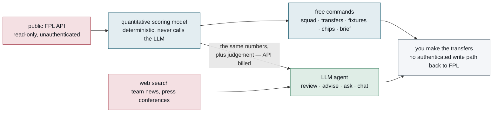
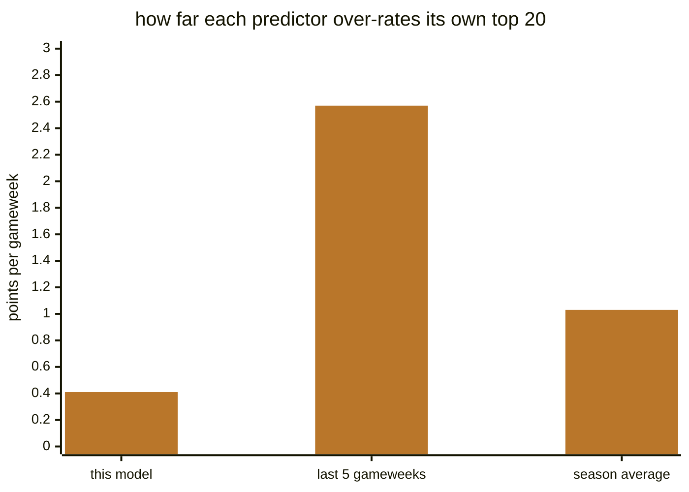
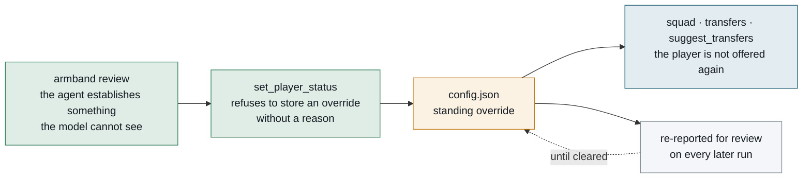

# FPL Armband

An AI Fantasy Premier League analyst that runs on your machine. The binary is `armband`.

*Named for the captaincy, which is the biggest single decision you make each week and the one
effect in this project's record that stands clear of the noise.*

It pulls live data from the public FPL API, scores every player with a quantitative model built
from FPL's actual scoring rules, and hands the results to a language model to reason over, critique
and turn into a recommendation.

The shape of the system, and where the split falls: everything up to the agent is deterministic
and costs nothing to run, and the language model is judgement layered on top of numbers it never
computes itself.



It beats the baselines you'd otherwise use. A transfer is a question about order, not about hitting
a points total, so the number to look at is how well a predictor ranks players within a gameweek.
Measured against the two things every FPL player already does by eye:

| predictor | ranks players within a gameweek | over-rates its own top 20 by |
|---|---|---|
| this model | 0.427 | 0.41 pts/gw |
| last five gameweeks | 0.330 | 2.57 |
| flat season average | 0.311 | 1.03 |

The second column is the one that costs you money. Every predictor flatters the players it likes
most, and those are exactly the players a transfer search picks from, so a five-game average will
talk you into a captain it has over-rated by two and a half points a week. Full tables, including
the columns where this is only line-ball with a moving average, are in
[docs/accuracy.md](docs/accuracy.md).

Drawn to scale, that second column is the whole pitch — the model's edge is how honest it is
about its own favourites:



**It writes to your config, never to FPL.** There is no authenticated write path at all — the
session cookie, the my-team endpoint and the `auth` command were removed outright, and
`TestTheClientHasNoAuthenticatedSurface` fails the build if one comes back. You make the transfers.

That config write is worth understanding, because **a review run leaves something behind**. When
the agent establishes something the model cannot see — a player out for six weeks, one who has
lost his place — it records it with `set_player_status`, which persists to `config.json` and binds
every later run, the free commands included: an excluded player is not offered again by `squad`,
`transfers` or `suggest_transfers` until the override is cleared. It refuses to store one without
a reason, and every standing override is re-reported for review each run. See
[docs/configuration.md](docs/configuration.md).

The loop is worth seeing whole — one paid run writes a fact down, and every free run afterwards
is bound by it until it is cleared:



---

## Quick start

```bash
go build -o armband ./cmd/armband

./armband squad          # best 15 it can find under the real rules — free, no AI
./armband fixtures       # fixture difficulty table
./armband chips          # chip windows and plan validation
./armband brief          # the whole deterministic picture, as Markdown
```

For the AI commands, set credentials once:

```bash
export ANTHROPIC_API_KEY=sk-ant-...     # platform.claude.com/settings/keys
./armband review                        # the weekly decision
```

First run writes a `config.json` you can edit, or copy `config.example.json` over it and set
`entry_id` to your own team. Requires **Go 1.26.5 or newer** (see `go.mod`). Nothing but the AI commands
needs a credential of any kind — the FPL endpoints this uses are public and unauthenticated.

**Only `entry_id` is required.** Every other key has a shipped default, and a key you leave out of
the file keeps that default — `config.example.json` is deliberately the short version rather than
the full one. The long `config.json` this repository ships is the *model's* configuration: around
forty tunable constants, most of which you should not need to touch and none of which you should
change without reading what it does first.

## It plays its own picks, in public

[FPL Armband](https://fantasy.premierleague.com/entry/2785902/history) is this project's team — and
the `entry_id` `config.example.json` ships with, so change it to your own. Every gameweek it fields
what the model says, and the table is there whether that goes well or badly.

A model that only ever scores itself against replays of seasons it was tuned on is marking its own
homework. So the picks go somewhere anyone can check them.

One season is a small sample, and a league table is a slow way to learn anything. The measurement
that *does* resolve is in [docs/accuracy.md](docs/accuracy.md), against thousands of
player-gameweeks — but it answers whether the model is right about **football**, not whether a
change to it earns **points**. That second question is [docs/replay.md](docs/replay.md)'s, and it
resolves far less often. Read the live team as skin in the game.

## Commands

Most of these cost nothing to run. `internal/analysis` never calls the LLM, so the
optimiser, the fixture model, the chip validator and the replay are all free.

| Command | What it does | API cost |
|---|---|---|
| `brief` | The whole deterministic picture as one Markdown document, for pasting into a chat (`-html` for a page) | — |
| `squad` | Best 15 it can find under the real constraints: £100m, positional quotas, three per club (`-plain`, `-html`) | — |
| `transfers` | Best transfers for the squad you own, as a team sheet (`-plain`, `-html`) | — |
| `fixtures` | Fixture difficulty per club, easiest run first | — |
| `chips` | Chip windows, plan validation, blanks and doubles | — |
| `congestion` | International breaks, turnarounds, European load | — |
| `nations` | FPL nationality codes with example players | — |
| `backtest <season> [gws]` | Replay a finished season — see [docs/replay.md](docs/replay.md) | — |
| `snapshot` | Model-and-harness accuracy record from a sweep's CSVs | — |
| `capture` | Archive today's live payload, dated and immutable | — |
| `priors` | Cache last season's totals before FPL overwrites them | — |
| `verify-competitions` | Record that competition status was checked, with nothing to correct | — |
| `schedule` | Print a crontab line for `due` | — |
| `review` | Weekly decision: competitions → chips → transfers → news → verdict | yes |
| `advise` | Full pre-deadline analysis, written to a report | yes |
| `ask "<q>"` | One-off question | yes |
| `chat` | Interactive session with follow-ups | yes |
| `due` | Run `advise`, but only if a deadline is near (for cron) — a one-shot prompt, not the `review` protocol | yes, when it fires |

**Flags go before the command** — `armband -html squad.html squad`, never
`armband squad -html squad.html`, which is rejected rather than silently ignored.
`armband` with no arguments prints every flag, with worked examples of the ones
whose ordering is easy to get wrong; that string is the only complete list. A few
commands parse their own flags and take them after the command instead — the
usage text names which, and the same before-the-positionals rule applies there.

**`capture` is the one worth putting on a timer.** It archives `bootstrap-static` and
`fixtures` into a dated directory, two requests, so that point-in-time questions become
answerable later. It yields nothing this season and a great deal next spring — and every
week missed is data that cannot be recovered. `armband capture -list` audits the series
for gaps.

## Two ways to run the review

`internal/analysis` never calls the LLM, so the only thing the API ever pays for is the
judgement on top. That split gives you a choice.

**`armband brief` — free.** Writes everything the model knows as one self-contained
Markdown document: your criteria and review policy, the numbered review protocol, competition
status, chip plan, squad and transfers, every flagged player, your standing overrides, research
targets, the best squad it found, the fixture table, and a "what this model cannot see" section. Paste
it into any chat assistant you already have a subscription for, and get the review there.
Roughly 5,000 words pre-season, and longer once you have a squad to describe.

**`armband review` — API billed.** The same protocol, but the agent calls tools
iteratively: it can notice something odd and go look, rather than reasoning from a single
snapshot. `advise` is the same agent loop on a one-shot prompt, and `due` runs *that* unattended
on a schedule; what it will never do is submit anything, because there is no authenticated write
path and its absence is what the client's guard test exists to keep.

Use `brief` while you are still vetting the model's judgement, since it costs nothing to run
twenty times. Use `review` when you want it to work on its own.

> A chat subscription **cannot** fund `review`. Consumer plans cover the chat products;
> `armband` calls the Messages API directly and bills an API organization. `brief` exists
> precisely so the subscription you have is usable here.

## Documentation

Everything in `docs/` is reference — a description of the system as the code stands, nothing
speculative. Seven documents and an index:

| | |
|---|---|
| **[docs/accuracy.md](docs/accuracy.md)** | How well it actually predicts, measured against a five-game average and a season average. **Start here if you want to know whether it works.** |
| **[docs/model.md](docs/model.md)** | How players are scored: underlying stats, fixtures, expected minutes, congestion, role risk. The intellectual core. |
| **[docs/configuration.md](docs/configuration.md)** | Every config field, what it does, and what you must fill in by hand. |
| **[docs/workflow.md](docs/workflow.md)** | The weekly review protocol and chip strategy. |
| **[docs/architecture.md](docs/architecture.md)** | Code layout, data flow, SDK gotchas, how to extend it. |
| **[docs/replay.md](docs/replay.md)** | The backtest harness: how a scoring change is validated, and what it can and cannot resolve. |
| **[docs/backfill.md](docs/backfill.md)** | Recovering historical team news from the Internet Archive, and the one rule that must not be got wrong. |
| **[docs/README.md](docs/README.md)** | The map: what each document covers and how they fit together. |

---

## What makes it more than a spreadsheet

**The score is auditable.** Expected goals become points at the real position-dependent
rates; clean-sheet probability comes from expected goals conceded via a Poisson model. No
black-box rating — you can trace any number to the term that caused it, and every term is
stored separately and reported to the agent rather than folded into one opaque figure.

**FPL's step functions are modelled as steps.** Appearance points and the clean sheet are
paid at sixty minutes and are all-or-nothing, so they scale by the *probability a player
reaches sixty*, not by the fraction of a match he plays. Those two terms are 61% of a
defender's per-90 score, so treating them as rates — which the model did once — is a large
and position-dependent error.

**Expected minutes are treated as a gate, not a tiebreaker.** Correlation between season
minutes and season points is **r = 0.929**. Rotation risk is penalised convexly, weighted
toward recent gameweeks, with a per-position relaxation for midfielders.

**Uncertainty is priced where it was measured, and switched off where it was not.** Two
discounts survive because the data supports them, and they deliberately act on different
channels. The summer-signing discount multiplies `Score` by 0.88: signings turn out to be
marginally better per 90 but about 12% less available, so the discount is calibrated against
that availability gap rather than applied to minutes directly. The post-tournament rest
discount multiplies expected **minutes** by 0.83, because minutes are where its effect was
measured. Applying a discount on the wrong channel is what retired the new-manager penalty —
§6 of [docs/model.md](docs/model.md) tells that story.

The penalties that did not survive measurement ship at 1.00, the neutral value. The
new-manager penalty and five of the eight congestion penalties — the three European ones and
both short-rest ones — measured as nothing on the channel they are applied to. The remaining
three, covering domestic cups, long-haul travel and the week after an international break, sit
at 1.00 on the weaker but sufficient argument that an unmeasured multiplier which moves a score
is not neutral and 1.00 is.
All nine are still reported to the agent so a human can weigh them; none changes a number.
§5 and §6 of [docs/model.md](docs/model.md) record what each was measured at, and which
were not.

**The chip plan feeds squad construction.** A wildcard at GW6 shortens the optimiser's
horizon; a bench boost makes the optimiser buy fifteen playable footballers instead of eleven
plus fodder.

**Claims are validated against replayed seasons, not asserted.** Six archived seasons entered
at six deadlines give 36 matched cells, and a change is judged on the paired difference within
each cell rather than on a season total. Most of what that harness has measured is a *negative*
result — five separate corrections of genuinely measured biases lost points. See
[docs/replay.md](docs/replay.md).

**The agent can see what the model cannot.** Web search runs server-side, so it reads actual
team news and press conferences rather than relying on FPL's terse `news` field.

**Every run reports its own cost.**

```
14 API calls · 952k prompt tokens (900k cached, 95% hit rate) · 25k output · 3 web searches
estimated cost: $0.540 at introductory rates through 2026-08-31; $0.810 after
without prompt caching this run would have cost about $5.39
```

---

## Cost

Prompt caching is on by default with two breakpoints — the system prompt plus tool
definitions, and the conversation tail. Cache reads bill at 0.1× input, so a healthy run
shows a hit rate above 0.8. **A hit rate near zero means something in the prefix is changing
between calls** — that is a bug, not a tuning problem.

Context editing clears stale tool results once more than four tool calls are behind.

Levers, roughly in order of impact:

| Lever | Change | Effect |
|---|---|---|
| `effort` | `high` → `medium` | Largest single saving |
| `model` | `claude-opus-5` → `claude-sonnet-5` | $5/$25 → $3/$15 per MTok |
| Free commands | `brief`, `squad`, `transfers`, `fixtures`, `chips` | Zero cost |
| `max_iterations` | Lower than the default 25 | Bounds a runaway, not typical spend |

Pricing is date-aware, so promotional rates are applied while valid and revert automatically.

---

## Pre-season behaviour

Between seasons the FPL API's aggregate stats still hold **last season's** totals. That is the
correct baseline for gameweek 1, and the agent is told so explicitly — along with the
caveats: players who changed clubs show their old club's output, new signings from abroad show
nothing, and set-piece hierarchies may have changed.

This matters more than it sounds. Those aggregates reset at GW1 and then accumulate, so
anything that divides by a fixed 38-game season reports an ever-present as a fringe player for
most of the autumn. The model uses `Engine.DataWindow()` for exactly that reason.

## What you must configure by hand

The FPL API does not publish these, so they are hand-maintained and **must be re-derived every
summer**. They fail *silently*: a stale list simply applies to the wrong clubs, or stops
applying at all.

- **European and domestic cup participation** — dated windows per club
- **Managerial changes** (`new_coach_clubs`) — ten clubs shipped for 2026/27
- **Nationality groups** for travel load — run `armband nations` to map the opaque codes
- **Post-tournament rest** (`rest_players`) — the 17 Premier League players who were **on the
  pitch for the majority of a 2026 World Cup semi-final**. That is a teamsheet test, not a
  squad list: unused substitutes are excluded on purpose, so an audit against published squads
  will "find" names missing and be wrong. Read the comment on `DefaultRestPlayers` before
  editing the JSON, which has no room for one.

Three of the four lists are display-only. All eight congestion penalties ship at 1.00, and the
new-manager penalty with them, so a stale competition window, nationality group or manager list can
no longer mis-*score* a player — only mis-inform the agent reading it. `armband congestion` prints
what was derived from the calendar against what is still missing, and how old it is.

**`rest_players` is the exception, and it is live.** It multiplies expected minutes inside
`blendFor`, so a misspelt name there is a mis-scored player, not a cosmetic error — and it bites
in GW1 and GW2, the two gameweeks straight after the summer maintenance that was supposed to
have checked it.

## Known limitations

Worth knowing before you trust a recommendation:

- **Free transfers are reconstructed**, not published by FPL. Close, but verify against the
  site if a decision turns on the exact number.
- **Selling prices are reconstructed too, and that one is checkable.** FPL pays you what you
  paid plus half of any rise, so a squad cannot be sold for its market value. The
  reconstruction is proved right when it sums to FPL's own published team value, and reported
  as an assumption when it does not.
- **The model cannot distinguish injury absence from being dropped.** Both look like low
  expected minutes. This is the largest measured gap in the system and the reason the agent
  layer exists.
- **The replay cannot test judgement.** Team news is worthless in hindsight, so a backtest
  measures the floor the model provides rather than the system's actual output.
- **Not every constant in the model is provably the best one.** Seasons, not gameweeks, are the
  scarce axis, and six seasons of football is a small sample for questions at that resolution.
  [docs/replay.md](docs/replay.md) is candid about which comparisons the harness can settle and
  which it can't.

## Testing

```bash
go build ./... && go vet ./... && go test ./...
```

Tests hit the live FPL API and skip cleanly when unreachable. They assert **invariants and
regressions**, not exact values, since the underlying data changes weekly — a test pinned to a
specific player or score rots within days.

Each regression test encodes a bug that was actually shipped; see
[docs/architecture.md](docs/architecture.md#testing) for a representative five and the
optimiser's three guards. The replay's own diagnostics are behind `DIAG=1` and do not run in
the ordinary suite — [docs/replay.md](docs/replay.md) covers those.
