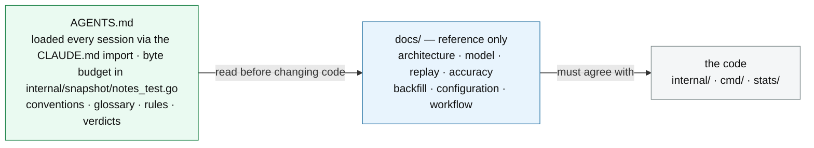

# docs

Everything here is **reference**: it describes what the system *is*, as the code stands. If
one of these disagrees with the code, the document is wrong and should be fixed.

That is the whole of it, and the narrowness is deliberate — see "Why this is eight files"
below before proposing anything new.

## Reference

| Document | Read it before |
|---|---|
| [architecture.md](architecture.md) | changing any package boundary, adding a tool, or touching the agent loop. Named by AGENTS.md as required reading before changing code |
| [model.md](model.md) | changing the scoring. Named by AGENTS.md as the authority on what the numbers mean |
| [replay.md](replay.md) | measuring anything. How a scoring change is validated, what a cell is, and what the harness cannot resolve |
| [accuracy.md](accuracy.md) | trusting a number the tool prints. How well the model predicts, where it is biased, and what it cannot see — every figure from the generated snapshot |
| [backfill.md](backfill.md) | using `data/captures/<season>/`, or changing how historical team news is recovered. Carries the one rule that must not be got wrong — last crawl **strictly before** the deadline — and the measured reason FPL's own calendar cannot be trusted for gameweeks it has not reached |
| [configuration.md](configuration.md) | adding or renaming a config field — every numeric one needs a backfill in `config.Load`, and the hand-maintained lists deliberately do not |
| [workflow.md](workflow.md) | changing the weekly review protocol or chip strategy |

`model.md` and `replay.md` are the pair: one says what a number means, the other says how you
would find out whether changing it helps. A change to the scoring wants both, and the
statistics that turn a replay into a verdict live in [`stats/README.md`](../stats/README.md).

## Why this is eight files

`docs/` used to hold two more categories: **design** documents proposing what the system
*should* be, and a **research record** — nine themed notes carrying the evidence behind each
verdict in AGENTS.md. Both were removed on 2026-08-14. Neither is available from a checkout.

⚠️ **The evidence layer is not empty, and reading this as "nothing is checkable" is the wrong
conclusion.** `stats/snapshots/` still holds dozens of banked runs; `stats/findings/` holds the
narrative and the pre-registration for each; and `stats/cells/` holds the cells two R screens read
as input. Several verdicts in AGENTS.md cite one by name. That is where to look before deciding a
number cannot be checked at all.

This is recorded here permanently, and as a decision rather than as history, because the
alternative is that the next person to look at a thin `docs/` proposes rebuilding one of them.
It was considered and decided. The costs were known and accepted at the time:

- **The verdicts stayed and the evidence did not.** AGENTS.md's "What has been measured"
  still carries a verdict line per finding — that is the part which stops an idea being
  rebuilt, and it is resident so an agent cannot skip it. What is gone is the ability to check
  one from here.
- **The index is no longer checked for completeness, and this is the largest cost.**
  `TestEveryNoteIsIndexed` asserted *both* directions of the seam: every note linked from
  AGENTS.md, and every link resolving. Only the second still has a subject. **Nothing can now
  tell that a finding has silently left the record** — which the original test called worse than
  never having written it, because the next person rebuilds the idea believing it is new. It is
  unenforceable from a checkout and it is not coming back.
- **`TestRetractedFiguresAreNotQuotedAsCurrent` no longer reaches the evidence.** Its glob over
  the notes was deleted rather than repointed, with the reasoning written into the test. It
  still covers AGENTS.md, the root `README.md`, `.claude/*.md`, `docs/*.md`, `stats/*.md` and
  every Go source under `internal/` and `cmd/` — note that
  `stats/*.md` is `stats/README.md` and the two pre-registrations, so the R scripts and the
  snapshot findings are **not**
  scanned for retracted figures, though they *are* scanned for stale paths by the guard below.
- **Changes to the moved material no longer owe a review.** `reviewWatchedPaths` covers `docs`,
  so an edit to a research note used to fire `TestReviewCoversTheCurrentCode`. Nothing fires now.
- **AGENTS.md is the only place the record can still grow.** There is no longer anywhere to move
  evidence *to*, so the budget in `internal/snapshot/notes_test.go` stopped being a ceiling with
  an overflow valve and became a hard one. It was raised to 72 KB in the same commit for exactly
  that reason. **Raise it again rather than compressing a qualifier** — that instruction is
  load-bearing in a way it was not before.

Two things follow for anyone working here. **Do not add a design document or a research note to
`docs/`** — reference only; if it proposes something the code does not do, or records what was
learned while finding out, it does not belong in this directory. And **do not read a missing
citation as a missing finding**: a verdict in AGENTS.md with nothing to click is the expected
state, not a broken link.

`TestNoLivePointerCitesTheRecordByPath` fails if a path to the removed material comes back — the
notes directory **or** any of the five design documents, in the repo-root spelling, the
`docs/`-relative spelling, or Go's `filepath.Join` spelling — in AGENTS.md, these docs, the Go
sources or the R scripts. ⚠️ **The first version matched one literal and nine live pointers
passed it green**, which is why the forms are spelled out rather than inferred.

Dated **attestations** — `reviews/` and `stats/snapshots/` — are deliberately exempt: each is a
claim about what was true at a named commit, and rewriting a path inside one would make it attest
to a location that did not exist then. ⚠️ **The work queue was exempt for a weaker reason and it
was a known gap**: a queue is read forward, so a stale pointer in one is a task *premise* rather
than a dated claim — which is worse, not better. The queue left this repository on 2026-08-15, so
the gap is no longer *here*; it is permanent wherever the queue now is, because nothing in a
checkout can reach it.

## The rule that keeps these honest

A retracted figure is worse here than in the research record, because a reader trusts a
document called "the model" to describe the model.
`TestRetractedFiguresAreNotQuotedAsCurrent` scans `AGENTS.md`, the root `README.md`,
`.claude/*.md`, `docs/*.md`,
`stats/*.md` and every Go source for withdrawn numbers quoted as current, and
`TestReviewCoversTheCurrentCode` treats `docs` as reviewable code. Neither can tell whether a
document is *good*; both catch the specific failure that has actually happened here more than
once.
