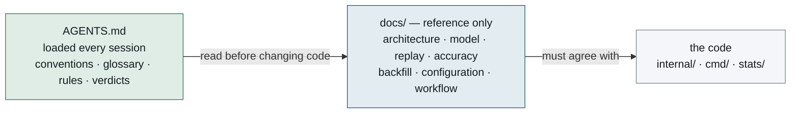

# docs

Everything here is **reference**: it describes what the system *is*, as the code stands. If
one of these documents disagrees with the code, the document is wrong and should be fixed.

That narrowness is deliberate. Design proposals — what the system *should* be — and research
notes recording how a conclusion was reached do not live in this directory, and should not be
added to it. The project's measured verdicts are summarised in AGENTS.md; the evidence behind
most of them sits outside this repository. What a checkout does carry is `stats/snapshots/`
(dozens of banked runs), `stats/findings/` (a narrative and a pre-registration per run) and
`stats/cells/` (the banked cells two R screens read as input) — look there before deciding a
number cannot be checked. A verdict with no citation to click is the expected state, not a
broken link.

## Reference

Seven documents. The table says when each one is the required reading, not merely the
suggested one.

| Document | Read it before |
|---|---|
| [architecture.md](architecture.md) | changing any package boundary, adding a tool, or touching the agent loop. Named by AGENTS.md as required reading before changing code |
| [model.md](model.md) | changing the scoring. Named by AGENTS.md as the authority on what the numbers mean |
| [replay.md](replay.md) | measuring anything. How a scoring change is validated, what a cell is, and what the harness cannot resolve |
| [accuracy.md](accuracy.md) | trusting a number the tool prints. How well the model predicts, where it is biased, and what it cannot see — every figure from the generated snapshot |
| [backfill.md](backfill.md) | using `data/captures/<season>/`, or changing how historical team news is recovered. Carries the one rule that must not be got wrong — last crawl **strictly before** the deadline — and the measured reason FPL's own calendar cannot be trusted for gameweeks it has not reached |
| [configuration.md](configuration.md) | adding or renaming a config field — every numeric one needs a backfill in `config.Load`, and the hand-maintained lists deliberately do not |
| [workflow.md](workflow.md) | changing the weekly review protocol or chip strategy |

`model.md` and `replay.md` are the pair: one says what a number means, the other says how you
would find out whether changing it helps. A change to the scoring wants both, and the
statistics that turn a replay into a verdict live in [`stats/README.md`](../stats/README.md).

## The rule that keeps these honest

A stale figure is worse here than anywhere else, because a reader trusts a document called
"the model" to describe the model. Two tests guard against exactly that:
`TestRetractedFiguresAreNotQuotedAsCurrent` scans these documents, the root `README.md` and
the source code for withdrawn numbers quoted as current, and `TestReviewCoversTheCurrentCode`
treats `docs` as reviewable code. Neither can tell whether a document is *good*; both catch a
specific failure that has happened here more than once.
