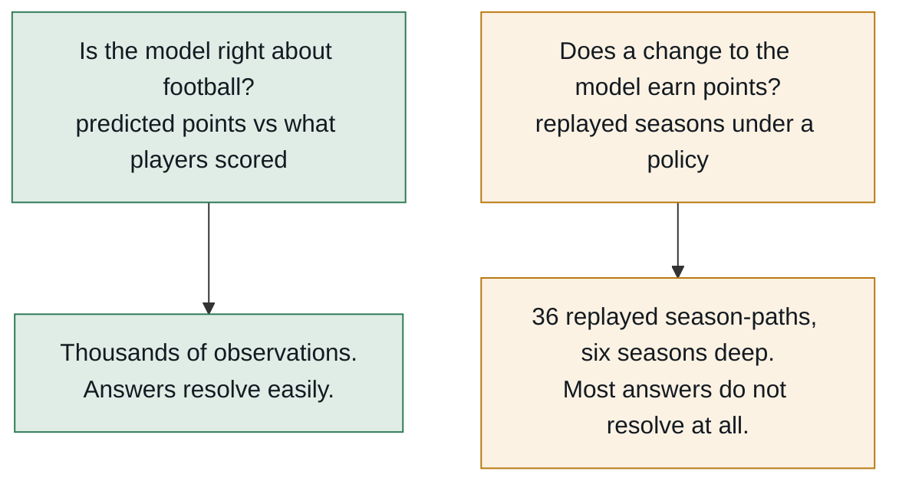
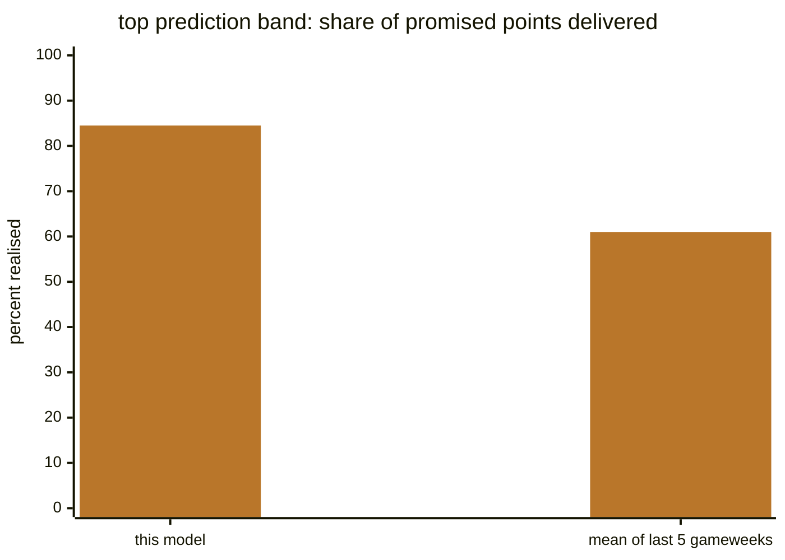
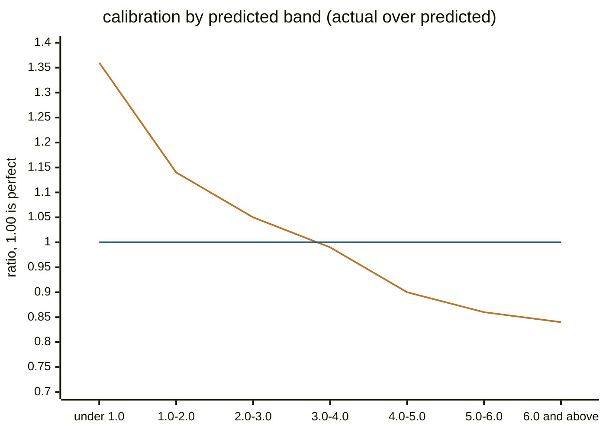
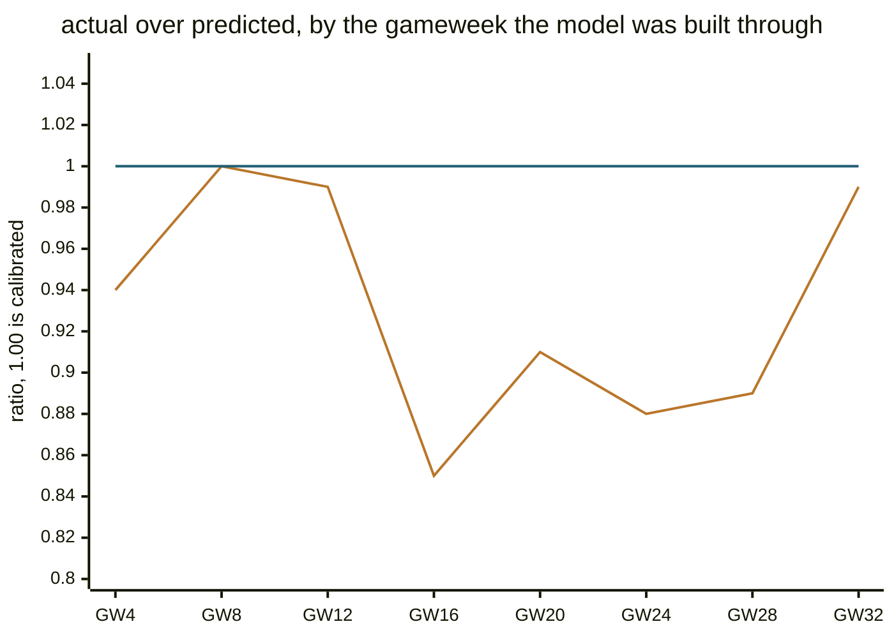
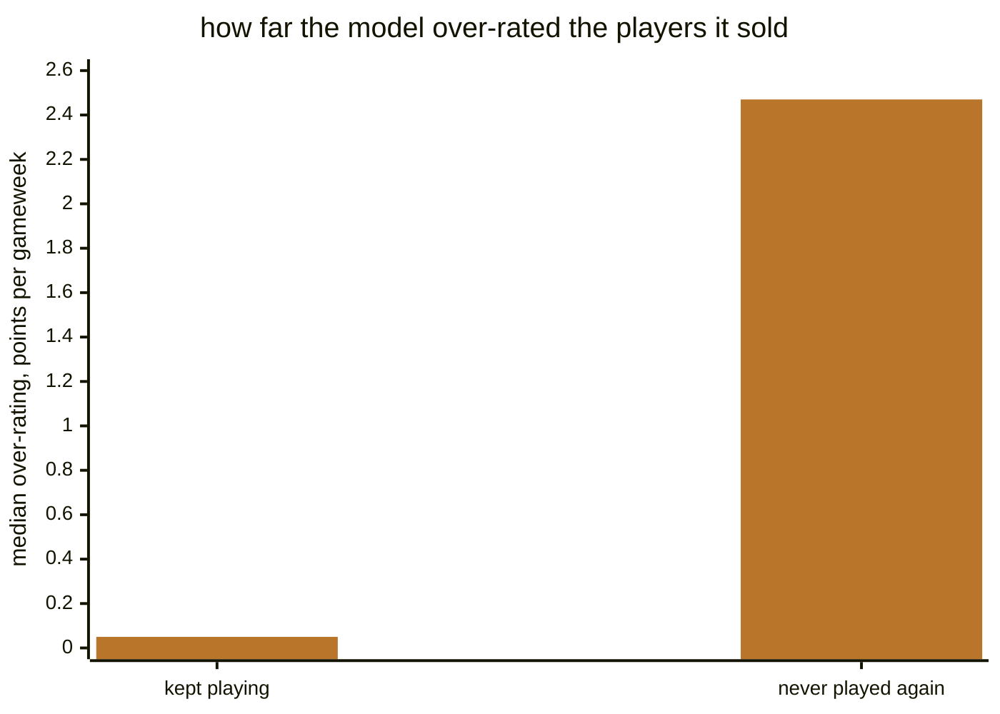

# How accurate is this, actually?

Short version: **the model orders players about 29% better than a five-game
average, its top twenty is nearly unbiased where the naive one is over-rated by
2.6 points a gameweek, and it over-predicts your best players by roughly 15%.**
It is line-ball with a moving average at picking out the players who go on to
haul — the column people quote, and the one that misleads, for a reason that is
arithmetic rather than a flaw. And most of the constants inside it cannot be
shown to be optimal, because six seasons of football is not enough data to tell.

Every **model** figure on this page comes from the dated accuracy snapshot in
[`stats/snapshots/`](../stats/snapshots), which is **generated rather than
remembered** — regenerated from the diagnostics on every scoring change, stamped
with the commit and the constants in force. Most figures here are from
`stats/snapshots/2026-08-10-27740ba`, which is live in the tree and an ancestor
of `main`. That snapshot is a four-season run and predates some later changes,
notably the chip modelling. It stays until this page is re-rendered, rather than
being silently swapped for numbers nobody decided on. Where a section has since
been re-measured it cites its own snapshot directly — the clean-sheet section is
the one that has. If this page and a snapshot disagree, the snapshot is right.

The **harness thresholds** below come from a second source, not that snapshot:
`stats/out/<sweep>/mde.csv`, rebuilt from committed cells by
`stats/regenerate_mde.sh` in seconds. Any figure rescaled to a grid nobody ran
on is labelled as an ordering where it appears.

---

## What "accurate" means here, and why there are two answers

Two questions get confused constantly, and they have different answers:



The first question is answered well. The second is answered badly, and no amount
of care fixes it — the replay's unit of evidence is a whole season, six are
playable today, and the past only ever grows by one a year. See
[replay.md](replay.md) for the machinery.

**This matters to you as a user** because it sets what the tool can honestly
claim. It can tell you a player is likely to out-score another. It cannot tell
you that its bench-weight constant is the best possible one.

---

## Predicting one gameweek ahead

The most direct test: predict every player's next gameweek, then compare against
two naive predictors anyone could build in a spreadsheet. The table shows
root-mean-square error in points, one gameweek ahead, on the same players.
**Lower is better**, and bold marks the lowest in each column.

| predictor | all | Zeros | Blanks | Tickers | Haulers |
|---|---|---|---|---|---|
| **this model** | **2.89** | **1.88** | **1.64** | 1.57 | **5.60** |
| mean of last 5 gameweeks | 3.11 | 2.22 | 2.13 | 1.83 | 5.62 |
| flat season average | 3.02 | 2.11 | 1.71 | **1.56** | 5.81 |

The categories are defined by what actually happened: *Zeros* recorded no
minutes, *Blanks* played for two points or fewer, *Tickers* three or four,
*Haulers* five or more.

Take the three left-hand columns seriously and the two right-hand ones lightly.
Tickers and Haulers are decided by under 1%, and both flip on mean absolute
error, which the same snapshot also banks: on MAE the model wins Tickers (1.19
against 1.25) and the moving average wins Haulers (4.72 against 4.78). Neither
column supports a claim about either predictor.

**Read the Haulers column with care — it is the one people quote and the one
that misleads.** Conditioning on a hauling outcome rewards a noisier predictor
automatically: the naive one fires far more high guesses, and selecting on
"he hauled" keeps the ones that landed. Measured directly, the naive predictor
puts nearly three times as many player-gameweeks in its top band and realises
about 61% of what it promises there, against this model's **84.5%** (7.59
predicted, 6.41 returned). It is not better informed about hauls; it is louder.

Side by side, that is the difference between a forecast and a shout — the share
of its own top-band promise each predictor actually delivers:



One note on checkability: the model's 84.5% is banked in the snapshot
(`model.prediction_calibration.predicted_6_0_and_above.ratio`), but the naive
predictor's band figures — the 61% and the "three times" — are printed by the
diagnostic and not banked, so they can be re-run but not re-read from any
snapshot in the tree.

---

## The number that actually matters: ordering

The optimiser and the transfer search both consume an **ordering**, not a level.
A model that is uniformly 10% low ranks players identically and costs nothing; a
model that is right on average but scrambles the order is useless.

| predictor | rank correlation within a gameweek | signed error over its own top 20 |
|---|---|---|
| **this model** | **0.427** | **+0.41** |
| mean of last 5 gameweeks | 0.330 | +2.57 |
| flat season average | 0.311 | +1.03 |

Higher is better on the left; **closer to zero is better on the right**, where
positive means the top of the predicted distribution is over-rated.

This is where the model earns its keep. It orders players **29% better** than the
five-game average, and — the part that matters for a transfer — its own top
twenty is over-rated by 0.41 points a gameweek where the naive one is over-rated
by 2.57. The transfer search picks from the top of that distribution, so being
honest *there* is worth more than being accurate in the middle.

---

## Where it is wrong, and by how much

### It over-predicts your best players

Grouped by what the model **predicted**. Ratio is actual over predicted, so
**1.00 is perfect and below 1.00 means over-prediction**.

| predicted | actual | ratio |
|---|---|---|
| under 1.0 | 0.86 | 1.36 |
| 1.0 – 2.0 | 1.73 | 1.14 |
| 2.0 – 3.0 | 2.60 | 1.05 |
| 3.0 – 4.0 | 3.39 | **0.99** |
| 4.0 – 5.0 | 3.99 | 0.90 |
| 5.0 – 6.0 | 4.67 | 0.86 |
| 6.0 and above | 6.41 | **0.84** |

The shape is the point, so here is the same column drawn as a curve, with the
flat line marking perfect calibration — everything below it is over-prediction:



Monotone, crossing 1.00 at about 3.5 predicted points and settling near 0.84 at
the top. **A player the model scores at 7.6 returns about 6.4.**

Practically: treat a high projection as a ranking, not a forecast. The ordering
survives this — every candidate is shrunk in the same direction — which is why
the bias is documented rather than corrected. This project has tried correcting
a measured bias five times and lost points every time.

### It gets over-confident in mid-season

Predicted against actual points per gameweek, by the gameweek the model was
built through:

| built through | GW4 | GW8 | GW12 | GW16 | GW20 | GW24 | GW28 | GW32 |
|---|---|---|---|---|---|---|---|---|
| actual / predicted | 0.94 | 1.00 | 0.99 | **0.85** | 0.91 | 0.88 | 0.89 | 0.99 |

Plotted against the calibration line, the mid-season sag is hard to miss — the
ratio sits near 1.00 at both ends of the season and drops through the middle:



The *actual* column is flat all season. The *predicted* column rises. The model
does not get worse at football — it gets **more confident** while reality stays
where it was, because by mid-season it is largely trusting this season's rates,
which are noisier than the prior they replaced.

**The useful reading: a mid-season transfer deserves more scepticism than an
early one.** The model is least trustworthy exactly when it is most active.

### It over-predicts clean sheets by about 3%

A clean sheet is roughly a quarter to nearly half of a defender's predicted
score, so calibration here matters more than for any other single term.

The model prices a clean sheet from `XGC90` — expected goals conceded per 90
minutes, blended toward the prior season and shrunk, read point-in-time.
Measured against that regressor, one row per team-gameweek, predicted over
actual is **1.052 on the three seasons that carry native xGC data and 1.004
pooled over six**.

The pooled figure flatters the model, for a known reason: the measurement keeps
only the most-played defender or keeper, on the matches he finished, and that
selection drops 14.2% of club-gameweeks — disproportionately the defensively
worse ones. Removing the selection moves the pooled ratio to about 1.03. The
coupling the model omits — it prices defensive contributions and clean sheets as
independent when they are negatively correlated — was sized separately and adds
roughly another point, taking it to about 1.04. Note that this second step
composes two separately measured shifts rather than measuring them jointly. So
the honest reading is an over-prediction of **about 3% from the selection alone,
or 3.7% once the omitted coupling is composed on top**.

That does not establish the term is well calibrated, only that it is not badly
miscalibrated. The confidence interval on the native ratio runs from 0.90 to
1.20, wide enough that a real bias several times the estimate would still fit
inside it, and 2023-24 alone reads 1.14. The measurement bounds the bias; it
does not pin it.

It ships uncorrected because the points consequence is unmeasurable: even a
deliberately induced error of a vastly larger size — halving every clean-sheet
probability — did not produce a points difference the replay could resolve, so a
3% bias had no chance. The evidence sits in
`stats/snapshots/2026-08-15-clean-sheet-2x2/`.

### Its worst errors are team news, not scoring

When the model is badly wrong about a player, the reason is usually not that it
mis-rated his football — it is that he stopped playing. The cleanest place to
see this is the players the replayed transfer policy sold, tracked after the
sale. Negative means over-rated, in points per gameweek:

| sold player | median error |
|---|---|
| kept playing | −0.05 |
| never played again | **−2.47** |

Drawn as magnitudes of over-rating, the disproportion is the finding — nearly
all of the damage sits on one side:



For a player who keeps playing, the model is close to right. The damage comes
almost entirely from the ~13% who stop — injury, a lost place, a move away. That
is **not a scoring failure, it is a team-news failure**, and it is the single
strongest argument for checking press conferences before acting on any
recommendation.

---

## What it cannot see at all

- **Team news.** The model reads FPL's status flags, which are terse and lag
  press conferences by days. The agent searches the web for this; the
  deterministic commands do not.
- **Your rank, and other managers' squads.** Ownership is priced nowhere. A
  differential is not modelled as a differential.
- **Price changes before they happen.** Perfect price timing was measured as a
  hindsight upper bound and came out too small for the harness to distinguish
  from zero, so nothing is built for it.
- **Whether a role has changed.** A player whose statistics came from a different
  club, a new set-piece taker, a manager's stated plan — all invisible. This is
  what `research_targets` exists to flag.

---

## What "we cannot measure that" means

Several verdicts above end in a shrug — measured, unresolved, ships anyway. This
section explains why that is the honest outcome rather than a failure of effort.

The replay tests a change by running whole seasons under it and comparing
against the shipped configuration. Seasons are the scarce axis: only six are
playable, and seasons genuinely differ from one another, so season-to-season
disagreement is real variance that no amount of extra replaying averages away.
The standard error that matters therefore rests on one degree of freedom fewer
than the number of seasons — a ceiling of five today, and often lower for a
particular comparison. With so few degrees of freedom, the multiple of the
standard error needed for significance at p = 0.05 is well above the familiar
2 — it is 2.571 at five — so a detection threshold has to be read per comparison
rather than looked up once for the harness.

The measured thresholds bear that out. Across 23 real comparisons, all on the
four-season grid, the median p = 0.05 threshold is **39 points a season** on the
season-clustered estimator; the start-fixed estimator, which is valid only where
the seasons genuinely agree, puts the same 23 at 32. On the season-clustered
estimator the range runs from **7.6 to 232 points a season**, and the spread is
mostly about consistency: a change whose mechanism is certain and lands almost
identically in every cell — the vice-captain fallback — resolves at 12.7, while
a setting whose effect swings by season needs 232.

Today's default grid is six seasons, and the same arithmetic says its median
threshold should be roughly a third finer — about 26. Read that as an ordering,
not a threshold to quote: it is a rescaling of figures measured on the narrower
grid, and no comparison has been re-measured on the wider one.

Almost every constant argued over in this project is worth 11 to 34 points a
season, which sits below the median threshold either way. **So "unresolved" is
the expected verdict for a real effect of that size, not evidence against one.**
Where a constant cannot be resolved on points, it is decided on *mechanism*
(does the objective say what the game actually pays?) or on *shape* (a plateau
with a cliff, or a consistent direction across several settings) — never by
picking whichever swept value scored highest, which manufactures effects out of
noise.

If you want the full treatment of what the harness can and cannot resolve, read
[replay.md](replay.md).

---

## How to check any of this yourself

```bash
# Regenerate the whole accuracy record. ~10 minutes, no AI, no network.
# See stats/README.md for the full recipe.
armband snapshot -cells /tmp/cells.csv -model /tmp/model.csv
```

The snapshot diffs itself against the previous one and prints what moved, so a
scoring change that quietly altered a figure shows up as a row rather than as
nobody noticing. It also lists **what it could not measure**, because a
diagnostic that did not run is not a diagnostic that found nothing.
