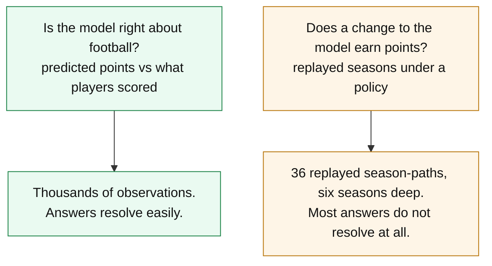

# How accurate is this, actually?

Short version: **the model orders players about 29% better than a five-game
average, its top twenty is nearly unbiased where the naive one is over-rated by
2.6 points a gameweek, and it over-predicts your best players by roughly 15%.**
It is line-ball with a moving average at picking out the players who go on to
haul — the column people quote, and the one that misleads, for a reason that is
arithmetic rather than a flaw. And most of the constants
inside it cannot be shown to be optimal, because six seasons of football is not
enough data to tell.

Every **model** figure on this page comes from the dated accuracy snapshot in
[`stats/snapshots/`](../stats/snapshots), which is **generated rather than
remembered** — regenerated from the diagnostics on every scoring change, stamped
with the commit and the constants in force. The figures here are from
`stats/snapshots/2026-08-10-27740ba`, which is live in the tree and an ancestor of
`main`.

⚠️ **This page used to cite `9e5e1d1`, and that directory was deleted at `3095fe5`**
as one of fourteen taken before the unregistered-pool, autosub-legality and chip
fixes — "not measurements of the current model in any useful sense". Re-pointing was
checked rather than assumed: the two figures files carry the same 588 keys and **all
513 `model.*` figures are byte-identical**, so every number below now resolves in a
directory anyone can open. It also *gains* provenance — `9e5e1d1` carries
`stamp.dirty,true` and so was never attributable to any committed code state, where
`27740ba` is clean. The 48 `harness.*` rows that do differ between the two reach
nothing here, because this page takes its thresholds from the second source below.

⚠️ **The snapshot is old, and it is kept deliberately** — `3095fe5` kept it as the
only one taken after the autosub-legality fix. It still predates the chip modelling
and is a four-season run, and **several figures below have since moved**. One section
is now the wrong way round: see the marker above "It is more wrong about a player it
buys than one it sells". They are the last figures anyone published for this page and
they stay until it is re-rendered, rather than being silently swapped for numbers
nobody decided on. If this page and a snapshot disagree, the snapshot is right.

The **harness thresholds** below are a second source and not that snapshot:
`stats/out/<sweep>/mde.csv`, rebuilt from committed cells by
`stats/regenerate_mde.sh` in seconds. Any figure rescaled to a grid nobody ran on is
labelled as an ordering where it appears.

---

## What "accurate" means here, and why there are two answers

Two questions get confused constantly, and they have different answers:



The first question is answered well. The second is answered badly, and no amount
of care fixes it — the replay's unit of evidence is a whole season, six are
playable today, and the past only ever grows by one a year. See [replay.md](replay.md) for the
machinery and the harness-and-inference note for the full
treatment.

**This matters to you as a user** because it sets what the tool can honestly
claim. It can tell you a player is likely to out-score another. It cannot tell
you that its bench-weight constant is the best possible one.

---

## Predicting one gameweek ahead

Root-mean-square error in points, one gameweek ahead, against two naive
predictors on the same players. **Lower is better.**

| predictor | all | Zeros | Blanks | Tickers | Haulers |
|---|---|---|---|---|---|
| **this model** | **2.89** | **1.88** | **1.64** | 1.57 | **5.60** |
| mean of last 5 gameweeks | 3.11 | 2.22 | 2.13 | 1.83 | 5.62 |
| flat season average | 3.02 | 2.11 | 1.71 | **1.56** | 5.81 |

The categories are defined by what actually happened: *Zeros* recorded no
minutes, *Blanks* played for two points or fewer, *Tickers* three or four,
*Haulers* five or more.

⚠️ **The bold marks the lowest RMSE, and in two columns that is a coin toss.**
Tickers and Haulers are decided by under 1%, and **both flip on mean absolute
error**, which the same snapshot also banks: on MAE the model wins Tickers (1.19
against 1.25) and the moving average wins Haulers (4.72 against 4.78). Neither
column supports a claim about either predictor; the three on the left do.

**Read the Haulers column with care — it is the one people quote and the one
that misleads.** Conditioning on a hauling outcome rewards a noisier predictor
automatically: the naive one fires far more high guesses, and selecting on
"he hauled" keeps the ones that landed. Measured directly, the naive predictor
puts nearly three times as many player-gameweeks in its top band and realises
about 61% of what it promises there, against this model's **84.5%** (7.59
predicted, 6.41 returned). It is not better informed about hauls; it is louder.

⚠️ **The naive predictor's two figures are the one place this page departs from its
own provenance rule**, and are marked rather than removed. `reportPredictionCalibration`
guards its sink with `if name == "model"`, so the naive predictors' band ratios are
printed to the console and **never banked** — the 61% and the "three times" are read
off a run and are not checkable from any snapshot in the tree. The model's own 84.5%
is banked (`model.prediction_calibration.predicted_6_0_and_above.ratio`) and was the
figure previously misquoted here as 87%.

---

## The number that actually matters: ordering

The optimiser and the transfer search both consume an **ordering**, not a level.
A model that is uniformly 10% low ranks players identically and costs nothing; a
model that is right on average but scrambles the order is useless.

| predictor | rank correlation within a gameweek | signed error over its own top 20 |
|---|---|---|
| **this model** | **0.427** | **+0.41** |
| mean of last 5 gameweeks | 0.330 | +2.57 |
| flat season average | 0.311 | +1.03 |

Higher is better on the left; **closer to zero is better on the right**, where
positive means the top of the predicted distribution is over-rated.

This is where the model earns its keep. It orders players **29% better** than the
five-game average, and — the part that matters for a transfer — its own top
twenty is over-rated by 0.41 points a gameweek where the naive one is over-rated
by 2.57. The transfer search picks from the top of that distribution, so being
honest *there* is worth more than being accurate in the middle.

---

## Where it is wrong, and by how much

### It over-predicts your best players

Grouped by what the model **predicted**. Ratio is actual over predicted, so
**1.00 is perfect and below 1.00 means over-prediction**.

| predicted | actual | ratio |
|---|---|---|
| under 1.0 | 0.86 | 1.36 |
| 1.0 – 2.0 | 1.73 | 1.14 |
| 2.0 – 3.0 | 2.60 | 1.05 |
| 3.0 – 4.0 | 3.39 | **0.99** |
| 4.0 – 5.0 | 3.99 | 0.90 |
| 5.0 – 6.0 | 4.67 | 0.86 |
| 6.0 and above | 6.41 | **0.84** |

Monotone, crossing 1.00 at about 3.5 predicted points and settling near 0.84 at
the top. **A player the model scores at 7.6 returns about 6.4.**

Practically: treat a high projection as a ranking, not a forecast. The ordering
survives this — every candidate is shrunk in the same direction — which is why
the bias is documented rather than corrected. This project has tried correcting a
measured bias five times and lost points every time.

### It gets over-confident in mid-season

Predicted against actual points per gameweek, by the gameweek the model was built
through:

| built through | GW4 | GW8 | GW12 | GW16 | GW20 | GW24 | GW28 | GW32 |
|---|---|---|---|---|---|---|---|---|
| actual / predicted | 0.94 | 1.00 | 0.99 | **0.85** | 0.91 | 0.88 | 0.89 | 0.99 |

The *actual* column is flat all season. The *predicted* column rises. The model
does not get worse at football — it gets **more confident** while reality stays
where it was, because by mid-season it is largely trusting this season's rates,
which are noisier than the prior they replaced.

**The useful reading: a mid-season transfer deserves more scepticism than an
early one.** The model is least trustworthy exactly when it is most active.

### It over-predicts clean sheets by about 3% — the recorded "quarter" is against a regressor it does not score on

Pooled over team-matches: **0.300 predicted against 0.240 actual**, worth about
0.24 points a match to every defender and keeper.

⚠️ **Both figures on that line are measured against realised single-match xGC, and are superseded
as a description of the model — see the correction below.** They are not withdrawn: they are a
correct measurement of a different regressor from the one the model scores.

The cause is not the expected-goals-conceded figure, which matches actual goals
conceded to within 1.4% (1.506 against 1.527). It is that xGC is *regressive*
match to match, so the same xGC yields fewer clean sheets than a Poisson on it
implies. It ships uncorrected because the error is shared by every defender and
keeper, and FPL forces you to own five defenders and two keepers regardless.

⚠️ **Two corrections to that sentence, 2026-08-15, and neither changes what ships.**

**The size is measured against the wrong regressor.** Every figure above is computed against
*realised single-match* xGC. The model scores on `XGC90` — a per-player per-90 rate, blended
toward a prior season and shrunk — and `exp()` is convex, so the two disagree by construction.
Refit against `XGC90` itself (`TestDiagCleanSheetRegressor`, point-in-time, one row per
team-gameweek), predicted against actual is **1.052 on the three native-xGC seasons and 1.004
pooled over six**, against the 1.25 in this section (1.281 on the per-observation fit
`stats/cs_calibration.R` runs). So most of the over-prediction described here is a property of the
measurement rather than of the model. ⚠️ That does **not** mean the term is correctly calibrated:
the refit's slope separates neither 1.0 nor 1.17, and it measures the neutral path only. The native
interval on that ratio is **[0.90, 1.20]**, so a fifth of the over-prediction described above is
still inside it, and 2023-24 alone reads 1.140. The refit's population also flatters it — the
most-played defender or keeper, on the matches he finished — and that is now **sized**: the guard
drops 14.2% of club-gameweeks, the dropped ones really are worse defensively, and removing the
selection takes the pooled ratio from 1.0051 to 1.0305. So the honest reading is an over-prediction
of **roughly 3% from the selection alone, or ~3.7% once the omitted defcon coupling is added**
— far from the quarter described above, and not zero. See
`stats/snapshots/2026-08-15-clean-sheet-2x2/`.

**And the clause "so it cannot change which ones you buy" is withdrawn.** The quota fixes how many
defenders are in the *squad*; it does not fix how many are in the *eleven*, and only the eleven
scores. `Optimize` is a knapsack against one shared budget rather than an ordering consumer, so a
position-level shift can move where the money goes and, separately, which eleven is fielded — **the
second is mechanism, unmeasured on points.** `TestDiagXGCPoints` establishes the money half only:
the DEF+GKP count is 7 in every cell of both arms *because the quota forces it*, so any composition
effect has to run through **which** defenders and **which** keeper, not how many.

### It is more wrong about a player it buys than one it sells

⚠️ **Retracted 2026-08-15, and the figures are left as the record of what was run.**
On `stats/snapshots/2026-08-15-9e743cf` the buy−sell asymmetry is **+0.05 where it is
−0.41 here** — buy −0.26, sell −0.30 — so it is the **sell** side that is over-rated
harder, and the heading and the argmax reading under the table argue for a direction
that no longer holds. ⚠️ **Both sides are still negative, so both are still
over-rated**: what reverses is which is larger, *not* a sign. The availability finding
below it survives unchanged.

| | median error, points per gameweek |
|---|---|
| player bought | **−0.61** |
| player sold | −0.20 |

Negative means over-rated. The buy side is over-estimated harder, which is the
signature of a search that hunts the top of a noisy distribution on the way in
and merely accepts what it already owns on the way out.

**And nearly all of the sell-side error is one thing — availability:**

| sold player | median error |
|---|---|
| kept playing | −0.05 |
| never played again | **−2.47** |

For a player who keeps playing, the model is close to right. The damage comes
almost entirely from the ~13% who stop — injury, a lost place, a move. That is
**not a scoring failure, it is a team-news failure**, and it is the single
strongest argument for checking press conferences before acting on any
recommendation.

---

## What it cannot see at all

- **Team news.** The model reads FPL's status flags, which are terse and lag
  press conferences by days. The agent searches the web for this; the
  deterministic commands do not.
- **Your rank, and other managers' squads.** Ownership is priced nowhere. A
  differential is not modelled as a differential.
- **Price changes before they happen.** Perfect price timing was measured as a
  hindsight upper bound and came out too small for the harness to distinguish
  from zero, so nothing is built for it.
- **Whether a role has changed.** A player whose statistics came from a different
  club, a new set-piece taker, a manager's stated plan — all invisible. This is
  what `research_targets` exists to flag.

---

## What "we cannot measure that" means

Most of the constants in the scoring model **cannot be shown to be optimal**, and
the honest reason is sample size. Seasons are the scarce axis: the standard error
that matters rests on one degree of freedom fewer than the number of seasons
replayed, and the six that ship today set a *ceiling* of five — the figure for any
one comparison is resolved from that comparison's own cells and is frequently
lower. So the multiple of the standard error needed for p = 0.05 is well above the
familiar 2, and a threshold has to be read per comparison rather than looked up.

There is no single number for "the smallest effect the replay can detect".
Across 23 real comparisons — measured on the four-season grid the record was built
on, before the default widened on 2026-08-11 — the p = 0.05 threshold has a median
of **39 points a season on the season-clustered estimator** (the start-fixed one puts
the same 23 at 32). The often-quoted span of **3.9 to 232** is *pooled across
the two estimators* rather than being one estimator's range: on the season-clustered
one those same 23 comparisons run **7.6 to 232**, and the 3.9 end belongs to the
start-fixed estimator, which is valid only where the between-season component is
genuinely zero. So part of that span is how consistently a change lands across cells
— a mechanism-certain one like the vice-captain fallback resolves 12.7 on the
transfer metric, a setting whose effect swings by season needs 232 — and part of it
is which estimator you are entitled to.

On today's six-season grid the same arithmetic reads about a third finer, roughly 26
for that median — but that is an **ordering, not a point estimate**: it is
`t_crit(S−1)/√S` applied to a figure measured elsewhere, not a re-measurement, and no
comparison here has been re-run on the wider grid. The one time the ratio was checked
against data it came in at 0.677 rather than 0.66 — on the positive control, which is
the arm entitled to answer, the other two measured being near-degenerate — and the
borrowed provider offset on the three backfilled seasons costs about a further point a
season of threshold on top of that: **8.4 where an unborrowed one would give about
7.4, which is ~12% of the threshold and a lower bound.** ⚠️ Not 12% *of the gain* — as
a fraction of the 12.4 → 8.4 improvement it is nearer a fifth — and it was measured
before the xGC repair at `7cb769e`. Read 26 as "finer, by about a
third", never as a threshold to quote for a comparison — which is also why the
per-comparison endpoints above are left on their own grid rather than rescaled.
Almost every constant argued over here is worth 11 to 34 points a season, which sits
below the median either way.

**So "unresolved" is the expected verdict for a real effect, not evidence against
one.** Where a constant cannot be resolved on points, it is decided on *mechanism*
(does the objective say what the game actually pays?) or on *shape* (a plateau
with a cliff, or a consistent direction across several settings) — never by
picking whichever value scored highest, which manufactures effects.

If you want the full treatment of what the harness can and cannot resolve, read
[replay.md](replay.md).

---

## How to check any of this yourself

```bash
# Regenerate the whole accuracy record. ~10 minutes, no AI, no network.
# See stats/README.md for the full recipe.
armband snapshot -cells /tmp/cells.csv -model /tmp/model.csv
```

The snapshot diffs itself against the previous one and prints what moved, so a
scoring change that quietly altered a figure shows up as a row rather than as
nobody noticing. It also lists **what it could not measure**, because a
diagnostic that did not run is not a diagnostic that found nothing.
