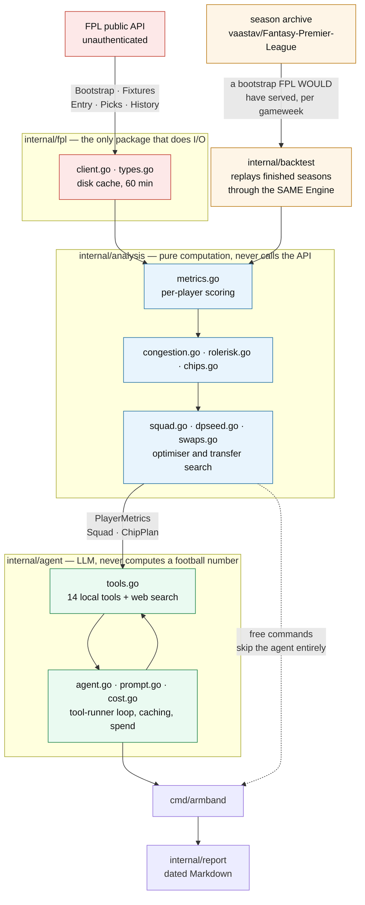
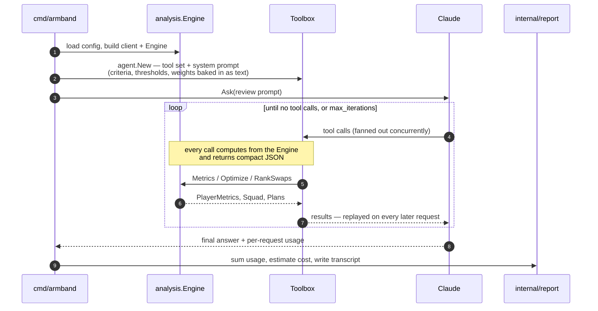

# Architecture

A Go binary. Deterministic analysis in `internal/analysis`, an LLM agent on top that reasons
over it via tools. **The analysis layer never calls the API; the agent layer never computes
football numbers.** That separation is why `squad`, `fixtures`, `chips` and `congestion` cost
nothing to run.



The replay edge is the one worth tracing. `internal/backtest` builds an ordinary
`analysis.Engine` from a reconstructed historical bootstrap, so it measures **the shipped
model** rather than a copy of it — which is the only reason its verdicts transfer. See
[replay.md](replay.md).

The dotted edge is the point of the whole layout: `squad`, `fixtures`, `chips` and
`congestion` reach `cmd/armband` without passing through the agent, which is why they
cost nothing to run.

---

## Packages

### `internal/fpl`

Thin client over the public, unauthenticated FPL API. No login required for anything used
here.

Responses are cached on disk (`cache_minutes`, default 60) so a single agent run making
many tool calls hits the network once per endpoint. `Bootstrap` and `Fixtures` are
additionally memoised per process.

**Gotchas baked in:**

- The API rejects requests without a browser-like `User-Agent`.
- Numeric fields arrive inconsistently — `"expected_goals": "25.50"` as a string, others as
  bare numbers. The `Num` type absorbs both.
- **Between seasons, aggregate stats hold the *previous* season's totals** until the first
  gameweek completes. This is correct for GW1 planning but every consumer must know it.

`FreeTransfers` reconstructs the available transfer count from history (1 per gameweek,
banked to 5, minus spent, skipping chip weeks). FPL does not publish this, so it is a close
reconstruction rather than an authority — the tool says so in its output.

### `internal/analysis`

Pure computation, no I/O. `Engine` holds a bootstrap, fixture list and the four config
structs, and derives everything on demand.

`NewEngineFull(boot, fixtures, weights, congestion, roleRisk)` is the full constructor;
`NewEngine` and `NewEngineWithCongestion` are conveniences that fill in defaults.

State built once at construction: the per-team upcoming fixture index, and `congestionState`
(international breaks, rest days, European gating, post-cup gameweeks).

See [model.md](model.md) for what the numbers mean.

### `internal/agent`

Wraps the Anthropic Go SDK's `BetaToolRunner`. **Fourteen** local tools plus server-side web
search: gameweek status, player search, single-player lookup, team fixtures, squad optimisation,
my team, transfer suggestions, chip planning, squad status, research targets, two writers that
record a player's status and a price forecast, and two more that read and update competition
participation. `Toolbox.Tools()` is the single registry — a tool that is written and not
registered there is invisible to the agent.

**Three non-obvious things:**

1. **The runner overwrites `params.Tools`** with the local tool set (`betatoolrunner.go:64`).
   Server tools must be appended to `runner.Params.Tools` *after* construction. `NextMessage`
   re-reads `Params` each iteration, so this works.

2. **The runner does not resume `pause_turn`.** A server-side tool loop that hits its
   iteration cap returns `stop_reason: "pause_turn"`, and the runner exits because no local
   tool produced a result — surfacing as a silently truncated answer. `Ask` detects this and
   restarts with the paused turn appended, up to four times.

3. **The runner executes tools concurrently.** It fans a turn's tool calls out through an
   errgroup, so two player searches in one turn drive the engine over the whole player pool
   simultaneously. Two consequences, both of which have caused real failures. Anything the
   engine builds lazily must be `sync.Once`-guarded and anything mutable lock-guarded — a map
   built under a plain nil check is a *fatal* concurrent-map-write, not a recoverable panic.
   And every config write must go through the one guarded helper, because each config-writing
   tool is a read-modify-write of the whole file: unguarded, an agent recording several findings
   in one turn loses all but the last, silently and with no error anywhere.

**Prompt caching** uses two breakpoints: one on the system prompt (which also covers tool
definitions, since tools render first), and a top-level one that auto-places on the
conversation tail. Both are stable across runs, so a healthy loop shows a cache hit rate
above 0.8.

**Context editing** (`clear_tool_uses_20250919`, keeping 4) clears stale tool results. Without
it, the full JSON of every earlier search is replayed on every subsequent request.

`cost.go` accumulates usage across iterations — usage is reported *per request*, so a run
total is the sum, not the final message. Pricing is date-aware to handle promotional rates
that expire.

### `internal/config`

`config.json` load/save with per-field backfill, so a partial or outdated file stays valid.

### `internal/report`

Markdown reports to `reports/`, dated, never clobbering an earlier file from the same day.

### The supporting packages

Seven more exist, each because the FPL bootstrap does not carry something the model needs.
None of them is on the path of an ordinary scoring call.

| package | what it is for |
|---|---|
| `internal/backtest` | replays finished seasons through the model and scores what the policy would have earned. Every scoring claim in this project is validated here — see [replay.md](replay.md) |
| `internal/recent` | per-player match history from `element-summary/{id}`, so minutes can be recency-weighted. The bootstrap publishes season totals only, and a player who lost his place six weeks ago still reads as an ever-present in those. `Engine.Recent` is **nil by default**, so a failed fetch degrades to flat season totals rather than breaking |
| `internal/priors` | last season's totals, cached before FPL overwrites them at GW1. Multi-season priors come from `element-summary`'s `history_past`, not from the CSV mirror, which publishes only the current season |
| `internal/capture` | archives the live payload, dated and immutable, so point-in-time questions become answerable later. Never read by the live path — it is not a cache. Also owns the **reader** over that store, which serves live and backfilled captures alike |
| `internal/wayback` | the Internet Archive's CDX index and raw-payload endpoints. The only other package that does network I/O, deliberately separate from `internal/fpl` because its results are an immutable record rather than a cache — see [backfill.md](backfill.md) |
| `internal/backfill` | recovers the same point-in-time team news for **finished** seasons from archived crawls of `bootstrap-static`. Selection is the last crawl strictly before each deadline, never the nearest, and nothing is stored that cannot prove from its own payload that it predates its deadline |
| `internal/snapshot` | renders the dated model-and-harness accuracy record. It **reads** inference and never computes it; `TestThisPackageDoesNotComputeInference` fails if it grows a copy |

---

## Data flow for one `review`



Two things in that loop cost real money and are easy to miss. Tool results are **replayed
on every subsequent request**, so a verbose field is paid for once per remaining
iteration rather than once — which is why `playerRow` is terse and full detail sits
behind single-player lookups. And the fan-out at step 4 is genuinely concurrent, which is
where the `sync.Once` and config-write rules below come from.

---

## Extending it

**A new scoring factor** — add the field to `PlayerMetrics`, compute it in `Engine.Metrics`,
multiply it into `Score`, and expose it on `playerRow` in `tools.go` so the agent can see it.
Add the knob to the relevant config struct with a backfill in `config.Load`.

Then **give it an escape hatch and measure it**. A scoring change that cannot be switched off
cannot be compared against the behaviour it replaced, and the standing convention here is a
package-level `FPL_NO_<thing>` var beside the term. Judge it on `HOLD` **at the default grid, 36
cells over six seasons**, rather than on a season total — [replay.md](replay.md) covers both, and
the failure to expect is not a wrong answer but a plausible number that measured nothing.

⚠️ **This said "24 cells" until 2026-08-15, and it is a prescription rather than a record** — a
figure quoted about a past measurement stays correct as a four-season figure, but an instruction to
the next person telling them to use a grid that is no longer the default is simply wrong. The
default became six pairs × six entry gameweeks; `FPL_SWEEP_SEASONS` selects otherwise.

**A new tool** — write a `func (t *Toolbox) name() (anthropic.BetaTool, error)` using
`toolrunner.NewBetaToolFromJSONSchema`, and register it in `Toolbox.Tools()`. Keep output
compact: every tool result is replayed on every subsequent API call, so verbose fields are
paid for repeatedly.

**A new command** — add a case in `run()` and a line in `usage`. If it needs no LLM, keep it
out of `cmdAgent` so it stays free.

---

## Testing

```bash
go test ./...
```

Tests hit the live FPL API and skip cleanly when it is unreachable. They assert **invariants
and regressions**, not exact values, since the underlying data changes weekly.

`internal/backtest` also holds around a hundred measurement diagnostics, all gated behind `DIAG=1`
and skipped by the line above. They replay whole seasons and take minutes, so they are run
deliberately rather than as part of the gate — see [replay.md](replay.md).

The regression tests each encode a bug that was actually shipped. **This is a representative
five, not the list** — the full inventory of bugs this codebase has shipped and now guards is
the "Things that have already bitten" section of [AGENTS.md](../AGENTS.md), and anything added
there should arrive with a test.

| Test | Guards against |
|---|---|
| `TestMinutesReliabilityTracksExpectedMinutes` | Using `starts_per_90`, which rates a 26-min/week player identically to an ever-present |
| `TestOptimizeRespectsExpectedMinutesFloor` | Rotation risks reaching the starting XI |
| `TestEuropeanPenaltyIsDateGated` | Penalising Champions League clubs before European football starts |
| `TestOptimizeProducesLegalSquad` | Budget, quota and club-limit violations |
| `TestIntroPricingIsDateAware` | Promotional rates silently under-reporting after expiry |

### The optimiser's three guards, and why they exist

The squad search is a local search seeded with exact per-formation solutions — see "Single swaps
are not enough" under Squad optimisation in [model.md](model.md). Its failure
mode is **silence**: if the seeding stops contributing, nothing errors and no legality check
fails — the seeds are simply never the best answer any more, and the search quietly returns
worse squads. Three tests exist for exactly that, plus the supporting cases in
`dpseed_test.go` and `searchquality_test.go`.

| Test | What it guarantees |
|---|---|
| `TestOptimizerIsNeverWorseThanAnExactSeed` | The standing guarantee. A local search has no optimality proof of its own, but it must never return *less* than the exact per-formation solutions it was handed. Fails if the seeding stops being used at all. |
| `TestNoPremiumSquadBeatsTheOptimum` | Locks each expensive player in turn, re-solves, and checks that none of those constrained squads beats the unconstrained answer. If one does, the free search failed to reach a squad it should have found. |
| `TestSeedBudgetLeavesRoomForThePremiums` | Pins arithmetic that broke once: the seed's bench reservation must set aside the *cheapest* players who could fill those slots, not the dearest. Reserving from the wrong end cut roughly £20m off the eleven's budget and made every seed too poor to buy a premium — with nothing failing. |

---

## Known limitations

- **Free transfers are reconstructed**, not read. Verify against the site if a decision turns
  on the exact number.
- **The model cannot distinguish injury absence from being dropped.** Both look like low
  expected minutes. Check minutes-per-start.
- **The hand-maintained season lists must be re-derived every summer** — European and domestic
  cup campaigns (each club's competitions, with a start date and an optional end date), the
  clubs that changed manager, and the post-tournament rest list. None is in the FPL API, and
  they fail *silently*: a stale list simply applies to the wrong clubs, or stops applying at
  all. `armband congestion` reports what is set and how old it is.
- **All eight congestion penalties ship disabled at 1.00**, so that block is reported to the
  agent and moves no score at all, and **three of those four lists** are consequently
  display-only — a stale one can mis-inform a human and can no longer mis-score a player.
  `TestTheShippedCongestionBlockIsInert` makes re-enabling one deliberate. Section 5 of
  [model.md](model.md) says what each was measured at and why it is off.
  ⚠️ **Corrected 2026-08-15: this said all four.** `DefaultRestPlayers` is live on the scoring
  path — `blendFor` applies `restFactor` at `blend.go:165` through `rest_minutes_factor`, a
  `Weights` field rather than a congestion penalty, at GW1 and GW2 only. Two unrelated things
  answer to "rest"; only the congestion pair is inert. See AGENTS.md, "Season maintenance".
- The agent has web search, so it can read team news — but it cannot see your reasoning or
  anything you have not told it. `criteria` is how you fix that.

## `Engine.Recent`: what the live path costs

Moved from the resident index (then `CLAUDE.md`) on 2026-08-12, verbatim. This is operational rather than research — it says
what the recency hook costs to run live, not whether it is worth having. The evidence that it
is worth having is in the recency-and-priors note.

**`Engine.Recent` needs per-gameweek history, which the bootstrap does not carry.** It is nil
by default and the model falls back to flat season totals — so a failed fetch degrades rather
than breaks. The replay feeds it from the archive; live, `internal/recent` fetches
`element-summary/{id}` at concurrency 6.

Measured cost: 0.25s per request sequentially, 24 requests in 0.94s at concurrency 6, so
roughly **half a minute once per cache window**, not once per command. Only players with
minutes are fetched — a player who has not played has no history to weight and the flat
fallback already reports him correctly — which is 400-500 requests rather than 700. Responses
are 13KB pre-season rising to ~32KB by May and the client caches raw bodies, so expect the
cache directory to roughly double. **None of it reaches the LLM**: this changes a number the
tools already report, not the shape of what they report.

The olbauday CSV mirror would be one request instead of 500, and was rejected deliberately: it
is a single-maintainer repo and the previous community archive stopped updating mid-life.
Stale minutes are *worse than none*, because they would report a dropped player as still
starting — exactly the failure this exists to fix. An immutable finished season (priors) is a
different risk from a live weekly signal.
