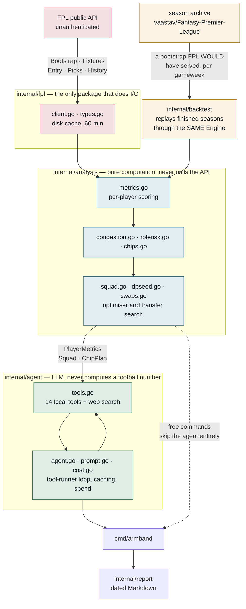
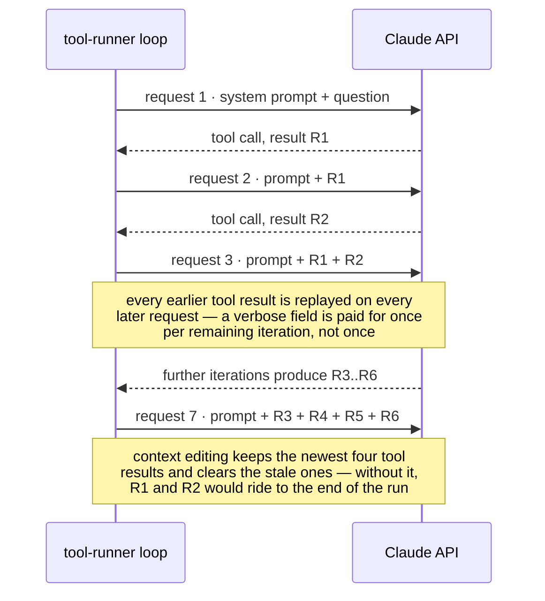
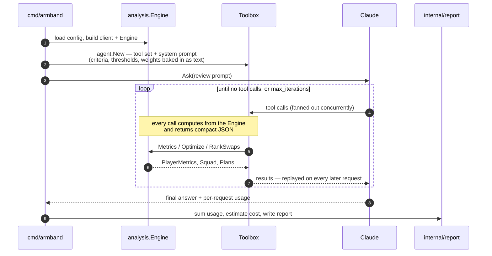
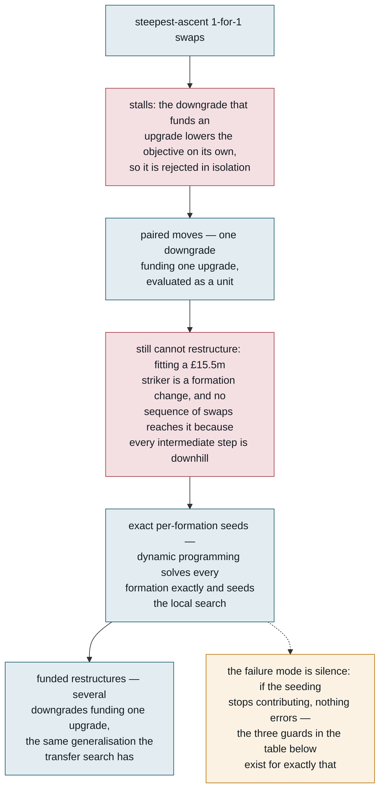

# Architecture

The whole system is one Go binary with two layers that never blur. Deterministic analysis
lives in `internal/analysis`; an LLM agent sits on top and reasons over it via tools. **The
analysis layer never calls the API; the agent layer never computes a football number.** That
separation is why `squad`, `fixtures`, `chips` and `congestion` cost nothing to run — they
never touch the agent at all.



The replay edge is the one worth tracing. `internal/backtest` builds an ordinary
`analysis.Engine` from a reconstructed historical bootstrap, so it measures **the shipped
model** rather than a copy of it — which is the only reason its verdicts transfer. See
[replay.md](replay.md).

The dotted edge is the point of the whole layout: `squad`, `fixtures`, `chips` and
`congestion` reach `cmd/armband` without passing through the agent, which is why they
cost nothing to run.

---

## Packages

Each core package below owns one concern; the eight supporting packages at the end each
exist because the FPL bootstrap does not carry something the model needs.

### `internal/fpl`

Thin client over the public, unauthenticated FPL API. No login required for anything used
here.

Responses are cached on disk (`cache_minutes`, default 60) so a single agent run making
many tool calls hits the network once per endpoint. `Bootstrap` and `Fixtures` are
additionally memoised per process.

`Client.get()`'s read order is overlay (a per-process writable cache) → an optional
read-only `snapshot_dir` → a live fetch → and, only if that live fetch fails, whatever is
on disk however old — the snapshot first, then the overlay. That last step is a
deliberate, narrow exception to this project's "no fallbacks" rule: `armband serve` calls
`Bootstrap`/`Fixtures` once at startup, so an unrecoverable error there is not "this read
degrades", it is the pod failing to start. Serving stale data is paged on rather than
silent — see `Client`'s doc comment for the reasoning and `cmd/armband/metrics.go` for
what a deployment scrapes.

`cmd/armband/instruments.go` builds that scrape on `github.com/prometheus/client_golang`
rather than hand-rolled exposition text, on its own `prometheus.Registry` — never the
global default, since `package main` is every subcommand of this binary, not just
`serve`. Beyond the three staleness series (`armband_serving_stale_data`,
`armband_stale_data_age_seconds`, `armband_live_fetch_failures_total`) it adds HTTP
dispatch counters and histograms (`armband_http_requests_total`,
`armband_http_request_duration_seconds`, both origin traffic only — see their HELP text
for why a deployment's own edge metrics will disagree with them), how long a request
waited on `squadServer.mu` (`armband_render_mutex_wait_seconds`), and two pipeline
timings: `armband_optimize_duration_seconds` for `Engine.Optimize` alone, wired through
the package-level `analysis.ObserveOptimize` hook so `internal/analysis` stays free of a
metrics dependency, and `armband_page_build_seconds` for `buildSquadPage`'s own stage
breakdown (the same stages `FPL_SERVE_TIMINGS` prints to stderr).

Three quirks of the API are absorbed here so nothing downstream has to know about them:

- The API rejects requests without a browser-like `User-Agent`.
- Numeric fields arrive inconsistently — `"expected_goals": "25.50"` as a string, others as
  bare numbers. The `Num` type absorbs both.
- **Between seasons, aggregate stats hold the *previous* season's totals** until the first
  gameweek completes. This is correct for GW1 planning but every consumer must know it.

`FreeTransfers` reconstructs the available transfer count from history (1 per gameweek,
banked to 5, minus spent, skipping chip weeks). FPL does not publish this, so it is a close
reconstruction rather than an authority — the tool says so in its output.

### `internal/analysis`

Pure computation, no I/O. `Engine` holds a bootstrap, fixture list and the four config
structs, and derives everything on demand.

`NewEngineFull(boot, fixtures, weights, congestion, roleRisk)` is the full constructor;
`NewEngine` and `NewEngineWithCongestion` are conveniences that fill in defaults.

State built once at construction: the per-team upcoming fixture index, and `congestionState`
(international breaks, rest days, European gating, post-cup gameweeks).

See [model.md](model.md) for what the numbers mean.

### `internal/agent`

Wraps the Anthropic Go SDK's `BetaToolRunner`. **Fourteen** local tools plus server-side web
search: gameweek status, player search, single-player lookup, team fixtures, squad optimisation,
my team, transfer suggestions, chip planning, squad status, research targets, two writers that
record a player's status and a price forecast, and two more that read and update competition
participation. `Toolbox.Tools()` is the single registry — a tool that is written and not
registered there is invisible to the agent.

The SDK's tool runner has three behaviours that are not obvious from its documentation, and
each has caused a real failure here:

1. **The runner overwrites `params.Tools`** with the local tool set (`betatoolrunner.go:64`).
   Server tools must be appended to `runner.Params.Tools` *after* construction. `NextMessage`
   re-reads `Params` each iteration, so this works.

2. **The runner does not resume `pause_turn`.** A server-side tool loop that hits its
   iteration cap returns `stop_reason: "pause_turn"`, and the runner exits because no local
   tool produced a result — surfacing as a silently truncated answer. `Ask` detects this and
   restarts with the paused turn appended, up to four times.

3. **The runner executes tools concurrently.** It fans a turn's tool calls out through an
   errgroup, so two player searches in one turn drive the engine over the whole player pool
   simultaneously. Two consequences, both of which have caused real failures. Anything the
   engine builds lazily must be `sync.Once`-guarded and anything mutable lock-guarded — a map
   built under a plain nil check is a *fatal* concurrent-map-write, not a recoverable panic.
   And every config write must go through the one guarded helper, because each config-writing
   tool is a read-modify-write of the whole file: unguarded, an agent recording several findings
   in one turn loses all but the last, silently and with no error anywhere.

**Prompt caching** uses two breakpoints: one on the system prompt (which also covers tool
definitions, since tools render first), and a top-level one that auto-places on the
conversation tail. Both are stable across runs, so a healthy loop shows a cache hit rate
above 0.8.

**Context editing** (`clear_tool_uses_20250919`, keeping 4) clears stale tool results. Without
it, the full JSON of every earlier search is replayed on every subsequent request.

The shape of that cost is counter-intuitive enough to be worth drawing: watch what each
successive request carries, and where the clearing finally steps in.



`cost.go` accumulates usage across iterations — usage is reported *per request*, so a run
total is the sum, not the final message. Pricing is date-aware to handle promotional rates
that expire.

### `internal/config`

`config.json` load/save with per-field backfill, so a partial or outdated file stays valid.

### `internal/report`

Markdown reports to `reports/`, dated, never clobbering an earlier file from the same day.

### `internal/viewmodel`

The contract between the model and every client that draws it: plain Go structs with JSON
tags and nothing about transport in them.

It exists because there are three hosts for one application — `armband serve` over HTTP, a
Wails desktop build binding to Go directly, and a website. If the shape a client reads were
defined inside an HTTP handler, the desktop build would have to restate it, and one shape
with two statements is the failure this codebase pays for most often.

It computes nothing. Every figure is copied off `analysis.Squad`, `analysis.PlayerMetrics`,
`present.Watchlist` or config — the same rule `internal/present` states for itself, and what
lets the client stay dumb: a number the client needs and does not have gets added here
rather than worked out there.

`Build` returns an error on one condition only, a non-finite float. That is not defensive:
`encoding/json` refuses `NaN` and `+Inf` outright, so one bad value fails the whole document
and names neither the player nor the field.

### `internal/webui`

The client application — one document per page, the design system and self-hosted font subsets —
compiled into the binary with `//go:embed`.

Embedded rather than read from disk because a Wails build has no directory to read from and
no network to fetch from, so anything needed at first paint has to be inside the binary. It
also means `serve` cannot half-work: a missing stylesheet is a build failure rather than a
blank page in front of a reader.

`assets/pages` holds the documents, each reachable at exactly one URL; `assets/static` holds
everything they reference, under `/assets/`. The split is what stops the application having
two front doors.

Current pages: `app.html` (the planner), `landing.html` (the marketing document), `team.html`
(the house team at `/armband-team`, ungated for the same reason the landing page is — proof of
use is a marketing surface) and `wildcard.html` (the wildcard/free-hit planner at `/wildcard`,
paired with `team.html` rather than folded into the interactive builder). This list grows;
whatever it names next inherits the split below without needing to change it. ⚠️ **The
invariant is the policy split, not the page count:** the split is `landing` against everything
else, so every non-landing page — `team.html`, `wildcard.html`, whatever comes after — takes the
application's stricter directives, not the landing page's. See `connectSrcFor`'s doc comment in
`cmd/armband/webroutes.go` for how that split stays a two-way switch as pages are added, rather
than a table keyed on how many there are.

They carry two different Content-Security-Policy directives, on purpose:
the application (served at `/`, the front door) renders FPL's prose and player names by
innerHTML, so its `connect-src` stays `'self'` under any configuration, while the landing
page (`/about`) may widen. `ARMBAND_GA4_ID`, if set, widens the landing page's policy
alone — never the application's — to load GA4 from `analytics.js`;
`cmd/armband/webroutes.go`'s `connectSrcFor`/`scriptSrcFor` enforce the split, each
refusing to widen for any page but "landing". `/app` still resolves — a 302 to `/`, kept
for bookmarks and shared links from before the application became the root, and not a 301
because whether `/app` should exist at all is still an open, reversible question.

### `e2e/`

A Playwright suite, in Node rather than Go, driving a real `armband serve` in a real headless
browser — the first Node/Playwright toolchain in this otherwise Go-only repository, added
deliberately rather than extending `internal/browsertest` (the package `internal/webui`'s own
layout goldens use), because the value here is real interaction — clicks, drags, keyboard
dismissal, a session-cookie round trip — that a `--dump-dom`/`--screenshot` harness cannot drive
at all.

**It asserts geometry and behaviour, never pixels.** `internal/webui/visual_test.go`'s own
`TestLayout` records the ruling this suite inherits rather than re-litigates: the committed
layout goldens are machine-dependent (a worst channel delta of 2/255 between this machine and a
CI runner) and are a **local-only** check by decision, not a pending fix. What must not regress
silently is asserted over the rendered markup and its bounding boxes instead, which is exactly
what this suite does with a live browser rather than `--dump-dom`'s captured tree — `toHaveScreenshot`
and a committed PNG directory are forbidden here; a screenshot, trace and video are captured only
as **failure artefacts**.

**Determinism comes from a committed live capture, not a stub server.** `e2e/scripts/serve-fixture.mjs`
primes `internal/fpl.Client`'s on-disk cache straight from `data/captures/<LIVE_CAPTURE>` — the
same GW1 capture `internal/analysis`'s own deterministic test engines are built from (see
`internal/capture.LiveCapture`'s doc comment for why GW1 specifically: no prior-season blend, no
recency index, so the engine it builds is what production actually serves at this point in a
season). `e2e/scripts/live-capture.js` names the same directory a second time, because a Node
harness cannot import a Go constant; `internal/capture/analysisfixture_test.go`'s
`TestEveryFixtureNamesTheLiveCapture` pins every spelling against `LiveCapture` itself, extended
to this file rather than given a second, separate scan. The server then runs with its
`HTTP_PROXY`/`HTTPS_PROXY` pointed at a closed loopback port, so a cache-priming gap fails loud
(a live fetch dying against a dead proxy) instead of quietly serving live data under a suite whose
whole premise is a frozen capture.

**What is and is not reachable follows from that one capture.** Importing a team, the transfer
planner, and any past-gameweek result are all unreachable at GW1 — `cmd/armband/importwindow.go`'s
own gate requires the next gameweek's id to be at least 2, and this capture's `is_next` names
gameweek 1. The suite asserts the *closed* state instead (the import card hidden) rather than
skipping those areas silently; `e2e/README.md` names each gap and why.

**Division of labour with `internal/webui`.** That package's suite (goldens, contrast, the type
floor, inline-script and external-host bans — all pinned over markup/CSS, none needing a running
server) is the one that runs in CI on every push and stays fast. This suite drives interaction
sequences — Optimise/Reset round trips, the player sheet, the chip menu, the gameweek rail,
client-side market filters — that are structurally out of that package's reach, and it runs as its
own CI job (`.github/workflows/ci.yml`'s `e2e` job) so a browser download and a live server never
sit ahead of the Go gate. Locally it is opt-in (`cd e2e && npm test`), never wired into
`go test ./...`.

### The supporting packages

Eight more packages sit outside the model. Seven fill gaps in what the FPL API publishes;
the eighth is not about football at all. None is on the path of an ordinary scoring call, so
a reader tracing `Score` can safely ignore them; each of the seven matters when the question
is where a number *came from*.

| package | what it is for |
|---|---|
| `internal/backtest` | replays finished seasons through the model and scores what the policy would have earned. Every scoring claim in this project is validated here — see [replay.md](replay.md) |
| `internal/recent` | per-player match history from `element-summary/{id}`, so minutes can be recency-weighted. The bootstrap publishes season totals only, and a player who lost his place six weeks ago still reads as an ever-present in those. `Engine.Recent` is **nil by default**, so a failed fetch degrades to flat season totals rather than breaking |
| `internal/priors` | last season's totals, cached before FPL overwrites them at GW1. Multi-season priors come from `element-summary`'s `history_past`, not from the CSV mirror, which publishes only the current season |
| `internal/capture` | archives the live payload, dated and immutable, so point-in-time questions become answerable later. Never read by the live path — it is not a cache. Also owns the **reader** over that store, which serves live and backfilled captures alike |
| `internal/wayback` | the Internet Archive's CDX index and raw-payload endpoints. The only other package that does network I/O, deliberately separate from `internal/fpl` because its results are an immutable record rather than a cache — see [backfill.md](backfill.md) |
| `internal/backfill` | recovers the same point-in-time team news for **finished** seasons from archived crawls of `bootstrap-static`. Selection is the last crawl strictly before each deadline, never the nearest, and nothing is stored that cannot prove from its own payload that it predates its deadline |
| `internal/snapshot` | renders the dated model-and-harness accuracy record. It **reads** inference and never computes it; `TestThisPackageDoesNotComputeInference` fails if it grows a copy |
| `internal/signup` | the addresses the site's gate forms collect, in Postgres — the landing page's own ask plus the two in-app asks on the News and Pitch tabs, all three sharing one endpoint. The only package that **collects** personal data rather than archiving what FPL publishes, and the only one that talks to a database. It has **no read side** — nothing in the application ever lists what it has collected, because nothing has a reason to. No store is opened unless `ARMBAND_SIGNUPS_DSN` is set, which is a deployment setting rather than a local one; with none configured `/gate` **refuses with a 503** rather than accepting and discarding, so a deployment that lost its database URL cannot tell readers they signed up. Address validation runs either way. The landing page posts to the live site from wherever it is served, so one address lands in one list |

---

## Data flow for one `review`

The sequence below is a single `armband review` from the command line to the written
report. The loop in the middle is where the money goes, so the two notes after the diagram
are worth reading before touching anything inside it.



Two things in that loop cost real money and are easy to miss. Tool results are **replayed
on every subsequent request**, so a verbose field is paid for once per remaining
iteration rather than once — which is why `playerRow` is terse and full detail sits
behind single-player lookups. And the fan-out at step 4 is genuinely concurrent, which is
where the `sync.Once` and config-write rules above come from.

---

## Extending it

The three common extensions each have a fixed shape. Following it is less about style than
about not being invisible: a factor the agent cannot see, or a tool that is not registered,
fails silently rather than loudly.

**A new scoring factor** — add the field to `PlayerMetrics`, compute it in `Engine.Metrics`,
multiply it into `Score`, and expose it on `playerRow` in `tools.go` so the agent can see it.
Add the knob to the relevant config struct with a backfill in `config.Load`.

Then **give it an escape hatch and measure it**. A scoring change that cannot be switched off
cannot be compared against the behaviour it replaced, and the standing convention here is a
package-level `FPL_NO_<thing>` var beside the term. Judge it on `HOLD` **at the default grid,
36 cells over six seasons**, rather than on a season total — [replay.md](replay.md) covers
both, and the failure to expect is not a wrong answer but a plausible number that measured
nothing.

**A new tool** — write a `func (t *Toolbox) name() (anthropic.BetaTool, error)` using
`toolrunner.NewBetaToolFromJSONSchema`, and register it in `Toolbox.Tools()`. Keep output
compact: every tool result is replayed on every subsequent API call, so verbose fields are
paid for repeatedly.

**A new command** — add a case in `run()` and a line in `usage`. If it needs no LLM, keep it
out of `cmdAgent` so it stays free.

---

## Testing

```bash
go test ./...
```

Tests hit the live FPL API and skip cleanly when it is unreachable. They assert **invariants
and regressions**, not exact values, since the underlying data changes weekly.

`internal/backtest` also holds around a hundred measurement diagnostics, all gated behind `DIAG=1`
and skipped by the line above. They replay whole seasons and take minutes, so they are run
deliberately rather than as part of the gate — see [replay.md](replay.md).

The regression tests each encode a bug that was actually shipped. The table below is **a
representative five, not the list** — the full inventory of bugs this codebase has shipped
and now guards is the "Things that have already bitten" section of [AGENTS.md](../AGENTS.md),
and anything added there should arrive with a test.

| Test | Guards against |
|---|---|
| `TestMinutesReliabilityTracksExpectedMinutes` | Using `starts_per_90`, which rates a 26-min/week player identically to an ever-present |
| `TestOptimizeRespectsExpectedMinutesFloor` | Rotation risks reaching the starting XI |
| `TestEuropeanPenaltyIsDateGated` | Penalising Champions League clubs before European football starts |
| `TestOptimizeProducesLegalSquad` | Budget, quota and club-limit violations |
| `TestIntroPricingIsDateAware` | Promotional rates silently under-reporting after expiry |

### The optimiser's three guards, and why they exist

The squad search is a local search seeded with exact per-formation solutions — see "Single swaps
are not enough" under Squad optimisation in [model.md](model.md). Its failure
mode is **silence**: if the seeding stops contributing, nothing errors and no legality check
fails — the seeds are simply never the best answer any more, and the search quietly returns
worse squads. Three tests exist for exactly that, plus the supporting cases in
`dpseed_test.go` and `searchquality_test.go`. Each row below is one way that silence has
happened, or could.

First the ladder itself, compressed from [model.md](model.md)'s account — read top to bottom:
each red box is a failure the layer *above* it provably could not escape, which is why the
layer beneath it exists.



| Test | What it guarantees |
|---|---|
| `TestOptimizerIsNeverWorseThanAnExactSeed` | The standing guarantee. A local search has no optimality proof of its own, but it must never return *less* than the exact per-formation solutions it was handed. Fails if the seeding stops being used at all. |
| `TestNoPremiumSquadBeatsTheOptimum` | Locks each expensive player in turn, re-solves, and checks that none of those constrained squads beats the unconstrained answer. If one does, the free search failed to reach a squad it should have found. |
| `TestSeedBudgetLeavesRoomForThePremiums` | Pins arithmetic that broke once: the seed's bench reservation must set aside the *cheapest* players who could fill those slots, not the dearest. Reserving from the wrong end cut roughly £20m off the eleven's budget and made every seed too poor to buy a premium — with nothing failing. |

---

## Known limitations

These are the places where the system knows less than it appears to. None is a bug; each is
a boundary a user should know about before trusting a number.

- **Free transfers are reconstructed**, not read. Verify against the site if a decision turns
  on the exact number.
- **The model cannot distinguish injury absence from being dropped.** Both look like low
  expected minutes. Check minutes-per-start.
- **The hand-maintained season lists must be re-derived every summer** — European and domestic
  cup campaigns (each club's competitions, with a start date and an optional end date), the
  clubs that changed manager, and the post-tournament rest list. None is in the FPL API, and
  they fail *silently*: a stale list simply applies to the wrong clubs, or stops applying at
  all. `armband congestion` reports what is set and how old it is.
- **All eight congestion penalties ship disabled at 1.00**, so that block is reported to the
  agent and moves no score at all — and three of the four hand-maintained lists are therefore
  display-only: a stale one can mis-inform a human but cannot mis-score a player.
  `TestTheShippedCongestionBlockIsInert` makes re-enabling one deliberate. The live exception
  is `DefaultRestPlayers`: `blendFor` applies `restFactor` through `rest_minutes_factor`, a
  `Weights` field rather than a congestion penalty, at GW1 and GW2 only — it multiplies
  expected minutes, not the score, but a wrong name there still mis-scores a player. Two
  unrelated mechanisms answer to "rest"; only the congestion pair is inert. Section 5 of
  [model.md](model.md) says what each penalty was measured at and why it is off, and
  [AGENTS.md](../AGENTS.md)'s "Season maintenance" section carries the maintenance rule.
- The agent has web search, so it can read team news — but it cannot see your reasoning or
  anything you have not told it. `criteria` is how you fix that — in `team.json`, loaded with
  `-team`, since a manager's own preferences are not something a deployed server should serve.

## `Engine.Recent`: what the live path costs

This section is operational rather than research: it says what the recency hook costs to run
live, not whether it is worth having. The evidence that it is worth having sits outside this
repository.

**`Engine.Recent` needs per-gameweek history, which the bootstrap does not carry.** It is nil
by default and the model falls back to flat season totals — so a failed fetch degrades rather
than breaks. The replay feeds it from the archive; live, `internal/recent` fetches
`element-summary/{id}` at concurrency 6.

Measured cost: 0.25s per request sequentially, 24 requests in 0.94s at concurrency 6, so
roughly **half a minute once per cache window**, not once per command. Only players with
minutes are fetched — a player who has not played has no history to weight and the flat
fallback already reports him correctly — which is 400-500 requests rather than 700. Responses
are 13KB pre-season rising to ~32KB by May and the client caches raw bodies, so expect the
cache directory to roughly double. **None of it reaches the LLM**: this changes a number the
tools already report, not the shape of what they report.

The olbauday CSV mirror would be one request instead of 500, and was rejected deliberately: it
is a single-maintainer repo and the previous community archive stopped updating mid-life.
Stale minutes are *worse than none*, because they would report a dropped player as still
starting — exactly the failure this exists to fix. An immutable finished season (priors) is a
different risk from a live weekly signal.
