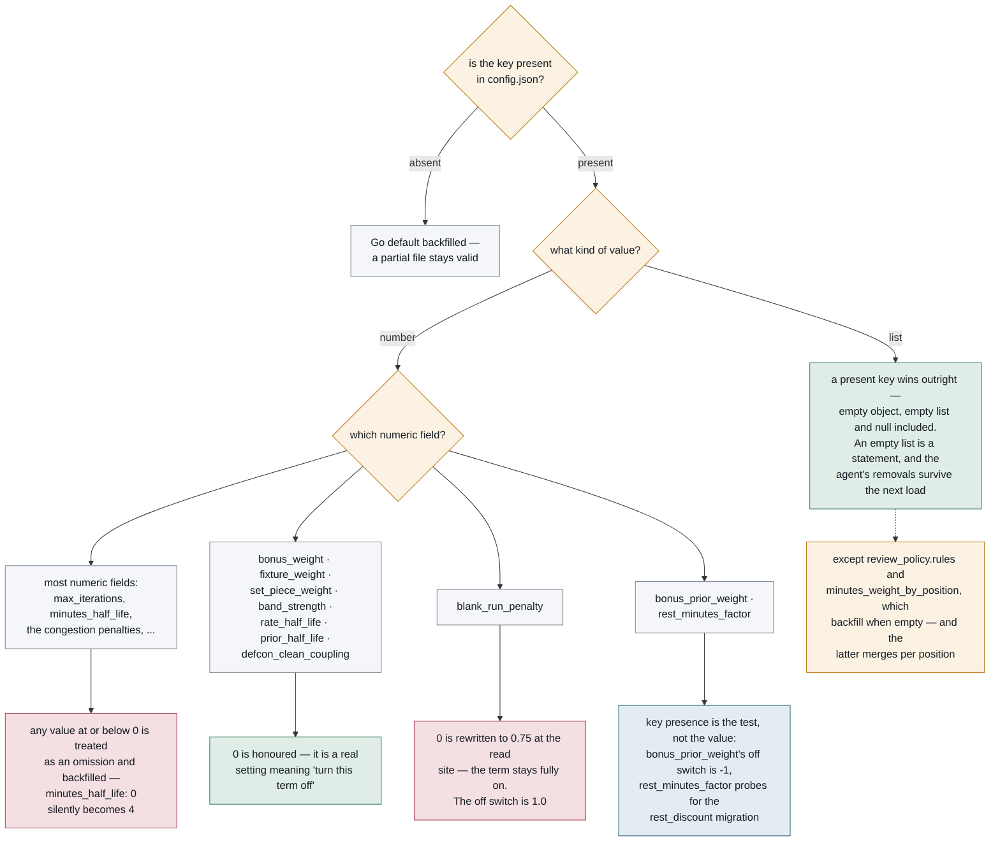
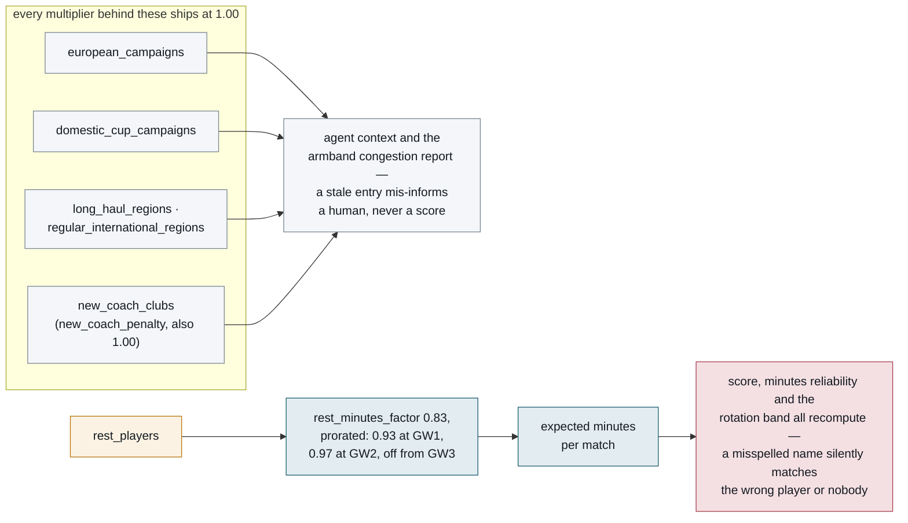
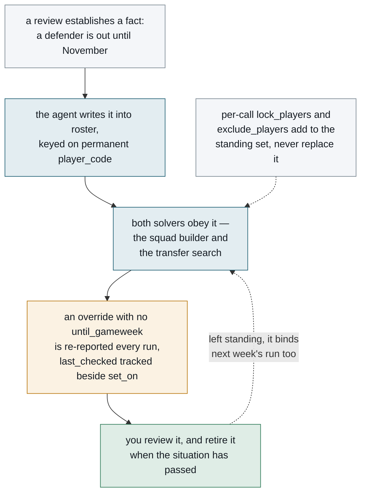

# Configuration reference

Everything lives in `config.json`, created with defaults on first run. Delete it and run any
command to regenerate. A field you omit is backfilled from defaults, so a partial file is valid —
useful when a new field is added and your existing config predates it.

That backfilling has consequences worth understanding before you edit anything, because
"absent", "zero" and "empty" are three different statements and the file does not treat them
alike. The rules below are the ones that catch people out.

## How the file is read

**For most numeric fields, an explicit `0` is treated as an omission.** `config.Load` backfills
anything non-positive for `max_iterations`, `fixture_horizon`, `minutes_half_life`,
`bench_weight`, `minutes_weight`, `blend_minutes_k`, `blend_rate_k`, `rest_minutes_factor`,
`cache_minutes`, all eight congestion penalties, all four `role_risk` numbers and six of
`review_policy`. So writing `"minutes_half_life": 0` does **not** select the flat season
average — it silently becomes 4.

Zero *is* honoured for `bonus_weight`, `fixture_weight`, `set_piece_weight`, `band_strength`,
`rate_half_life`, `prior_half_life` and `defcon_clean_coupling`, because for those it is a real
setting meaning "turn this term off".

**`blank_run_penalty` looks like it belongs to that second group and does not.** It has no
backfill in `config.Load`; instead `blankRunFactor` resolves "unset" at the *read* site, and a
configured value of `0` is silently rewritten to 0.75, the live default. So writing
`"blank_run_penalty": 0` does not disable the term — it leaves it fully on. **`1.0` is the off
switch**, because the term multiplies expected minutes and zero would erase them. It is also the
only weight with two defaults for one quantity, which is a shape this project has been bitten by
before, so `TestBlankRunPenaltyHasOneDefault` pins both halves.

Two fields need a genuine third state and get one by probing for **key presence** rather than
value: `bonus_prior_weight`, so that an absent key does not read as a deliberate 0 — which is
why its off switch is `-1` — and `rest_minutes_factor`, for the rename migration described under
post-tournament rest below.

**List-valued fields follow a different rule again.** An absent key keeps the Go default; a
present key wins outright — `{}`, `[]` and `null` included, since `encoding/json` zeroes a map
or a slice on `null`. So an empty list is a *statement* ("nobody is in Europe this season"), and
only omitting the key means "I did not say". Replacement rather than merging is what lets the
agent's own removals stick: when `SetCompetitionWindows` drops a knocked-out club, the next
`Load` keeps it dropped. `TestRemovingAClubSurvivesASaveLoadCycle` pins the round trip.

Two list-valued fields backfill anyway: `review_policy.rules` and `minutes_weight_by_position`,
because for them an empty list is a fallback trigger rather than a statement.
`minutes_weight_by_position` also *merges*, so naming one position leaves the other three at
their defaults.

The consequence to hold on to: **once a list is in your file, editing only the Go default has no
effect.** Edit both, or delete the key. All eight of the lists that exist twice — as Go defaults
*and* as copies in `config.json` — are in the shipped file, so their Go defaults are already
inert. `TestTheShippedConfigsHandMaintainedListsMatchTheGoDefaults` is what stops the two copies
drifting.

The whole procedure, traced key by key. The amber nodes are the questions `config.Load`
effectively asks; the two red ones are the answers that silently do the opposite of what
was typed.



---

## Top level

Identity, cost and housekeeping. `entry_id` is the one field worth setting immediately;
everything else has a workable default.

| Field | Default | Meaning |
|---|---|---|
| `entry_id` | `0` | Your FPL manager id. Read it from your points page URL: `fantasy.premierleague.com/entry/`**`1234567`**`/event/1`. Zero means the agent cannot see your squad — it can still build one from scratch. |
| `hypothetical_budget_m` | `0` | The money the squad builder plans with, in millions, **when `entry_id` is 0**. Zero means FPL's £100.0m opening allowance. Ignored entirely once there is a real squad to price. |
| `model` | `claude-opus-5` | Model to reason with. `claude-sonnet-5` is materially cheaper. |
| `effort` | `high` | `low` \| `medium` \| `high` \| `xhigh` \| `max`. The largest single cost lever. |
| `max_iterations` | `25` | Ceiling on tool-calling rounds. A runaway guard, **not** a typical-case setting — the loop ends when the model stops calling tools. |
| `report_dir` | `reports` | Where Markdown reports are written. |
| `cache_dir` | `.cache/fpl` | FPL API response cache. |
| `cache_minutes` | `60` | Cache lifetime. Use `-refresh` to force a refetch before a deadline. |
| `roster` | absent | Standing player locks, exclusions and minutes corrections. **Written by the agent, not by you** — see below. |

## `criteria`

Free-text rules passed **verbatim** to the agent. This is the main personalisation surface, and
eight are shipped by default — covering expected minutes as a filter, underlying numbers over
raw points, fixture runs, set-piece duty, xG overperformance, new signings and post-tournament
rest. Replacing the list replaces all eight; add to it rather than overwriting if you want to
keep them.

```json
"criteria": [
  "Never own more than one Spurs player.",
  "I'd rather take a -4 than field a player who isn't nailed.",
  "Don't recommend anyone from a team playing in Europe midweek."
]
```

The agent is told to follow these and to say so explicitly when the data argues against one.

## `weights` — the scoring model

These are the knobs on the deterministic scoring model. [model.md](model.md) explains each
mechanism in full; this table says what to type and what the default buys you. Several fields
ship at zero because the honest measurement said "off" — the table notes each one.

| Field | Default | Meaning |
|---|---|---|
| `fixture_horizon` | `5` | Gameweeks ahead to weigh. |
| `fixture_weight` | `0.65` | 0 ignores fixtures, 1 is fully fixture-adjusted. |
| `set_piece_weight` | `0.0` | **Off, deliberately** — scales a penalty/corner/free-kick bonus that measured as counting the same output twice. See below. |
| `bench_weight` | `0.10` | How much bench players count when optimising a 15-man squad, as a fraction of a starter. Lower buys cheaper fodder. |
| `minutes_weight` | `1.25` | Convexity of the rotation penalty. 1.0 is neutral; 1.6+ is ruthless about nailed-ness. |
| `minutes_weight_by_position` | `{GKP:1, DEF:1, MID:0.75, FWD:1}` | Per-position severity as a fraction of `minutes_weight`'s bite. See [model.md](model.md#per-position-severity). |
| `minutes_half_life` | `4` | How fast recent gameweeks outweigh older ones when estimating minutes, in gameweeks. A half-life of 4 gives a match four weeks ago half the weight of last week's. `0` uses the flat season average. Applies to **minutes only** — see [model.md](model.md#minutes-need-recency-rates-do-not). |
| `bonus_weight` | `1.5` | Weight on a player's own bonus-points rate once that rate is this season's evidence. |
| `bonus_prior_weight` | `0.5` | Weight on the same rate while it is still entirely *last* season's. The model slides between the two as he plays — see [model.md](model.md#4d-the-bonus-term-is-a-schedule-not-a-constant). Set it to `-1` to disable the slide and use `bonus_weight` throughout. |
| `blend_rate_k` | `8` | How stubbornly last season's per-90 rates are held onto, measured in 90 minutes played. At 8, a player with 8 full matches this season is believed half on this season and half on last. |
| `blend_minutes_k` | `5` | The same idea for minutes per match, counted in matches played. |
| `defcon_clean_coupling` | `0.3` | Links a defender's own defensive workload to his clean-sheet chance: a defender clearing the ball ten times a match is defending a side under pressure, so he is *less* likely to keep a clean sheet. `0` unlinks them. See [model.md](model.md#4e-defensive-work-and-the-clean-sheet-are-linked). |
| `blank_run_penalty` | `0.75` | Discounts expected minutes through a run of one to three consecutive blanks, where the recency weighting has not yet caught up on a player who has just been dropped or hurt. `1.0` disables it. See [model.md](model.md#absence-versus-rotation). |
| `tournament_absences` | AFCON 2025 | Mid-season tournaments that overlapped the season the aggregates came from, so those matches leave the *denominator* rather than counting as rotation risk. **Pre-season only** — it switches itself off once GW1 completes. Re-derive every summer. |
| `rate_half_life` | `0` | Off. Recency weighting on per-90 *rates* rather than minutes. Measured as a better predictor and a worse policy, so it ships disabled. |
| `prior_half_life` | `0` | Off. Blends seasons *before* last one into it, for players whose last season was an injury artefact. The mechanism is unit-tested; the benefit is not measurable on the replay archive, so it is off by default. |
| `band_strength` | `0` | Off. An experimental re-rating of the three best and three worst attacks and defences. Measured as no better than FPL's own difficulty ratings. |

**`set_piece_weight` ships at 0, and putting it back to 1.0 re-introduces a measured bug.**
FPL's expected-goals figure already contains penalties, and its expected-assists figure already
contains corners and free kicks, so a separate set-piece bonus adds output the base rate has
already counted. For a first-choice penalty taker, the whole of the over-prediction was the
bonus itself. Set-piece duty is still *reported* on every player, so the agent can reason about
a newly appointed taker; it just does not move the number.
`TestSetPieceBonusDoubleCountsPenalties` fails if the weight is restored. Full working in
[model.md](model.md#2-set-piece-duty--reported-not-scored).

There is no `minutes_floor` field. One existed, described as a sample-size guard on per-90
rates, and no scoring path ever read it — so it was removed rather than renamed. Both jobs it
claimed to do are done elsewhere, and were measured there: small samples are handled by
`blend_rate_k` and by shrinking a priorless player's rates toward his position's league-wide
rates, and rotation risk by minutes reliability. A knob that documents behaviour the model does
not have is worse than no knob, because it becomes the stated reason for trusting a number.

### Post-tournament rest

Players back late from a summer tournament are eased in over the opening gameweeks, and the FPL
API says nothing about who was at one. These four fields carry the discount and the
hand-maintained list of who it applies to.

| Field | Default | Meaning |
|---|---|---|
| `rest_players` | 2026 World Cup semi-finalists | Names or ids to discount after a summer tournament. Re-derive every summer — see below. |
| `rest_regions` | `[]` | Nationality codes — run `armband nations`. |
| `rest_minutes_factor` | `0.83` | Per-gameweek multiplier on a flagged player's expected **minutes**, not on his score. |
| `rest_gameweeks` | `2` | How many opening gameweeks the discount covers. |

The shipped list is hand-derived from the four 2026 World Cup semi-final teamsheets, and the
test for inclusion is time on the pitch, not squad membership: a player qualifies if he was *on
the pitch for the majority of his semi-final* — started, or on before half-time. That rule is
the doc comment on `DefaultRestPlayers` in `internal/analysis/metrics.go` (find it by the
identifier; `config.json` carries a copy of the list with no room for a comment). Only **17 of
the 36** Premier League players across the four semi-finalists clear it, and unused substitutes
are excluded deliberately — Saka, Watkins, Eze, Raya, Zubimendi and Pino had a long summer in a
hotel rather than a punishing one. So the list is supposed to look incomplete, and auditing it
against published squads will "find" names missing and be wrong. See
[model.md](model.md#post-tournament-rest) for the threshold and why it is not fragile.

Names are full names **exactly as the FPL API spells them, accents included** — `"Marcos Senesi
Barón"`, not `"Marcos Senesi"`. Matching is exact-then-fuzzy and surnames collide, with two
Martínezes on this list alone, so a misspelling silently matches the wrong player or nobody at
all. `TestDefaultRestPlayersAllResolveToDistinctPlayers` fails if any entry stops resolving.

`rest_regions` is deliberately empty. Flagging a nationality would discount every English,
Spanish, French and Argentine player in the game, most of whom spent the summer resting. Use it
only for a tournament where a nation's entire Premier League contingent travelled.

**Keep `rest_gameweeks` short.** Players get three weeks of mandatory rest after a tournament,
not three weeks of absence. The 2026 final was 19 July, so the flagged players were back in
training around 9 August with twelve days of pre-season before the GW1 deadline on 21 August.

**The field the discount multiplies is minutes, and that is the whole point of its name.** A
player back late from a tournament is eased in — he plays fewer minutes — and his output *while
on the pitch* does not reliably drop. So `rest_minutes_factor` scales his expected minutes per
match and lets everything downstream recompute from that: his score, his minutes-reliability
rating and the rotation band the agent reads all move together and all agree. Multiplying the
score directly would get this wrong — a rested player would still report full minutes and still
read as "nailed" while quietly scoring less. A tired player plays less, not worse.

The discount is **per gameweek** and is prorated across the horizon — see
[model.md](model.md#post-tournament-rest). At the defaults, a flagged player's minutes are
scaled by 0.93 for a horizon starting at GW1, 0.97 at GW2 and not at all from GW3, rather than a
flat 0.83 everywhere.

**An old config file still works.** The field was once called `rest_discount` and multiplied the
score. On load, a file that has `rest_discount` and no `rest_minutes_factor` is migrated: the
old value is converted to the minutes channel so the effect on the score stays what that file
was already getting, rather than jumping to the new default. The migration checks whether the
*key is present* rather than whether it holds a particular value — an unwritten
`rest_minutes_factor` already reads 0.83 from the defaults, so a value check would never fire.
`TestLegacyRestDiscountMigrates` pins it.

## `congestion`

Fixture congestion — European midweeks, cup ties, international travel — is described by a set
of competition windows and nationality lists that the FPL API does not carry, so they are
hand-maintained and dated to a season. The note after the table explains why every penalty in
this block ships neutral, and what that means for maintaining the lists.

Remember the list-valued rule from the top of this page: the two campaign maps **replace** on
load when the key is present, so a re-derivation done only in Go has no effect while your file
carries the key — and `{}` means "nobody is in Europe".

| Field | Default | Meaning |
|---|---|---|
| `european_campaigns` | 2026/27 contingent | Club → list of windows: `competition`, `start_date`, optional `end_date`, `match_dates`, `note`. Re-derive every season. |
| `domestic_cup_campaigns` | 2026/27 League Cup | Same shape, same override rule. European clubs enter round three, everyone else round two. |
| `status_last_verified` | — | Set automatically when the agent corrects status. Anything over a week old is flagged stale. |
| `long_haul_regions` | Go: `[]`, **shipped file: Brazil, Argentina** | Nationality codes facing intercontinental travel. `config.Load` has **no backfill** for this field, so whatever `config.json` says wins outright. |
| `regular_international_regions` | Go: `[]`, **shipped file: five codes** | Codes whose players are near-certain call-ups. Same no-backfill caveat. |
| `domestic_cup_penalty` | `1.0` | Multiplier for a gameweek with a cup tie. **Unmeasured**, and neutral for that reason. Early rounds are largely reserve sides, so a cup tie might protect league starters rather than tire them; the sign was never clear. |
| `ucl_penalty` | `1.00` | Off — Champions League club. |
| `uel_penalty` | `1.00` | Off — Europa League club. |
| `uecl_penalty` | `1.00` | Off — Conference League club. |
| `short_rest_penalty` | `1.00` | Off — under 4 days between league fixtures. |
| `very_short_rest_penalty` | `1.00` | Off — under 3 days. |
| `post_break_penalty` | `1.00` | Off — regular international returning from a break. |
| `long_haul_penalty` | `1.0` | Intercontinental traveller returning from a break. **Unmeasured**, and neutral for that reason. Note that `config.json` sets `long_haul_regions` and there is no backfill for it, so a value below 1.0 here becomes live immediately — and applies only to the listed nationalities, though the field describes intercontinental travel generally. |

> **All eight of these penalties ship at 1.00 — disabled — and are kept as levers rather than
> active terms, so the block changes no score at all.** Every one of them multiplies a player's
> *score*, and the honest finding in each case was one of two things. Five were measured as having
> no effect on the channel they are applied to — the three European penalties and both short-rest
> penalties. The other three, covering domestic cups, long-haul travel and the week after an
> international break, are neutral on the weaker but
> sufficient argument that an unmeasured multiplier which moves a score is not neutral, and 1.00
> is. (§5 of [model.md](model.md) reports the post-break week as showing nothing on either channel,
> which reads as a measurement instead; the shipped value is 1.00 either way, so do not cite that
> one as measured on the strength of either page.)
> The clearest measured example: under four days' rest really does cost about 4% of a
> player's minutes, but the players picked for a midweek round are the ones the manager trusts,
> so their points per 90 go *up* — charging a score penalty against that is wrong in sign, not
> merely wrong in size. Setting any of the eight back below 1.0 fails
> `TestTheShippedCongestionBlockIsInert`, so it has to be deliberate.
>
> The consequence for maintenance is worth knowing: the four hand-maintained lists *in this block*
> — the two campaign maps and the two nationality lists — are **display-only**. They still need
> refreshing, because the agent reads them and `armband congestion` reports them, but a stale entry
> can no longer mis-score a player — only mis-inform a human. Counting across the whole config
> rather than this block, the season lists are the two campaign maps, `new_coach_clubs` and
> `rest_players`, and there it is three of the four that are display-only: `rest_players` is live.

The two fates of a stale entry, drawn end to end: the lists behind a 1.00 multiplier stop at
a report, while `rest_players` reaches expected minutes and everything downstream of them.
Note that `new_coach_clubs` is a `role_risk` field rather than a congestion one; it appears here
because it is display-only for the same reason, through its own penalty at 1.00.



International breaks and turnarounds are **derived from the calendar** and need no config.
Competition participation and nationalities are **not in the API**; the shipped defaults cover
2026/27, and the agent refreshes them weekly during `review`.

An empty `end_date` means the club is assumed still involved. Setting one is how a knocked-out
club stops being penalised.

Run `armband congestion` to see what was derived and what is still missing.

## `role_risk`

Discounts for players whose role is genuinely uncertain: new signings without minutes at their
new club, and clubs whose data was earned under a different manager.

| Field | Default | Meaning |
|---|---|---|
| `new_signing_penalty` | `0.88` | Joined this summer. A **minutes** discount — see the calibration data in [model.md](model.md#new-signings--calibrated-not-guessed). |
| `new_signing_gameweeks` | `5` | After this, real minutes at the new club exist. |
| `confirmed_starters` | Go: `[]`, **shipped file: four names** | Signings you are confident start every week — exempt from the penalty. Empty in the Go defaults on purpose: it is judgement, not fact, so it lives in `config.json` rather than in code. |
| `new_coach_clubs` | ten 2026/27 clubs | Not in the FPL API — clubs that changed manager. Re-derive every season. |
| `new_coach_penalty` | `1.00` | **Off** — see below. |
| `new_coach_gameweeks` | `6` | How long the penalty would apply for, if enabled. |

> **`new_coach_penalty` ships at 1.00 for a different reason from the eight congestion terms
> above: the effect is real but a single multiplier is the wrong instrument for it.** A new
> manager does cost an established player about 8% of his minutes — but the players who survive
> the change raise their output per minute by almost exactly enough to cancel it, so the effect
> on points across 82 player-seasons is +0.003, which is nothing. What actually happens is a
> *spread*, not a shift: 35% of established players fell below half their usual minutes under a
> new manager against 21% under a continuing one, while whole clubs ran from 0.60 to 1.17 of
> their previous minutes. A multiplier applied to everyone shaves the players about to benefit
> exactly as hard as the ones about to be dropped. The right home for this is rotation risk, and
> until something puts it there 1.0 is the honest value. `new_coach_clubs` is still maintained,
> because it is reported to the agent as context to reason about.

2026/27 set a Premier League record for managerial turnover. Nine clubs appointed a manager
during the summer of 2026 — **BOU** Rose, **CHE** Alonso, **CRY** Sage, **FUL** Arbeloa,
**IPS** O'Neil, **LIV** Iraola, **MCI** Maresca, **NEW** Jaissle (1 Aug), **NFO** Glasner —
and **TOT** is included as a tenth: De Zerbi arrived on 31 March 2026 with eight matches
left, so effectively all the Spurs data the model reads was earned under someone else.

**MUN is deliberately excluded.** Michael Carrick took over on 13 January 2026, so about half
of last season's United minutes are already his — the evidence the model reads does reflect
the current manager. That is the test to apply when maintaining this list: not "is the
manager new" but "was last season's data produced under him".

`confirmed_starters` is judgement, not fact, so it lives in `config.json` rather than the Go
defaults. The shipped four are signings with strong pre-season evidence of a starting role:
Morgan Rogers and Maxence Lacroix (Chelsea, £117m and £52m, both reported as certain
starters), Elliot Anderson (Manchester City's record signing) and Marcos Senesi (handed
Tottenham's vacant number 5).

Two heavily-owned signings are pointedly **left on** the penalty. Martin Dubravka wears 39 at
Spurs and the reporting has De Zerbi committing to Kinsky in goal; Harry Wilson was benched
for Leeds' first friendly. Both are deliberate, and both want re-checking once real minutes
exist — this paragraph is the reminder.

## `chip_plan`

Zero means unplanned. See [workflow.md](workflow.md#chip-strategy).

| Field | Meaning |
|---|---|
| `wildcard_gameweek` | Shortens the optimiser horizon to **the gameweeks between now and it** — the upcoming gameweek through N−1, not GW1 through N−1. There is no value optimising for fixtures the squad will never serve. |
| `free_hit_gameweek` | **No horizon effect.** The chip fields a separate temporary fifteen and hands the permanent squad back at GW N+1, so the squad still has to serve the full horizon. What the plan does is remove that gameweek from scoring entirely — `ApplyFreeHitToScoring` drops the week, because the permanent squad should not be judged on a week it did not play. Truncating the horizon as well would count the chip twice. |
| `bench_boost_gameweek` | Raises bench weight when inside the horizon, so the optimiser buys fifteen playable footballers. |
| `triple_captain_gameweek` | Planning only; no squad-construction effect. |

`armband chips` validates the plan: gameweeks outside a chip's window, a chip planned for the
wrong half of the season, two chips in one gameweek, a gameweek that has already passed, and
chips left to expire.

## `review_policy`

The standing brief for `armband review`. You set the thresholds; the agent decides within
them.

| Field | Default | Meaning |
|---|---|---|
| `min_gain_for_free_transfer` | `0.4` | Modelled pts/gameweek a swap must gain to be worth a transfer. |
| `min_net_gain_for_minus_4` | `3.0` | Net gain across the horizon to justify a hit. |
| `free_transfer_value` | `2.0` | Points a free transfer is charged before it will be made, per move. Not an opportunity cost — a confidence threshold. Deliberately below a hit's 4, which measured *worse than charging nothing* because it starts refusing real improvements. |
| `bank_transfers_up_to` | `5` | Accumulate this many before spending without a specific reason. FPL banks five, not two — the rule changed for 2024-25. |
| `max_hits_per_week` | `1` | Zero means never take a hit. |
| `scheduled_run_lead_hours` | `6` | How long before a deadline a scheduled run fires. The point of running late is team news: press conferences land one to two days out, confirmed line-ups only at the deadline. |
| `always_act_on_ruled_out_starter` | `true` | Forces a move regardless of thresholds — an unavailable player scores zero. |
| `rules` | five shipped | Free-text policy, passed to the agent verbatim exactly like `criteria`. The defaults cover churn, hits, chip-adjacent transfers and fixture-chasing. |

Writing these down matters because they bind the agent in the weeks when a move feels
tempting. "Only transfer for a real gain" is easy to agree with in the abstract and easy to
abandon after a bad gameweek.

---

## `roster` — what the agent has established, and what binds every solver

This block is **written by the agent, read by the solvers, and reviewed by you.** It is the
mechanism by which a finding survives the run that made it: when a review establishes that a
defender is out until November, that fact would otherwise die with the transcript and next
week's run would either re-derive it or silently not.

```jsonc
"roster": {
  "minutes": [ { "player_code": 118748, "player": "Isak", "reason": "…",
                 "set_on": "2026-08-09", "expected_minutes": 85 } ],
  "exclude": [ … ],
  "lock":    [ … ],
  "teams":   [ { "team": "ARS", "xgc_factor": 1.15, "reason": "…", "set_on": "…" } ]
}
```

| List | What it does |
|---|---|
| `minutes` | **Prefer this one.** Replaces the model's expected-minutes figure and constrains nothing, so the optimiser can still decline the player — which is information rather than an obstacle. Setting 0 also subsumes most exclusions. |
| `exclude` | Must not appear in any squad, and must not be bought by any transfer. |
| `lock` | Must appear in every squad and must not be sold. `must_start` raises that from "in the fifteen" to "in the eleven". |
| `teams` | Corrects a **club's** expected goals conceded by a multiplier, for the case a per-player override cannot express: a back line that lost the player it was built around. |

Four properties are load-bearing, and each fixes a bug this project actually shipped:

- **Keyed on `player_code`, never on the element id.** FPL reassigns element ids every summer,
  so an override keyed on one comes back attached to a different footballer.
- **Both solvers read it.** Locking and excluding once existed in the squad builder alone, so a
  review could keep an injured player out of the squad it built and the transfer search would
  offer to buy him back the following week.
- **Per-call overrides *add to* this set rather than replacing it**, so a scenario cannot
  quietly reinstate a player an earlier run ruled out.
- **`until_gameweek` is optional and an indefinite override is reported for review every run**,
  with `last_checked` tracked separately from `set_on`. An expiry date is a guess made at the
  moment of the injury and is wrong in both directions; the expensive one is a player returning
  early, because the exclusion holds, he is never considered, and the squad simply never
  contains him.

Put together, the block is a loop rather than a ledger — a fact enters once, binds both
solvers on every later run, and keeps being surfaced until you retire it.



**Correct the numbers, do not override the decision.** `minutes` supplies a fact the model
lacks; `lock` and `exclude` assert a conclusion the optimiser cannot decline. The worked case is
Isak: locking him put £9.0m on the bench at 0.53 pts/gw, where correcting his minutes to 85 put
him at 3.57 and produced a considered *refusal* in favour of a cheaper forward — and that
refusal was the answer. A lock that looks necessary is usually evidence of a bug somewhere else.

---

## Credentials

Never put an API key in `config.json` — that file is tracked. The agent reads credentials
from the environment:

```bash
export ANTHROPIC_API_KEY=sk-ant-...
```

Or use an OAuth profile, which the SDK picks up automatically with no env var:

```bash
brew install anthropics/tap/ant && ant auth login
```

Only `review`, `advise`, `chat`, `ask` and `due` need an Anthropic credential. Everything else
— `brief`, `squad`, `transfers`, `fixtures`, `chips`, `congestion`, `nations`, `backtest`, `snapshot`,
`capture`, `priors`, `verify-competitions`, `auth` and `schedule` — runs without one.

There is no FPL credential. This program reads the public FPL API only — it never authenticates, never issues a POST, and cannot change your team on the site. Selling prices are reconstructed from public data and checked against FPL's own team value, which is both credential-free and verifiable.
