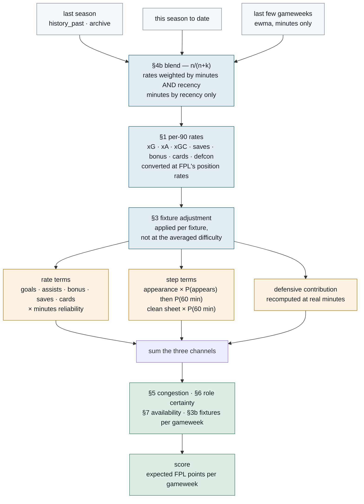
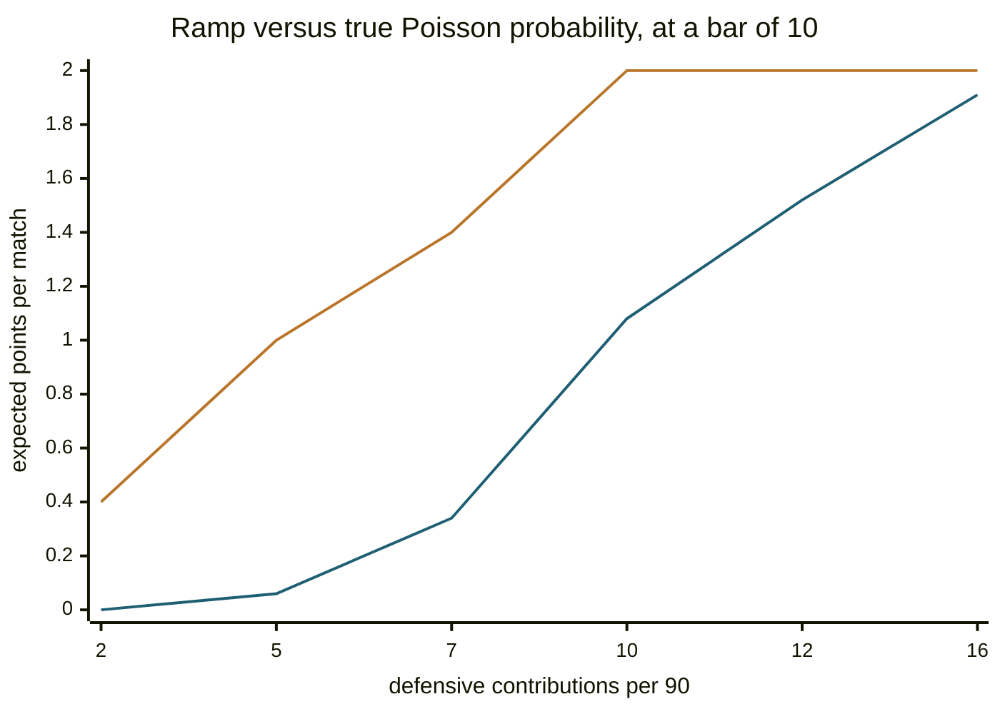
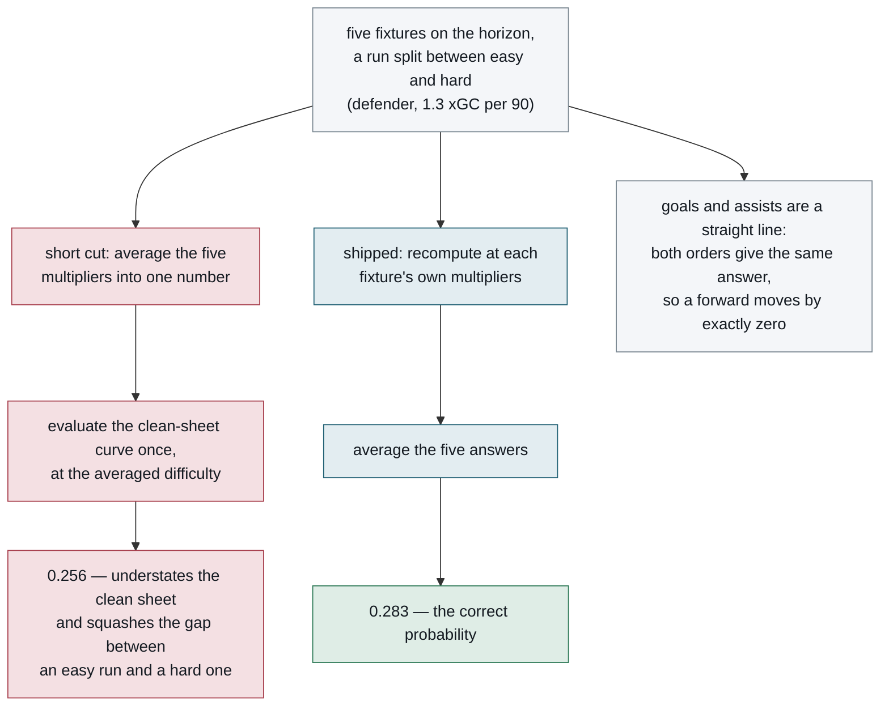
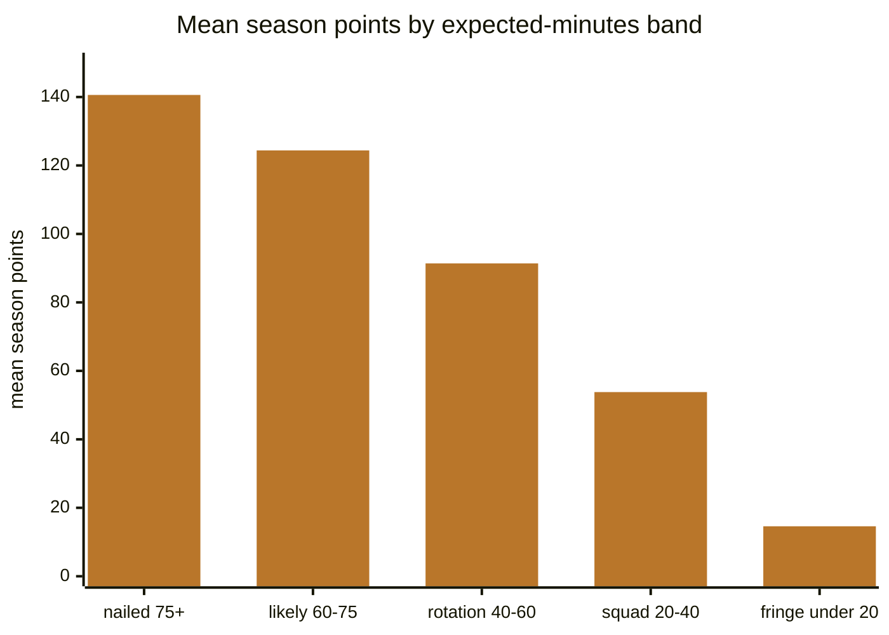
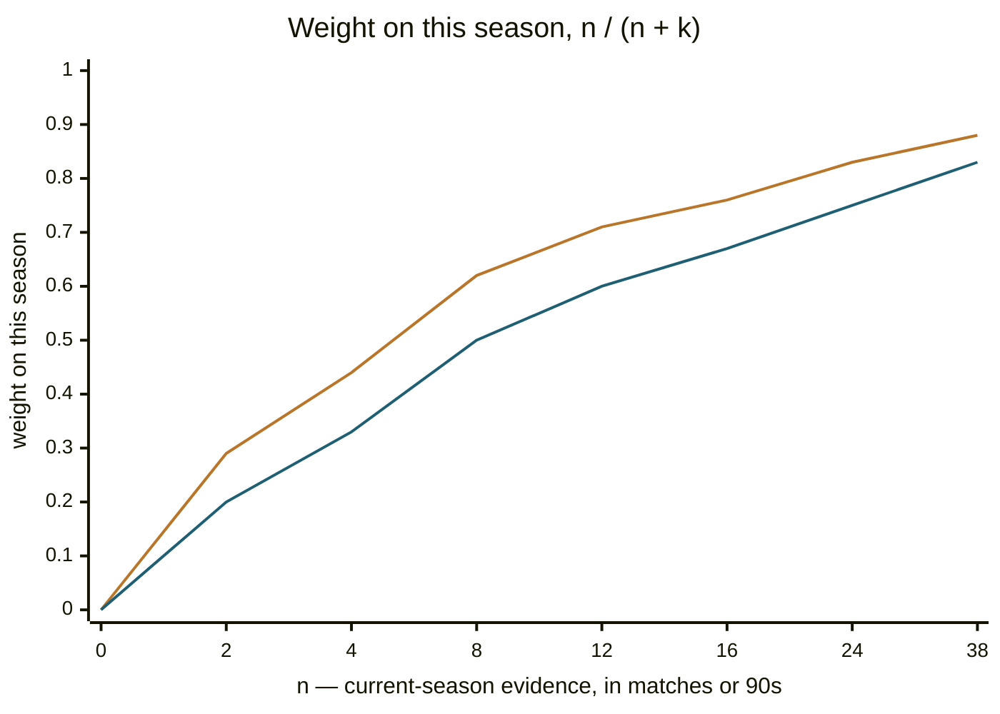
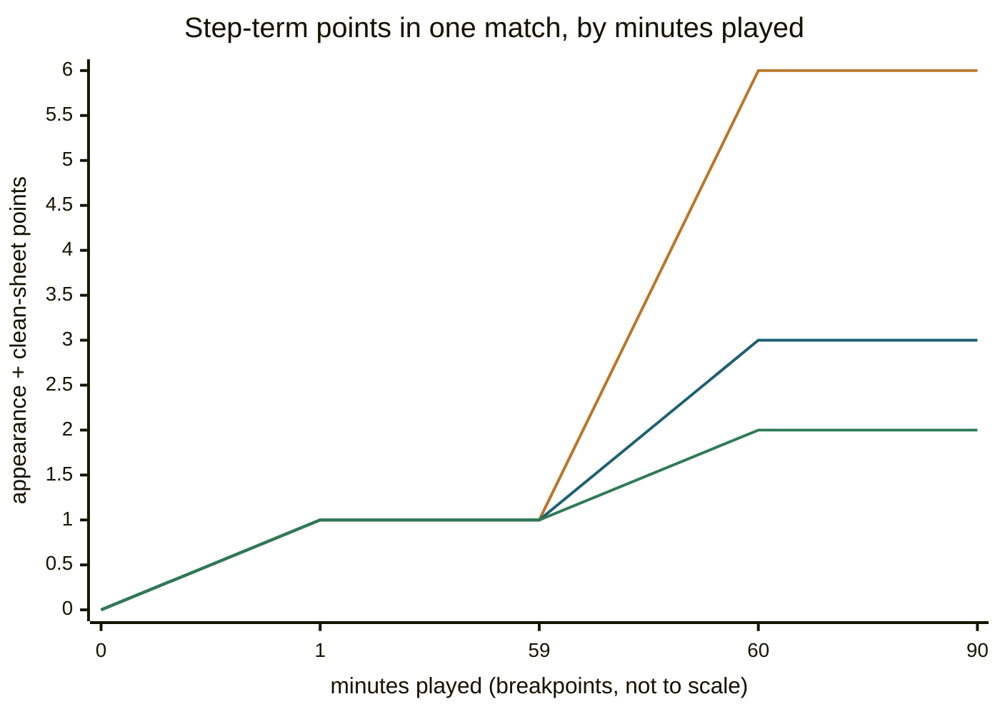
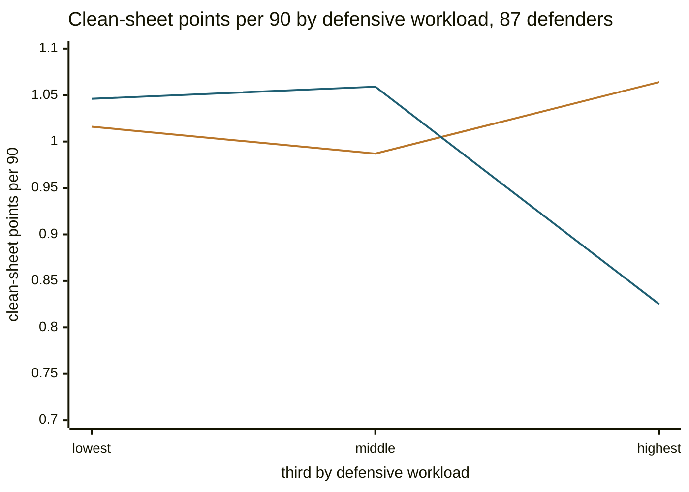

# The scoring model

Every player is reduced to one number — **`score`**, the modelled expected FPL points per
gameweek averaged over the fixture horizon. Everything else in the system ranks, filters or
optimises against it.

The model is built from FPL's actual scoring rules rather than a black-box rating, so every
number is auditable. If a player's score looks wrong you can trace exactly which term caused
it.

```
        ┌  rate_terms       × minutes_reliability      ← accrue minute by minute
        │  appearance       × P(appears), then again at P(60 min)   ← a TWO-step step
score = │  clean_sheet      × P(reaches 60 minutes)    ← paid in full, or not at all
        └  defensive_contribution, recomputed at the minutes he actually plays

      × congestion_factor   ← European, international and travel load
      × role_certainty      ← does last season's record still apply
      × availability        ← injury, suspension, chance of playing
      × fixtures_per_gw     ← how many matches his club plays per gameweek
```

All three lines in the bracket start from the same per-90 rates, and the ones that depend on the
opponent are fixture-adjusted first (section 3). What separates them is **how FPL pays them**, and
the model has to follow that:

- **Rate terms** — goals, assists, bonus, saves, cards, goals conceded — accrue while a player
  is on the pitch. Half a match really is worth about half the output, so scaling them by
  minutes reliability is exact.
- **Step terms** — appearance points and the clean sheet — are all-or-nothing rather than
  proportional, so they scale by a *probability* rather than by the fraction of a match played.
  **The two take different probabilities, because FPL pays them on different events.**
  Appearance is a **two**-step: 1 point for recording any minutes at all and a second at sixty,
  so its expectation is `P(appears) + P(60+)` over the two points — a fifty-minute cameo really
  is worth one point, and scaling it by P(60+) alone credits him nothing. The clean sheet has a
  single step at sixty — 4 to a defender or keeper, 1 to a midfielder — so it takes `P(60+)`
  alone. `appearanceFactor` holds the first, `playsSixty` the second.
- **Defensive contribution** is a threshold on a count of *actions in a match* rather than on
  minutes, so it is not scaled at all — it is recomputed from scratch at the minutes he plays.

**Why the split matters.** The model used to multiply everything by minutes reliability. That
credited a starter taken off at seventy minutes with about 0.73 of his appearance points and
0.73 of his clean sheet, when FPL had already paid him both in full — and those two terms are
61% of a defender's per-90 score, 34% of a midfielder's and 29% of a forward's, so the error
was large and uneven across positions. It was visible in the data before it was found in the
code: measured against each player's own full matches, per-90 output in partial starts averaging
72 minutes reads 12-24% higher, which is mostly two appearance points divided by 72 minutes
instead of 90. The model was not discovering that players are better in short appearances; it
was mis-scaling a step. Sections 4 and 4c cover both halves.

`fixtures_per_gameweek` is the newest term and the last multiplier applied. A score is points *per
gameweek*, and everything above it silently assumes one match a week — so a club playing twice in a
gameweek scored the same as one playing once, and a club not playing at all scored as though it
had. Section 3b covers it.

Each term is a multiplier on expected minutes or expected output, and every one of them is
computed and stored separately rather than folded into a single opaque rating, so a number can be
explained rather than asserted. Every one is reported straight through to the agent — that is a
standing rule here, not a courtesy, because a term the agent cannot see is a number it can only
assert.

**The order matters as much as the terms**, and the formula above does not show it. Rates are
blended before they are fixture-adjusted, and fixture-adjusted before they are split by how
FPL pays them — get that sequence wrong and the adjustment lands on the wrong quantity:



Two orderings in that diagram are load-bearing and have each been got wrong once. The
fixture adjustment sits **before** the three-way split, because the clean sheet is one of
the step terms and is convex in the multiplier — averaging the difficulty first compresses
the gap between an easy run and a hard one (§3). And the blend sits **before** the rates,
because a rate is evidence-weighted by the minutes behind it while minutes are weighted by
recency alone — weighting minutes by minutes is circular (§4b).

---

## 1. Base rate per 90

The starting point is what a player produces per 90 minutes, priced at what FPL actually pays
for it. Expected goals and assists per 90 are converted to points at the real
position-dependent rates — a defender's goal is worth 6, a forward's 4. The table is FPL's own
payment schedule:

| Position | Goal | Clean sheet | Per 2 conceded |
|---|---|---|---|
| GKP | 10 | 4 | −1 |
| DEF | 6 | 4 | −1 |
| MID | 5 | 1 | — |
| FWD | 4 | 0 | — |

Assists are 3 for everyone. Appearance is a two-step — **1 point for any minutes at all, 2 at
sixty** — which §4c takes apart, because the two steps take different probabilities.

### Expected stats are calibrated onto awarded events

xG and an FPL goal are the same event, so the ratio between them should be about 1 — and for
midfielders (0.986) and forwards (0.971) it is. **xA and an FPL assist are not the same
event.** FPL pays an assist for winning a penalty that is scored, for a shot parried to a
team-mate, and for deflected passes; an expected-assists model counts none of them. Across
last season that is 786 assists against 572 xA.

| Position | goals / xG | assists / xA |
|---|---|---|
| DEF | **0.781** | 1.336 |
| MID | 0.986 | 1.298 |
| FWD | 0.971 | **2.288** |
| all | 0.959 | 1.373 |

The spread is why this is done per position and not once globally. Defenders convert xG at
0.781 because their shots are set-piece headers and six-yard scrambles that xG models rate
generously; forwards convert xA at 2.288 because they win most of the penalties. A single
league-wide factor would tax forwards 4% on goals to correct a defender problem.

Correcting a **population-level** bias in the provider's metric is not the same as chasing an
individual's over-performance — xA remains the signal, it is simply scaled to what FPL pays
for. Individual finishing luck is still not credited.

Measured per appearance on players who start and finish, this moved midfielders from −0.230
to −0.117 and forwards from −0.382 to −0.197.

The ratios are recomputed from live data on every run rather than hardcoded, so they
re-derive each season and cannot go stale. Thin samples fall back to neutral — goalkeepers
score ~11 goals from ~0.2 expected, a ratio of 69 that would price every keeper as a striker.

**Clean-sheet probability is derived, not assumed.** Expected goals conceded per 90 feeds a
Poisson model: `P(clean sheet) = e^(-xGC90)`. A defence conceding 0.72 xG per 90 has a 49%
clean-sheet chance; one conceding 1.45 has 23%.

Also added, from each player's own historical rate: goalkeeper saves, defensive contributions,
bonus points and card deductions. The **goals-conceded deduction is not** one of these — like
the clean sheet it comes from blended expected goals conceded through a Poisson, and like the
clean sheet it is fixture-adjusted. It is a team quantity a player is exposed to, not a rate he
produces.

### Whole blocks that reset every match

Saves (1 point per 3) and goals conceded (−1 per 2) are counted **per match and rounded
down**. The remainder does not carry into the next game: two goals in one match costs a
point, two goals across two matches costs nothing. So both are priced as
`E[floor(X/d)]` under Poisson rather than as a season total divided by `d`, which would
bank every discarded remainder.

**The goals-conceded deduction was missing from the model entirely.** Reconstructing
seventeen goalkeepers' seasons from FPL's published rules missed by 25.8 points each without
it and 1.9 with it, and per-match blocks beat season-total division for both terms:

| saves | goals conceded | mean abs. error, pts/season |
|---|---|---|
| season total | season total | 3.8 |
| season total | per match | 11.3 |
| per match | season total | 7.2 |
| **per match** | **per match** | **1.9** |

The omission made goalkeepers the worst-calibrated position in the model, over-predicted by
0.65 points per 90 — and it hit them hardest because a keeper has no attacking output to
dilute it. It also flattened the position: a busy keeper behind a leaky defence banked save
points with nothing charged for the goals. With the deduction, Raya (0.74 xGC per 90) gives
up 0.47 and Petrović (1.49) gives up 0.82.

Goals conceded depends on the opponent, so it is fixture-adjusted alongside the clean sheet
rather than carried across unchanged.

### Defensive contribution is a threshold, not an accumulation

2 points for clearing 10 CBIT in a match as a defender, 12 CBIRT as anyone else. The award is
**per match and all-or-nothing** — nine actions score nothing — so it is priced the same way
as the clean sheet, as a probability of clearing the bar:

```
P(X >= threshold),  X ~ Poisson(defensive contributions per 90)
```

This was a linear ramp, `clamp(dc/threshold, 0, 1)`, until it was measured. That reads
"averaging 70% of the bar earns 70% of the bonus", when what it earns is however often you
actually clear the bar — about 17%. The line rises at a fixed rate while the true probability
is still near zero, so the error is a hump peaking around 0.7× the bar:

| dc/90 | 2 | 5 | 7 | 10 | 12 | 16 |
|---|---|---|---|---|---|---|
| ramp | 0.40 | 1.00 | 1.40 | 2.00 | 2.00 | 2.00 |
| true | 0.00 | 0.06 | 0.34 | 1.08 | 1.52 | 1.91 |

The same two rows drawn as lines make the shape of the error obvious: the upper line is the
ramp, the lower is the true probability, and the gap between them is the hump — widest at
dc/90 of 7, which is 0.7× a bar of 10, and closing at both ends:



FPL set the thresholds near what a busy outfielder actually achieves, so **86% of defenders
and 82% of midfielders sat in the 0.5–1.1× band where the approximation is worst**. Measured
against actual points per 90 across every player with 900+ minutes, replacing the ramp moved
mean absolute error from 0.842 to **0.565** and overall bias from +0.753 to −0.131.

The ramp also capped at the bar while the real probability keeps climbing past it, which
compressed the spread *within* a position: Senesi averages 11.5 and clears the bar 71% of
matches, Truffert averages 8.0 and clears it 28%, a true gap of 0.85 points that the ramp
showed as 0.40.

**Poisson was suspected of understating this term and does not.** The worry was
overdispersion: CBIT should be lumpier than Poisson, because a defender against a possession
side racks up 20 and against a weak one 4, and fatter tails would pull `P(X >= k)` upward for
everyone below the bar.

It is measurable. For players who start and finish, appearances equal starts and every other
term is known exactly, so the leftover *is* their real defensive-contribution return:

| dc/90 band | n | true hit rate | Poisson | gap |
|---|---|---|---|---|
| 4.0–6.5 | 11 | 0.102 | 0.074 | +0.027 |
| 6.5–8.0 | 9 | 0.220 | 0.179 | +0.041 |
| 8.0–9.5 | 11 | 0.393 | 0.379 | +0.014 |
| 9.5–11.0 | 7 | 0.529 | 0.565 | −0.036 |

Mean gap **+0.028 points per appearance** for defenders (n=39, se 0.019) and **+0.012** for
midfielders (n=23) — scattered around zero, changing sign, at the noise floor. A negative
binomial fitted to this data lands on r≈6.8 and improves RMSE only from 0.1385 to 0.1246,
which is what a dispersion model looks like when there is no dispersion to find.

One trap for anyone re-measuring this: **deduct goals conceded per match, not from the season
total.** Deducting `goals_conceded // 2` from the season total over-deducts a defender by
about 0.23 points per appearance — and that arithmetic alone manufactures a phantom
"dispersion gap" of +0.250, which is almost exactly the error. The tell is that midfielders,
who take no goals-conceded deduction at all, show no gap.

## 2. Set-piece duty — reported, not scored

Penalty, corner and direct-free-kick order are read from FPL and reported on every player,
but `set_piece_weight` **defaults to 0**, so they contribute nothing to the score.

The term used to add roughly `0.11 penalties per 90 × 0.76 conversion × position goal value`
for a first-choice taker — about 0.42 points per 90 for a midfielder. **That was counted
twice.** FPL's `expected_goals` already includes penalties, and `expected_assists` already
includes corners and free kicks, so the base rate contains the same output the bonus was
adding again.

Measured per appearance on midfielders and forwards who start and finish, where appearances
equal starts:

| Penalty order | n | bias | set-piece term | bias without it |
|---|---|---|---|---|
| **#1 taker** | 7 | **+0.400** | 0.393 | **+0.008** |
| #2 taker | 9 | +0.082 | 0.152 | −0.069 |
| no duty | 37 | −0.184 | 0.017 | −0.201 |

The over-prediction for first-choice takers (0.400) is almost exactly their set-piece term
(0.393) — the whole bonus was spurious. Zeroing it collapses the taker-versus-non-taker
spread from 0.58 to 0.21, which is just the uniform under-prediction every player carries.

**What this gives up.** A *newly appointed* taker's expected goals contain no penalties yet,
so he is now under-priced. The flags are still reported (`penalties #1`), so the case is
visible to the agent even though it is not scored — treat it as something to reason about
rather than something the number already knows.

**Why not fix it properly.** The correct form is non-penalty xG for the stable part plus a
role-based penalty prior for the volatile part — which also solves the separate problem that
penalty *volume* is a low-count, high-variance quantity that should regress toward the role
average rather than carry last season's total forward. FPL publishes neither npxG nor
penalties scored, only `penalties_missed`, and most takers have zero misses. FBref stopped
publishing advanced tables in January 2026 at Opta's request. Understat still has shot-level
penalty data if this is ever worth a second data source — but note the strip has to match the
window of the xG it is stripping from, so in-season it needs updating every gameweek, not
once a summer.

`TestSetPieceBonusDoubleCountsPenalties` fails if the weight is restored.

## 3. Fixture adjustment

A per-90 rate describes a player against an average opponent, and the next five fixtures are
rarely average. So the attacking and clean-sheet terms are recomputed against the difficulty
of **each** of the next N fixtures (default 5), and those N answers are averaged. Each FPL
difficulty grade maps to a pair of multipliers, one on attacking output and one on expected
goals conceded:

| Difficulty | Attacking returns | Goals conceded |
|---|---|---|
| 1 | ×1.30 | ×0.70 |
| 2 | ×1.15 | ×0.85 |
| 3 | ×1.00 | ×1.00 |
| 4 | ×0.85 | ×1.20 |
| 5 | ×0.72 | ×1.40 |

`fixture_weight` (default 0.65) blends the adjusted figure against the unadjusted one, so
fixtures matter without wholly overriding quality. **It is clamped to [0, 1]**, so setting 1.4
is silently identical to 1.0 — the only way past full strength is to stretch the ladders
themselves, which `FPL_ATK_FIXTURE_SCALE` and `FPL_DEF_FIXTURE_SCALE` exist for.

Terms that do not depend on the opponent — defensive contributions, bonus points and cards —
are carried across unchanged rather than being scaled twice.

### Per fixture, not at the averaged difficulty

The obvious short cut is to average the five multipliers into one number and evaluate the
estimate once, and it used to. That is **exact** for goals and assists, which are a rate
multiplied by the attacking multiplier: five fixtures scored at their mean difficulty and five
scored separately then averaged give the same answer, because the term is a straight line.

It is **wrong for the clean sheet**, which is `exp(−xGC × multiplier)` and therefore *curved* —
specifically convex, bending upward. For a curve like that the average of the five values is
always at least the value at the average difficulty, and they are equal only when all five
fixtures are equally hard. Averaging first therefore understated how often a clean sheet
arrives, and — the part that matters for a ranking rather than a level — it **squashed the gap
between an easy run and a hard one**, for defenders and keepers only.

Measured over the current pool on the real five-game horizons, after `fixture_weight` damps it:
about **+0.009 points per 90 on average for a defender or keeper and +0.025 at worst**,
+0.002 for a midfielder (whose clean sheet is worth 1 point rather than 4), and **zero for a
forward**, who has no clean sheet and no goals-conceded deduction so every term he has is
linear. A run split between the extremes of the ladder is where it is largest: at a defender's
1.3 expected goals conceded per 90 the correct clean-sheet probability is near 0.283 against
0.256 at the averaged multiplier, or 0.11 points per 90 before damping.

The two orders of operation, traced side by side on that worked defender, show where the short
cut loses the points — the red path evaluates the curve once at the mean and lands low, the blue
path evaluates it five times and averages the answers:



The forward's exact zero is what the regression test checks, because it is the sharpest
statement available: if an attacker's estimate moves at all, something non-linear has been
swept into the attacking side.

**The refactor matters as much as the correction.** The fixture-*insensitive* remainder is
computed as the whole estimate minus the fixture-sensitive part, so those two expressions have
to agree term for term — and they had silently drifted apart twice, both times on a change to
the clean sheet. They are now a single function, `fixtureSensitiveAt`, evaluated at one
fixture's multipliers or at neutral (1, 1). One implementation per quantity means the drift is
structurally impossible rather than merely tested for.

Defensive contribution is the assumption worth flagging, because it is not obviously true: a side
facing a possession team spends the match clearing, blocking and intercepting, which is exactly
what that category counts. It has been checked. Measured within-player over a season, defensive
actions against a given opponent run 1.069 to 0.901 — real, and an order of magnitude smaller than
the attacking ladder above, worth roughly ±0.06 points a match at the extremes. The ordering also
does not support the obvious mechanism: if it were possession, Manchester City and Arsenal would
head the list, and they sit mid-table while end-to-end sides top it. Not implemented, and recorded
so the assumption is documented rather than merely unexamined.

### Saves move with the fixture too, in the opposite direction

A goalkeeper's saves used to sit in that unadjusted remainder, and that was half a trade-off.
Facing a strong attack the model already raised his expected goals conceded, correctly costing
him clean-sheet value — and credited him nothing for the extra shots that same attack forces
him to face.

Measured against each keeper's own average, saves against a given opponent run **1.46 to 0.75**
— a spread of very nearly a factor of two, which is the same width as the goals-conceded ladder
above (0.70 to 1.40). So the same multiplier drives both and no new number is fitted: a hard
fixture raises expected goals conceded and raises expected saves by the same factor.

It is worth nothing in points either way, comfortably inside what the backtest can resolve. It
ships because the objective should say what the game actually pays, and because leaving one half
of a trade-off in the model and not the other is knowingly wrong.

## 3b. A gameweek is not a match — doubles and blanks

Everything above is a rate per 90 minutes turned into an expectation *per gameweek*, and that
quietly assumes each club plays once a week. Fixture congestion, cup replays and rearranged
matches mean it often does not: a **double gameweek** is two fixtures in one week and a **blank**
is none.

`fixtures_per_gameweek` is matches per gameweek over the horizon, and **the window is counted in
gameweeks rather than in fixtures**: `fixtureLoadFor` takes the club's fixtures falling inside the
next `horizon` gameweeks and divides by however many gameweeks the window actually found. A double
reads 2.0 at horizon 1, a blank 0.0, and an ordinary week 1.0. The denominator matters only at the
end of a season — with two rounds left and a horizon of five, a club playing both reads 1.0 rather
than 0.4.

Two things decide the window, and both were wrong once.

**It is anchored on the next GAMEWEEK, not on the club's next FIXTURE.** Asking a fixture *list*
for the next one match in a double gameweek returns one of the two and the double vanishes — which
is the case the term exists for. The blank is the mirror and is worse: anchored on the club's own
next fixture, a club that does not play simply starts its window a week later, so the blank falls
outside it and cannot be expressed at all. At horizon 1 that made the load **1 or more by
construction**. Checked against the archive's true fixture count over every club-gameweek of the
six-season grid, the old anchor missed **170 blanks and no doubles**;
`TestDiagFixtureLoadMatchesTheArchive` is that comparison and
`TestFixtureLoadMatchesTheArchiveOnOneSeason` runs the cheap half by default.

**It honours the skip set.** A free hit removes its own week from the permanent squad's horizon,
and `WeekViews` isolates a single gameweek by skipping every round before it — so a window of N
means N gameweeks *this engine scores*, not N on the calendar. Reading the fixture index raw made
every projected week inherit the imminent week's load, so a club with a double this Saturday had
its players doubled in all five projected weeks.

`TestFixtureLoadCountsDoublesAndBlanks`, `TestFixtureLoadHonoursTheSkipSet` and
`TestFixtureLoadWindowEndsWithTheSeason` pin the three properties.

**Where the term is applied decides everything, and it is not applied everywhere.** It scales
the score used to pick the eleven you actually field this week, and the score used to judge a
transfer. It does *not* scale the score used to build a permanent fifteen from scratch.

The **free hit** is the one exception, and it is not an oversight. That fifteen is fielded for a
single round and handed back, so one gameweek *is* its whole horizon: it is built on the horizon-1
engine, load and all, and its candidate *pool* excludes clubs with no fixture — because zeroing a
score keeps a player out of the eleven and does nothing about the four bench slots, where a builder
is indifferent between two footballers worth nothing and takes the cheapest. A **wildcard** is the
opposite and is built at the full horizon: that fifteen is kept, so a single blank week must not
pick it.

The reason is that starting a player who plays twice this Saturday is **free** — you already own
him and the eleven is re-picked weekly at no cost — while buying one for a double three weeks out
is a **bet**, made before a ball is kicked, when several transfer windows will have had a chance
to move things first. Applying one number to both charges the bet against the certainty, and it
measures that way: applied everywhere it damages squad selection, and confined to the two
decisions that are re-made cheaply it is the largest reliable gain measured anywhere in this
project, with squad selection completely unchanged. `FPL_NO_FIXTURE_LOAD=1` and
`FPL_NO_LOAD_TRANSFERS=1` separate the two consumers again.

Read the direction as safe and the size as optimistic, and read it as a statement about **doubles
only**. The replay knows about every double gameweek from GW1, where in reality FPL announces them
only as cup rounds resolve. And that measurement was taken when the window anchored on a club's
next fixture rather than the next gameweek, which at a horizon of one made the load one or more by
construction — so a blank could not enter the comparison at all. The anchor is fixed; the blank
half has not been priced.

The generalisable lesson: a signal can be right for one decision and wrong for another, and the
fix is to find the seam between the consumers rather than to weaken the signal. That works
because a double gameweek is an **event at a point in time**. It does not work for fixture
difficulty, which is a standing property every club carries all season and which both decisions
can see equally — tried, and every variant was worse.

## 4. Expected minutes — the most important term

> **Points only accrue while a player is on the pitch.** Correlation between season minutes
> and season points across all players with any minutes: **r = 0.929**.

Every player carries `expected_minutes_per_gw` — his mean minutes per gameweek — and a band.
The bands are labels on that number, and the right-hand column is why minutes lead everything
else in this document:

| Band | min/GW | Mean season points |
|---|---|---|
| nailed | 75+ | **140.6** |
| likely starter | 60-75 | 124.4 |
| rotation risk | 40-60 | 91.4 |
| squad player | 20-40 | 53.8 |
| fringe | <20 | 14.6 |

⚠️ **"nailed" is no longer the number alone.** Since 2026-08-22 the top band additionally
requires the estimate to be corroborated — a real prior Premier League season on record, enough
of the current season already played, or a manual minutes override confident enough to read as
an assertion of settled status rather than a hedge (`Engine.minutesCorroborated`,
`internal/analysis/blend.go`). A player who clears 75 on a single unshrunk cameo, or on an
override its own author called "a starter today, not a nailed one", now reports "likely starter"
instead. This changes no figure above — it is a label change, not a scoring one, and the table's
points are keyed to `expected_minutes_per_gw` itself — but it does mean "nailed" and "≥75" are no
longer the same test.

Drawn to scale, that right-hand column is the steepest relationship in this document — the fall
accelerates down the bands, and a nailed starter is worth nearly ten fringe players:



Of last season's **top 20 scorers, 18 averaged 75+ minutes per gameweek**. Nailed-ness is
not a trade against upside — it is where both the mean and the ceiling live.

### The denominator is the season so far, never a fixed 38

FPL's published totals reset at GW1 and then accumulate, so dividing minutes by 38 in September
is dividing four matches of football by a whole season. It reports an ever-present as 2.4
minutes a gameweek after one week — which puts *every player in the game* in the "fringe" band
at about 1% of his true value, and nothing recovers until around GW29.

So the denominator is the number of gameweeks actually played, falling back to 38 only before
the season starts, when FPL's totals genuinely are a full previous season. The same scaling
applies to the squad pool's minimum-minutes filter, which is written as a season total: unscaled,
the pool is empty in August and the optimiser fails outright. `TestDataWindowTracksTheSeason`
simulates a season and fails if either regresses.

### Reliability is minutes, and only minutes

```
minutes_share = mean minutes per match ÷ 90
rating        = minutes_share ^ minutes_weight
```

`minutes_weight` above 1 makes the penalty **convex**, so rotation risk is punished
disproportionately rather than linearly. Default 1.25.

> **Retired: the start-share blend.** This term used to be
> `0.6 × minutes_share + 0.4 × start_share` — the share of gameweeks in which he started — on the
> argument that the two fail differently: a player averaging 60 minutes by starting every week
> and being substituted looks safer than one averaging 60 by starting two thirds of the time and
> playing 90, because the second carries blank weeks you cannot plan around. Every step of that
> is true and the conclusion was wrong. Swept across four replayed seasons the mix is monotone in
> favour of minutes, and dropping start share entirely is worth about **180 points** over those
> four seasons, winning three of them including the season held out of all tuning.
>
> The reason is that this term is an **expectation** — what a player is expected to return, on
> average. That is governed by how long he is on the pitch. Whether he *starts* is a statement
> about the **variance** around that average, which is a different quantity, and mixing it into a
> mean made one number do two jobs. The blank risk the start-share term was reaching for is real
> and now has its own home: the model estimates the chance a player records no minutes at all and
> uses it to price the bench slots that exist to cover exactly that event — see
> [the bench is a hedge](#the-bench-is-a-hedge-and-its-slots-are-not-interchangeable).

### Minutes need recency; rates do not

A season average treats a player who lost his place six weeks ago identically to one still
starting, because a season average is all FPL's published totals can express.
`minutes_half_life` fixes that by weighting recent gameweeks more heavily — at the default of 4,
a match four gameweeks ago counts half as much as last week's, one eight gameweeks ago a quarter
as much. It applies to **minutes only**.

That restriction is the finding, not an oversight. Tested out of sample across three seasons and
8,374 predictions, sharpening recency on minutes cuts the error by 9%, while doing the same to
per-90 *rates* makes them worse — a "last 3 games" rate is 19% worse than the season average at
predicting both points and underlying output, because a three-match window chases finishing luck.
Minutes are a statement about the present and reward recency. Rates are a statement about quality
and punish it.

The deeper reason is worth carrying to any new term. Recency on minutes removes a **bias**: a
dropped player was reading as an ever-present, which is simply wrong. Recency on rates trades
bias for **variance** — it is more accurate about the average player and noisier at the very top.
Everything downstream picks the *highest*-scoring available player, so extra noise at the top is
paid for directly, while a bias shared by everyone costs almost nothing. Before extending recency
to a new term, ask which of the two it does; only removing a bias is safe here.

**The half-life is 4 rather than 2 because the effect is asymmetric.** A short half-life is right
about a player *losing* his place and wrong about one *gaining* it — two starts do not make anyone
nailed — so the errors on the player you sell and the player you buy move in opposite directions.
At a half-life of 2 the sell-side error is well corrected and the buy-side error triples. 4 is the
shortest setting that beat the flat average in every season while keeping the buy side small.

**It needs per-gameweek history, which FPL's main payload does not carry**, so the model fetches
each playing player's match log separately — a few hundred small requests, roughly half a minute
once per cache window, not once per command. If that fetch fails the model falls back to flat
season totals, so a failure **degrades rather than breaks**. Only players with minutes are
fetched: a player who has not played has no history to weight, and the flat figure already reports
him correctly.

A single-file community mirror would be one request instead of several hundred and was rejected
deliberately. It is maintained by one person, and the previous community archive stopped updating
mid-season. **Stale minutes are worse than no recency at all**, because they would report a
dropped player as still starting — which is the exact failure this term exists to fix.

### Never use `starts_per_90` for this

FPL publishes a `starts_per_90` field. It measures *"when this player appears, does he
start"*, which sits at ≈1.0 for almost every player in the game.

An earlier version of this model used it. The result:

| | min/GW | rating |
|---|---|---|
| B.Fernandes | 80.7 | **1.00** |
| Aït-Nouri | 25.6 | **1.00** |

A 26-minute-per-week squad player scored identically to an ever-present, and the model had
no concept of rotation risk at all. Fixing it moved scores by up to −87%.

`TestMinutesReliabilityTracksExpectedMinutes` guards against the regression.

### Per-position severity

`minutes_weight_by_position` scales how hard the penalty bites, as a fraction of the global
setting's severity:

```
exponent = 1 + (minutes_weight − 1) × position_scale
```

Midfielders default to **0.75**, i.e. three quarters of the severity everyone else gets. At
`minutes_weight` 1.25 that is a gentle nudge, not a large shift. To relax midfielders meaningfully,
lower the scale to ~0.5 rather than raising the global weight.

**The original justification for relaxing midfielders was wrong, and the knob is load-bearing
anyway.** The stated reason was that midfield returns accrue in the minutes actually played, unlike
a defender's clean sheet, which is all or nothing. Two problems with that. A defender needs *sixty*
minutes for a clean sheet, not ninety, so the asymmetry is smaller than claimed. And the effect does
not track substitution at all: forwards are the most-substituted outfield position — fewer than half
of forward starts go the full ninety, against four fifths of defender starts — and relaxing
*forwards* is the single worst change tried, while relaxing midfielders is the best. Whatever this
knob is pricing, it is not "this position gets taken off".

What it does track is **leverage**. Squad rules force five midfielders into four or five starting
slots against three forwards into one or two, so the midfield scale moves half the eleven and the
forward scale moves a corner of it. Softening the penalty helps where the optimiser fields several
of a position and can afford good cheap part-timers, and hurts where it fields one or two and needs
them nailed.

Two cautions before touching it. Anything from 0 to 0.75 performs the same and 0.9 upward is
clearly worse, so 0.75 stays because nothing distinguishes it from the plateau, not because it wins.
And this knob is **coupled to the reliability term above**: swept against the old
minutes-plus-starts mix it moved nothing at all and was nearly deleted as an unmeasured assertion,
and re-run against minutes-only reliability the same knob spans 226 points. The old mix credited a
substituted starter for having started, which propped midfielders up; removing that prop is what
made this matter. **A sweep of one knob is only valid at the setting of every knob it shares a
population with.**

### Absence versus rotation

**The model cannot tell "injured for three months" from "not picked".** Both show low
expected minutes.

Check minutes-per-start. A player with 22 starts at 77 min/start was *absent*, not benched,
and may be nailed when fit. One with 12 starts at 81 min/start genuinely was not first
choice.

**The onset of an absence is the case recency handles worst, and it has its own term.** One
blank after a run of starts barely moves a half-life-4 average, so a player who has just been
dropped or hurt still reads as an ever-present for a fortnight. `blank_run_penalty` multiplies
his blended minutes by **0.75** through a run of one to three consecutive blanks, and then
stops — by four the exponential average has caught up on its own, and measurement says so:
relative to a player with no trailing blanks, the correction wanted is about 0.75 across the
first three and about 1.0 from the fourth. A flat plateau with a cliff at each end, so one
constant rather than five fitted ones.

Two things about it are worth knowing before tuning it. It is restricted to players FPL has
**not** flagged, so it is signal `availabilityFactor` does not already carry. And its effect on
the replay is close to nothing, because the pool's minutes cliff has already removed 85-100% of
the players it touches from squad selection — it ships on the reported figure the agent reads,
where a player shown 44 expected minutes who will play 30 is misinforming the one component
that can act on it. `FPL_NO_BLANK_RUN=1` turns it off.

### The denominator, not the numerator

There is one class of absence the model *can* resolve, because it is a matter of public
record: a mid-season international tournament.

**This whole correction is gated to pre-season and switches itself off the moment GW1
completes.** That is not an oversight. The list describes the season the *aggregates* came
from, and once a gameweek is played FPL has overwritten those aggregates with this season's
running totals — at which point last summer's list describes data nobody is reading any more. A
tournament inside the *current* season would need its own entries and this guard revisited.

The denominator above is the matches the aggregate totals cover. For a player who spent four
weeks of that period at a tournament, those matches were never on offer, and counting them scores
an absence as rotation risk. `tournament_absences` removes them:

```
available     = matches the totals cover − matches missed at a mid-season tournament
minutes_share = (minutes ÷ available) ÷ 90
```

AFCON 2025 ran 21 December to 18 January, inside the congested festive programme. Senegal
won it and Nigeria finished third, so their Premier League contingent missed up to six league
matches each. The effect on one of them:

| | denominator 38 | denominator 32 |
|---|---|---|
| Iliman Ndiaye — 2,780 mins, 32 starts | 73 min/gw, *likely starter* | **87 min/gw, nailed** |
| score | 4.59 | **5.63** |

That is the difference between the seventh-best midfielder in the game and the second, at
£6.0m, and none of it is new information about the player.

**The reduction is capped by the player's own record** — he cannot have missed more matches
than he failed to start. Antoine Semenyo holds a Ghanaian passport and started 37 of 38, so
even a wrong entry could credit him at most one match. That cap is what makes the list safe
to hand-maintain: over-stating `matches` is harmless, listing someone who did not go is not.

**Injuries deliberately do not qualify.** The blind spot above is real and guessing at it
would hand minutes back to players who genuinely lost their place. A tournament is different:
participation is public, the dates are fixed, and every call-up is knowable in advance.

Like the European campaigns and the rest list, this describes the season the *stats* came
from and must be re-derived every summer. `TestTournamentAbsenceNamesResolve` fails loudly if
a name stops matching, because the correction would otherwise silently stop applying.

## 4b. Blending last season into this one

FPL's aggregates reset at GW1, so from the first whistle the model reasons only from what has
happened since — two matches at GW2. Last season is gone from the API by then;
`internal/priors` keeps a copy, and this decides how much of it to still believe:

```
weight = n / (n + k)          n = current-season evidence, k = the prior's strength
```

At `n == k` the two are believed equally. Pre-season it is a no-op — FPL's totals *are* last
season, so blending would double-count it.

The formula drawn out shows how belief shifts as evidence accumulates. The upper line is
minutes at its calibrated k of 5, the lower is rates at k of 8; each crosses one half exactly
where `n == k`, and neither ever quite stops listening to last season:



**Both values of k are measured.** Calibrated against 2025-26, predicting each player's
rest-of-season output from a blend of what had happened so far and what came before:

| Term | k | Error at best k | vs ignoring last season | vs ignoring this one |
|---|---|---|---|---|
| expected-stat rates | **8** matches | 0.0511 xG/90 | 16% better | 14% better |
| minutes per match | **5** matches | 18.74 minutes | 15% better | 15% better |

Both curves are flat around the minimum, so neither is fitted to noise. The rate figure is a
clean out-of-sample calibration — 2024-25 as prior, 2025-26 as outcome, 218 players. The
minutes figure is weaker: the 2024-25 dataset carries no minutes column, so the first half of
2025-26 stands in as the prior. That prior is 19 matches rather than 38, which if anything
argues for a slightly larger k. Re-derive once a full season with minutes on both sides exists.

Evidence is counted in the units the term is judged in. Minutes are per match, so `n` is
matches played. Per-90 rates are per 90 played, so `n` is 90s played — a substitute who has
appeared six times has far less than six matches of evidence, and the blend knows it.

**Every rate goes through the blend, counting stats included.** Bonus, saves and cards were
originally read straight off the element as `count * 90 / minutes` while the expected stats
were blended. That divides a whole number by a fraction of a match: two bonus points in a
22-minute cameo reads as 8.18 bonus a gameweek, and the replay's early transfers were driven
almost entirely by it — modelled gains of +5.59 and +8.50 a gameweek, into players with one
substitute appearance. Blended, the same player reads 0.24. Any new counting term must be
blended the same way.

**Players with no prior shrink to the league.** A promoted club's player or an arrival from
abroad has no prior of his own, so his rates shrink toward his position's league-wide per-90
rates (`calibrateLeagueRates`, totalled across the pool at construction) using the same
weighting. Without it the priorless case reproduces the whole problem on its own: the replay's
largest remaining GW2 transfer was +8.50 a gameweek into a defender with ninety minutes of
Premier League football to his name.

Minutes are deliberately *not* shrunk. Ninety minutes in one appearance really does mean ninety
minutes when he plays, and the minutes-reliability term already prices whether he plays again.
`current_season_weight` still reports what the sample justifies, so the thinness stays visible.

## 4c. The sixty-minute threshold

Two of FPL's terms are steps rather than rates, and between them they are the largest part of most
players' scores — 61% of a defender's, 34% of a midfielder's and 29% of a forward's.
**Appearance points**: 1 for playing at all, 2 at sixty minutes. **The clean sheet**: 4 for a
defender or keeper and 1 for a midfielder, at sixty minutes, and nothing below. A player on 59
minutes gets one appearance point and no clean sheet; at 60 he gets both in full, and nothing
after that changes either.

What the two terms pay as a player's minutes rise is a pair of steps, not a slope — the x-axis
below marks the breakpoints rather than running linearly, which is what makes the steps
visible. The top line is a defender keeping a clean sheet (1 point at the first minute, then
1 + 1 + 4 = 6 at sixty), the middle a midfielder (to 3), the bottom a forward, who has no
clean sheet and steps only to 2. Everything between the steps is flat, which is exactly what a
proportional minutes multiplier gets wrong:



**So each takes the probability of the event that pays it, and both probabilities are fitted from
data rather than assumed.** There are two, and conflating them is a bug this model has shipped in
both directions:

| term | scales by | in code |
|---|---|---|
| appearance, first point | `P(records any minutes)` | `playsAtAll` |
| appearance, second point | `P(reaches 60 minutes)` | `playsSixty` |
| clean sheet | `P(reaches 60 minutes)` | `playsSixty` |

`appearanceFactor` combines the first two into one multiplier on the 2-point appearance term.
Scaling the *whole* of appearance by `P(60+)` — which the model did once — credits a fifty-minute
substitute nothing where FPL pays him one point, and it is worth about +0.185 appearance points per
gameweek pooled, peaking near +0.283 for the 25-to-35-minute population. `FPL_NO_SHORT_PLAY=1`
restores the single branch.

`playsSixty` is an S-curve fitted against mean minutes per gameweek across 2,934 player-seasons;
`playsAtAll` is a separate fit, on the identity that a player's mean minutes are
`P(appears) × E[minutes | appears]`. **Both are then clamped between limits that are provably
true**, because a fitted curve is wrong at the ends of its range:

- A **ceiling**, which binds when minutes are very low: a player averaging *m* minutes a gameweek
  cannot reach sixty more often than `m ÷ 60` of the time, because reaching sixty *k* of the time
  already spends 60k minutes of his average. Without it, a player who has never played collects a
  slice of appearance points forever — the fitted curve reads 0.045 at an average of one minute
  where the truth is 0.007 — and the property that a footballer with no Premier League football
  scores exactly 0.00 quietly stops holding.
- A **floor**, which binds when minutes are very high: nobody can play more than 90 minutes, so
  averaging *m* forces reaching sixty at least `(m − 60) ÷ 30` of the time. At an average of ninety
  that forces 1, which is the only right answer for a player who never leaves the pitch. The bare
  curve saturates near 0.94 and would dock him for it.

**`P(appears)` has exactly one implementation, fitted against mean minutes, and that is
deliberate.** It once had two, fitted from different statistics with nothing requiring them to
agree — one on mean minutes and one on start share — and they differed by up to 0.34 for the same
player. `appearanceOdds` now returns the probability and its complement together, so the
bench-slot weights and the defensive-contribution exposure cannot disagree even by a rounding
error. `FPL_NO_UNIFIED_APPEARANCE=1` restores the pair.

**Defensive contribution needed the opposite correction.** Its bar is a count of *actions in a
match* — ten clearances, blocks, interceptions and tackles for a defender, twelve including
recoveries for anyone else. A player on sixty minutes has two thirds of the chances to reach ten,
so his probability of clearing the bar falls *faster* than his minutes do, not slower. The model
used to take his full-ninety probability and scale the resulting points by minutes reliability,
which over-credited part-timers badly: a defender averaging 10 actions per 90 clears a bar of 10
in 54% of full matches and 8% of hour-long ones, and was being credited with 33%. It is now
recomputed at his real exposure — his mean minutes **when he appears**, rather than across all
gameweeks, because a blank contributes no actions and no points rather than a fraction of both.

Both corrections ship on the same principle: the objective should say what the game actually pays.
The backtest cannot distinguish them from noise, and this is **bias reduction rather than a
bias-for-variance trade**, which is the one kind of correction that is safe when everything
downstream is picking a maximum.

## 4d. The bonus term is a schedule, not a constant

Bonus points are FPL's post-match award for the three best performances, and the model adds each
player's own historical bonus rate. The term is **circular** by construction: bonus is driven by
goals, assists, clean sheets, saves and defensive actions, every one of which the model already
prices. Removing it nonetheless loses points, because bonus also rewards plenty the model never
sees — passes completed, tackles won, key passes, big chances created, recoveries. It is badly
calibrated *and* informative, which is a combination worth keeping and not worth amplifying: a bias
shared by every player costs little when all that is wanted is an ordering, while losing the
ordering signal costs a lot.

**What it is worth depends entirely on whether the rate describes the player now or the player a
year ago at possibly another club**, and a single weight cannot be right in both places. Measured
on a held opening fifteen across four seasons, split by the gameweek the season was entered at:
before a ball is kicked the term is monotone *harmful*, and once ten gameweeks have been played it
is monotone *helpful*. Averaging those two opposite trends produces a flat, structureless table
that reads as "no effect" — which is what earlier sweeps concluded.

So the weight slides. `bonus_prior_weight` (0.5) applies while the rate is entirely last season's,
`bonus_weight` (1.5) once it is entirely this season's, interpolated on the share of the rate that
is current-season evidence. Against a flat weight that is worth +383 on the held-fifteen metric and
+141 with transfers — aggregates over twelve replayed season-paths rather than per-season figures —
and it wins at **every** entry point rather than only on the average, which is the standard this
project holds a result to. Most of the gain is at GW1, where a flat weight of 1.0 was most wrong: it
applied full confidence to a rate that was entirely a year old.

One trap for anyone re-deriving it: the evidence share is computed independently rather than reused
from the blend in section 4b, because that share reads 1.0 pre-season — FPL's totals *are* last
season then, so there is nothing to blend — which is exactly backwards for this purpose.

## 4e. Defensive work and the clean sheet are linked

**First, the rule, because a change was once queued on getting it backwards.** FPL pays the clean
sheet for reaching 60 minutes without conceding *while on the pitch* — so a defender withdrawn at
70 keeps his four points when his side concedes at 85 — and the 60-minute threshold **excludes
stoppage time**. Both are stated directly in FPL's own rules. A clean sheet is therefore **not a
team event**, and the per-player expected-goals-conceded figure captures that by a channel nobody
designed for it: team-mates who both played 60+ minutes disagree in 2.8-6.1% of team-gameweeks,
rising as substitutions do. Replacing that per-player figure with a club rate — which has been
proposed — would delete the effect.

The model prices a defender's clean sheet from his team's expected goals conceded and his
defensive contribution from his own action count, with nothing connecting them. Those two are
**negatively correlated in reality**: a side without the ball concedes more *and* clears, blocks
and tackles more. So a defender who clears ten times a match plays for a team under pressure, and
the model was crediting him for both the clearances and a clean sheet he is less likely to get.

Measured on 87 defenders, with the model built through GW19 and scored on the rest of the season,
the mis-specification is stark. The model predicted essentially the **same** clean-sheet value for
the lowest, middle and highest third by defensive workload — 1.016, 0.987, 1.064 points per 90 —
while what those groups actually collected was 1.046, 1.059 and **0.825**. A defender's own
workload is evidence about his clean sheet that his team's aggregate expected goals conceded does
not carry.

The two series side by side are the whole finding: the near-flat line is what the model
predicted for each third, and the line that dives at the highest-workload third is what those
defenders actually collected —



`defcon_clean_coupling` (0.3) folds that into the quantity it belongs in: a defender with an
above-average action count has the expected goals conceded feeding his clean-sheet term raised,
rather than having his answer docked afterwards. It applies to **defenders only**, and the size is
clamped so an extreme workload cannot run away with it.

**Keepers deliberately do not get the analogue, and the reason is worth knowing.** A keeper making
six saves a match is under pressure in exactly the way a defender making ten clearances is, so the
same correction looks obvious. Measured over 55 keeper-seasons across three season pairs — saves
exist in every season, unlike defensive contribution — it is not needed: the signature that
condemned the defender version is absent — the model's predicted clean sheet falls steeply and
monotonically with a keeper's save rate (1.278 → 0.732) and what keepers collect tracks it. The
structural reason is that a keeper's busyness and his clean sheet have the *same* cause and the
model already reads it: saves come from shots faced, shots faced are what team expected goals
conceded measures. A defender's clearance count is **personal workload**, which the team aggregate
does not carry. Do not port a correction across positions on the strength of the analogy — check
whether the model already has the channel.

Treat the *size* of the coupling as provisional. Defensive contribution has only existed as a
scoring category since 2025-26, so there is one season to measure it on, and it cannot be measured
pre-season at all.

## 5. Fixture congestion

A Premier League match is not the only football a player plays: European ties, cup rounds and
international travel all compete for his legs. This section tracks that load — and, as the
measurements below explain, deliberately charges nothing for it. Two inputs are **derived from
the calendar** and reliable:

- **International breaks** — any gap of 10+ days between gameweek deadlines. The gameweek
  *after* a break routes intercontinental travellers through `long_haul_penalty` and everyone
  in `regular_international_regions` through `post_break_penalty`.
- **Turnarounds** — kickoff-to-kickoff rest days per club.

Two are **not in the FPL API** and are maintained by hand:

- **Competition participation** — European football and the domestic cup, as dated windows per
  club.
- **Long-haul nationalities** — FPL publishes an opaque `region` code with no lookup table.
  `armband nations` maps codes to countries via example players.

Both of those *are* configured in the shipped `config.json` — `long_haul_regions` is Brazil and
Argentina, and `regular_international_regions` carries five more. The reason nothing moves is the
penalties, not the lists.

### All eight penalties are switched off

Every one of them ships at **1.00**, so this block moves no score at all, and a stale entry in
the competition windows or the nationality lists can only mis-inform a human — `armband
congestion` prints them and the agent reads them, but nothing they feed reaches a score. The
new-coach list (section 6) is display-only for the same reason, through its own penalty shipping
at 1.00. `TestTheShippedCongestionBlockIsInert` makes re-enabling any of the eight deliberate.

**The one hand-maintained list that is live is the post-tournament rest list**, and the reason is
that it works through a different mechanism entirely: it multiplies expected **minutes**, not the
score. `blendFor` applies `restFactor` to a player's minutes per match and start share
(`rest_minutes_factor`, 0.83, at GW1 and GW2 only), so a misspelt name there mis-scores a player
today. Be careful with the word "rest", because two unrelated things answer to it: the short-rest
*penalties* in this section, `ShortRestPenalty` and `VeryShortRest`, are congestion multipliers
and are genuinely inert, while the post-tournament *teamsheet* — covered under
[role certainty](#post-tournament-rest) — is a different mechanism that happens to share the name.

Five of the eight got to 1.00 by measurement — the three European penalties and both short-rest
penalties, each tested and found to move nothing on the channel it is applied to. The other three,
covering the domestic cup, long-haul travel and the week after an international break, got there
by the weaker but sufficient argument that **an unmeasured multiplier which moves a score is not
neutral, and 1.00 is.** The
domestic cup was the case that made the point: early rounds are largely reserve sides, which
would *protect* league starters rather than tire them, so even the sign was never clear.

The measurements are worth reading before re-enabling anything, because they failed in three
different ways.

**The European penalties measured as nothing.** The belief was that a Champions League club
rotates its league side materially. Each affected player was baselined on the season before his
club entered Europe and compared against players at clubs that did not, across four seasons.
Minutes came out at 0.98 for the Champions League, 0.97 for the Europa League and 1.05 for the
Conference League, with every range of uncertainty comfortably covering "no effect" — where 0.93
predicts a 7% loss.

**Per-90 output looked like a real effect and was not.** Taken raw, Champions League players lose
11% of their points per 90 against the comparison group — a large, clean-looking effect on exactly
the channel the penalty was applied to. Compared *within bands of prior output* it collapses to
0.7%. Read that comparison group's own numbers and the reason is obvious: players who scored most
heavily last season decline most this season, all by themselves, and European clubs hold the best
players. **Any comparison between good clubs and the rest needs that control**, because past
output predicts decline on its own.

**The rest penalties were right in size and wrong in sign.** Under four days between fixtures
genuinely costs about 4.3% of a player's minutes — the one finding here tight enough to exclude no
effect. But these terms multiply his *score*, and on score the measured effect is **positive**:
points up 2.7%, points per 90 up 7.2%. The mechanism is selection, not fitness — who plays a
midweek round is *chosen*, and the chosen are the trusted. Charging a penalty against that is
wrong in direction, not merely in magnitude. The minutes finding is real and belongs on the minutes
channel, the way post-tournament rest now does; until something puts it there, 1.00 is the honest
value. Under *three* days' rest, and the week after an international break, show nothing on either
channel.

The post-break penalty is the one term whose classification is unsettled: the sentence above reads
as a measurement, while `TestTheShippedCongestionBlockIsInert` counts it among the three neutralised
by argument. Nothing downstream turns on it, because the shipped value is 1.00 either way — but do
not cite it as measured on the strength of this page alone.

**The general lesson, which cost this project real points elsewhere: check what a multiplier
multiplies before calibrating it.** A term that scales expected minutes and a term that scales
points per minute look identical in code and are calibrated against completely different
measurements.

### Competition windows

Each club holds a list of `CompetitionWindow` records with a start date, an optional end
date, and optional known match dates:

```jsonc
"BHA": [
  {"competition": "UECL", "start_date": "2026-08-20", "end_date": "2026-08-27",
   "match_dates": ["2026-08-20", "2026-08-27"],
   "note": "play-off round, two legs; progression not yet known"},
  {"competition": "UECL", "start_date": "2026-10-15",
   "note": "league phase, conditional on winning the play-off"}
]
```

Three properties matter. The worked figures below date from when the European penalties were
active; **every penalty this gating feeds now ships at 1.00, the domestic cup included**, so the
windows currently drive reporting rather than a score. The mechanics are documented because
anything that re-enables one of these terms inherits all three properties, and because getting
the gating wrong is how a European penalty came to be charged in GW1-3 for matches that had not
been scheduled.

**Start dates prevent penalising matches that do not exist.** European football begins weeks
after the Premier League — in 2026/27 the Champions League league phase starts 8 September,
so GW1-3 carry no European load. Ungated, a Champions League club scored 0.930 when the correct
figure was 0.972, costing Haaland, Virgil and Gabriel 5-7% of their score in the opening weeks.

**End dates keep the model honest in-season.** A club knocked out in November should stop
carrying a rotation penalty immediately. The agent sets these from web search during the
weekly review — see [workflow.md](workflow.md#step-0--competition-status).

**Match dates narrow the penalty to reality.** A Champions League league phase is eight
matches across roughly twenty gameweeks, not twenty. With `match_dates` set, only gameweeks
within five days of an actual fixture are affected: an Arsenal factor of 0.930 assuming weekly
European football becomes 0.986 for a single fixture in the horizon.

### Season-specific data

`DefaultEuropeanCampaigns` and `DefaultDomesticCups` encode the 2026/27 contingent and must
be re-derived every summer. The 2026/27 line-up:

| Competition | Clubs | League phase from |
|---|---|---|
| Champions League | Arsenal, Man City, Man Utd, Aston Villa, Liverpool | 8 Sep 2026 |
| Europa League | Bournemouth, Sunderland, Crystal Palace | 16 Sep 2026 |
| Conference League | Brighton (play-off 20 & 27 Aug) | 15 Oct 2026 |

The League Cup inverts the usual assumption for August: the nine European clubs enter at
round three (15 Sep), while the other eleven enter at round two (26 Aug). **In the opening
weeks the domestic cup load sits on the clubs *without* European football.**

## 6. Role certainty

Expected minutes answer *"did he play last season"*. They do not answer *"does last season
still apply"*. Two things break that assumption.

### New signings — calibrated, not guessed

Detected automatically from `team_join_date`. The penalty is **derived from data**:

| Population | Mean pts | Mean mins | pts/90 | Became 60+ min regulars |
|---|---|---|---|---|
| First season at club | 69.3 | 1431 | **4.36** | 23.2% |
| Already at the club | 76.3 | 1623 | **4.23** | 28.7% |

**New signings are marginally *better* per 90.** The entire points gap is minutes — about
12% fewer — and among those who become 1800+ minute regulars the groups are
indistinguishable (119.8 pts at 4.21/90 vs 120.2 at 4.17/90).

So the default is **0.88, a minutes-availability discount, not a quality discount**. An
earlier value of 0.80 was roughly twice too harsh and conceptually misplaced.

Raise it toward 0.75 if you want to be deliberately more conservative than the evidence —
that is a legitimate risk preference, but it is overriding the data rather than applying it.

`confirmed_starters` exempts named signings you are confident walk into the XI.

### Managerial changes

**Shipped at ×1.00 — off.** The intended asymmetry was deliberate and still makes sense: a
transfer invalidates a player's entire statistical record, while a new manager leaves the numbers
intact and only makes selection uncertain, so the penalty should be milder. What is wrong is the
*shape*, not the size.

A new manager does cost an established player about 8% of his minutes, so ×0.93 would have been
roughly right had this term multiplied expected minutes. It multiplies the score, and the measured
points effect across 82 player-seasons is **+0.003** — nothing. The survivors' output per 90 rises
by almost exactly enough to cancel the minutes the group loses.

**The real effect is variance, not average.** Under a new manager, 35% of established players fell
below half their usual minutes, against 21% under a continuing one, and whole clubs ran from 0.60
to 1.17 of their previous minutes. A single multiplier applied to everyone at the club shaves the
players about to benefit exactly as hard as the ones about to be dropped. If this is ever priced
again it belongs in rotation risk.

There is also a selection problem worth naming: managers are appointed *after* bad seasons, so
mean reversion and the appointment push the same way. That makes even the tiny measured points
effect flattering to the penalty rather than sceptical of it.

The club list is still maintained, because it is reported to the agent as context to reason about.
It is not in the FPL API — `new_coach_clubs` is hand-maintained. It carries **ten of the twenty
clubs** for 2026/27, a record turnover: nine summer appointments plus Tottenham, where De
Zerbi arrived with eight matches of last season left. Manchester United is excluded because
Carrick took over in January and half the data is already his — the test is not "is the
manager new" but "was last season's data produced under him".

### Post-tournament rest

Distinct from congestion: this is about the off-season a player did not get. Players from the
four 2026 World Cup semi-finalists — Spain, Argentina, France, England — carry **×0.83 on their
expected minutes for the first two gameweeks**.

**Minutes, not score, and that is the whole finding.** Measured across the two tournament summers
the archive reaches, per-90 output does not reliably move for a returning player — the two groups
disagree on its sign — while minutes do move in both (−0.202 and −0.055), and so does the share of
players dropping below half their usual minutes (+9 and +17 percentage points). A tired player
plays less, not worse.

Applying it to minutes rather than to the score has a second benefit: everything downstream then
agrees with it. His minutes-reliability rating, his reported expected minutes and the rotation band
the agent is told to treat as a first-class filter all move together. Applied to the score, a rested
player still reported full minutes and still read as "nailed" while quietly scoring less.

**One thing deliberately does not see it: whether he is eligible for the squad at all.** The pool
has a minimum-expected-minutes floor — **55 minutes per gameweek** at every live call site — and
that floor is a **cliff rather than a discount**: below it a player is not scored lower, he is
removed from consideration. A nailed starter on 58 expected minutes, discounted to 54 for the
opening fortnight, would become un-pickable rather than slightly cheaper to prefer, which is a far
bigger claim than a two-week easing-in supports. So the score and the rotation band read the rested
figure, and pool eligibility reads the settled one.

Two companion constants belong beside it, because a reader tuning the cliff will meet them. A
**total-minutes floor of 600** applies alongside, scaled by `DataWindow()` so it means the same
thing in September as in May. And the cliff does **not** apply to cheap bench bodies — anything at
or below the £4.5m fodder price is exempt, because a fifteen has four slots that exist to be
substituted from and forcing every one of them past a starter's bar makes the squad unbuildable.

The two numbers are not interchangeable. Because the minutes penalty is convex (section 4), a
minutes factor of 0.83 lands at about 0.79 on the score — which is almost exactly the points effect
originally measured, so the model's own convexity reproduces the observed points drop from the
observed minutes drop. `TestRestFactorMovesMinutesAndNotRates` fails if the term goes back onto the
score, which is otherwise invisible: a season total falls either way.

**Do not set it to 0.85.** It is not a measured value — it sits between the two estimators, 0.83
and 0.87 — so nothing is lost by avoiding it.

### Squad membership is not the test

The selection rule is **on the pitch for the majority of his semi-final** — started, or on
before half-time. A semi-final is where a manager fields his strongest available side, so the
teamsheet is the best single read on who actually accumulated tournament minutes.

It cuts the list from 36 Premier League players to **17**. Saka, Watkins, Eze, Raya,
Zubimendi, Yéremy Pino, Mainoo and both Hendersons were all unused substitutes in their
semi-final: a long summer in a hotel, not a punishing one. Releasing them lifted their scores
about 11%.

The threshold is not fragile. Lacroix came on at 30 minutes for the injured Saliba and played
60; the next-longest appearance off any of the four benches was Cherki's 18. There is nothing
in between.

Two, not four. Players get three weeks of *mandatory rest* after a tournament, not three
weeks of absence. The final was 19 July, so they were back in training around 9 August and
had roughly twelve days of pre-season before the GW1 deadline on 21 August. A four-gameweek
window ran the penalty to 12 September, nearly two months after the final.

### The discount must be prorated across the horizon

The minutes figure this multiplies is **already an average over the next five gameweeks**.
Applying ×0.83 to it flat asserts the player is short of minutes in every one of those gameweeks,
including the three he is entirely fresh for. This is the same error the European penalty made
before it was date-gated.

So the factor is prorated by the share of the horizon that falls inside the rest window:

```
factor = (affected × rest_minutes_factor + (horizon − affected)) ÷ horizon
```

| Horizon starting at | Affected of 5 | Factor on minutes |
|---|---|---|
| GW1 | 2 | **0.93** |
| GW2 | 1 | 0.97 |
| GW3+ | 0 | 1.00 |

Ungated, a flagged player lost 17% of his expected minutes across a horizon reaching to
mid-September. `TestRestFactorIsProratedAcrossTheHorizon` guards it.

The same proration is applied to a minutes correction the analysis layer supplies with a return
date. "Out until GW12" is a claim about *particular gameweeks* and says nothing about GW13, so
applying it flat would assert the injury lasts exactly as long as the model happens to be looking.
An override with no end date is indefinite and applies flat, which is right — nobody has said when
it stops.

The term remains the model's bluntest: it cannot distinguish a player who started seven
matches from one who watched from the bench. Treat it as a prior for the agent to argue with.

## 7. Availability

The last multiplier is the simplest: FPL's own word on whether a player can play at all.
Reported chance of playing, or a status-derived fallback: available ×1.0, doubtful ×0.5,
injured/suspended/unavailable ×0.

---

## Squad optimisation

The score ranks individual players; buying a squad is a different problem, because FPL's
constraints bind the choices together. It is a multi-dimensional knapsack: a fixed budget,
2/5/5/3 positional quotas, max 3 per club.

**The budget is £100m only pre-season.** Once a season is under way, the money that answers "the
best fifteen available to me" is the squad's *selling* value plus the bank — the wildcard budget —
and it drifts both ways. Capping an in-season solve at £100m rejects every move that costs more
than it frees. If a squad is being tracked and cannot be priced, that is an **error rather than a
fallback to £100m**: a squad built with money that does not exist is a recommendation that dies at
the deadline instead of in the output.

**Objective** is the best eleven plus a discounted bench (`bench_weight`, default 0.10), so the
optimiser buys cheap bench cover and spends on starters — which is how FPL actually pays.

The eleven is counted with the **armband**: the highest scorer in it is counted twice, since a
captain's points are doubled, and the second-highest gets a small extra weight of 0.08 because FPL
passes the armband to the vice-captain whenever the captain records no minutes. That 0.08 was a
guess at how often a nailed captain blanks; replaying the model's own captain choices puts the real
rate at 9.6%, which is close enough to count as independent confirmation.

Two consequences of counting the captain worth knowing. It makes the armband the second-largest
source of a season's points after transfers — worth about 182 a season on a squad you simply hold —
and it **doubles any error in the top player's score**, which is exactly where the model is least
reliable. That is a known weakness of the objective when a transfer search reaches for a premium,
and it is not currently corrected.

### Single swaps are not enough, and paired swaps are not either

Steepest-ascent 1-for-1 swaps get stuck. The move real managers make constantly — *downgrade a
bench player to £4.0m fodder and spend the savings on a starter* — requires two coordinated swaps.
The downgrade alone lowers the objective, so it is rejected in isolation. The symptom was
diagnostic: an eleven scoring identically at 70.2 across every scenario, including ones that should
clearly have differed.

**Paired downgrade-and-upgrade moves were still not enough.** Asked whether a £15.5m striker fits,
a local search with paired moves said he cost 3.3 points a gameweek; an exact search found a
*formation change* that fits him for 0.26, by taking the money out of the goalkeeper. No sequence
of swaps reaches that, because every intermediate step is downhill.

So the search has three layers, and each one exists because the layer below it provably could not
get there:

1. **Every formation is solved exactly**, by dynamic programming, and those solutions seed the
   local search. This is what makes an expensive player reachable at all — buying a £15.5m striker
   is a restructure, not a swap.
2. **Paired moves**: one downgrade funding one upgrade, evaluated as a unit.
3. **Funded restructures**: several downgrades funding one upgrade, the same generalisation the
   transfer search has. Adding this took a diagnostic harness from failing 2 of 15 test landscapes
   to failing none, and found strictly better squads in 14 of the 15.

**Do not "simplify" the exact seeding away.** Three tests fail if it stops contributing, and the
failure mode is silence rather than an error — the seeds simply stop being the best answer, which
looks exactly like nothing happening. See
[architecture.md](architecture.md#testing) for what each of the three guards.

A locked player is pre-placed in the seeds rather than the seeding being switched off, so a
scenario question gets the same search quality as an unconstrained one. The self-consistency check
is that locking a player who is *already* in the unconstrained best squad must reproduce it exactly.

### The bench is a hedge, and its slots are not interchangeable

A flat bench weight is the wrong shape, and seeing why requires noticing what the weight is
actually for. A player's score already contains his own minutes reliability, so the bench
multiplier is not modelling whether *he* plays — it is modelling **the chance the slot is needed
at all**, which is a property of the eleven in front of him and of FPL's substitution rules:

- the reserve keeper covers exactly one player, and only if the starting keeper records no minutes;
- the first outfield substitute is the one that actually comes on, covering any outfield starter;
- the third is reached only when *three* starters blank in the same week.

**FPL's autosub rule says exactly what each slot is worth**, so the weights are derived rather than
guessed. A bench player is used when a starter records no minutes, in bench order. So the reserve
keeper's slot is worth the probability the starting keeper blanks; the three outfield slots are
worth the probability that at least one, at least two, and at least three outfield starters blank.
Blanks are near enough independent, so all four probabilities are computed exactly from the eleven.

The blank rate — the chance a starter records no minutes — comes from the single appearance
estimator of section 4c: one minus `appearanceOdds`, fitted on mean minutes. Estimating it
properly matters, because not starting is not the same as not playing — a squad player who comes
off the bench records minutes and cannot be substituted for. The ratio of "records no minutes" to
"does not start" is 0.91 for fringe players, 0.51 for rotation players and 0.69–0.80 for
near-nailed ones, a U-shape no single constant captures. An earlier rule fitted a constant to that
ratio over nailed starters only, and a second consumer then applied it to the whole pool, where
the ratio is 0.91; against realised appearance rates it read a bias of +0.177 with an rms error of
0.351, where the mean-minutes estimator reads −0.024 and 0.269. Sharing section 4c's one
implementation also means the bench weights and the defensive-contribution exposure cannot
disagree.

At a reference eleven the derivation produces weights of about 2.49 / 0.92 / 0.22 for the outfield
slots and 0.37 for the reserve keeper — they sum to four by construction, because `benchSlotScale`
normalises them there — against a hand-swept 2.4 / 1.0 / 0.4 / 0.2. Near-identical on the two slots
that matter, which is two independent methods checking each other. They differ
where a fixed set of numbers cannot help being wrong: the third outfield slot needs *three*
simultaneous blanks and is worth less than the reserve keeper, who needs only one.

On replayed points the choice of shape is a tie this instrument cannot resolve: four pricing
schemes span about 12 points a season, against per-arm detection thresholds of 17 to 40
(`stats/findings/2026-08-13-benchshape.md`). The derived weights ship because at a tie you prefer
the objective that says what the game actually pays over one that asserts a shape — particularly
when its inputs are measured. They also express something a fixed shape structurally cannot: depth
behind a *fragile* eleven is worth more than depth behind a nailed one, and the derived weights
sum to 6.72 behind an eleven of rotation risks against 2.79 behind a nailed one.

The shape produces the squad human managers actually buy, which is the check that matters: the
reserve keeper floors out at £4.0m and the first bench slot takes a cheap **nailed** starter rather
than the cheapest available body. A bench player earns his place three ways — automatic
substitution, weekly promotion into the eleven, and injury cover without spending a transfer — and
all three require him to have actually played. That is why the popular hedge is a cheap playing
defender and not a third goalkeeper.

### Starting XI

Every legal formation is enumerated (1 GKP, 3-5 DEF, 2-5 MID, 1-3 FWD, 11 total) and the
highest-scoring valid combination wins. Bench is ordered by score with the reserve keeper
last.

---

## What the model cannot see

It has no access to transfer news, press conferences, tactical changes, a player who just
lost his place, or new signings with no Premier League data at all.

That is the entire point of putting an agent on top: it is instructed to **critique** the
model's output rather than recite it, to flag when a recommendation rests on last season's
data, and — via web search — to check actual team news before committing.

A model number is a prior. The agent's job is to update it.
