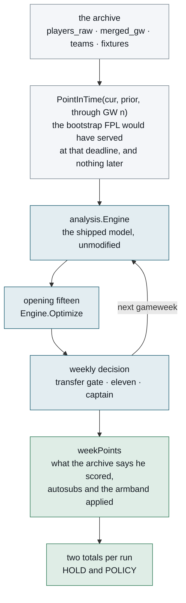
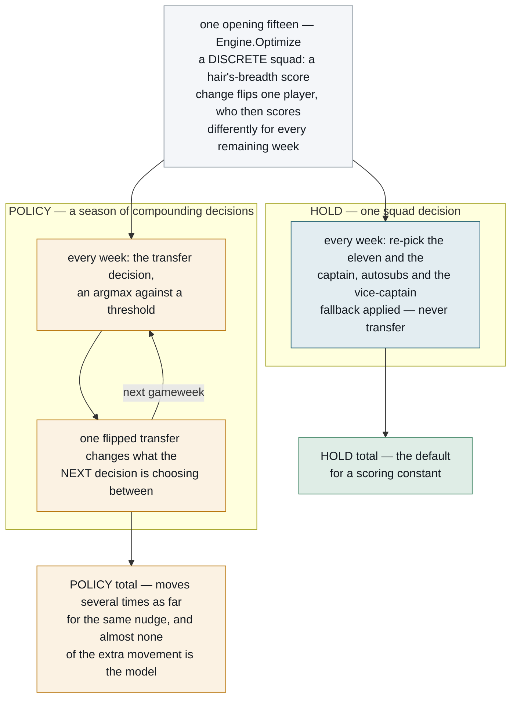
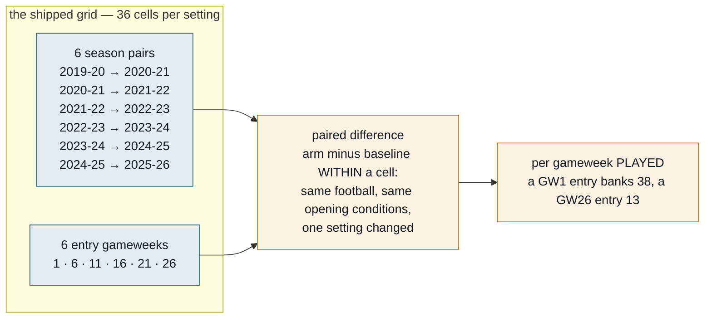
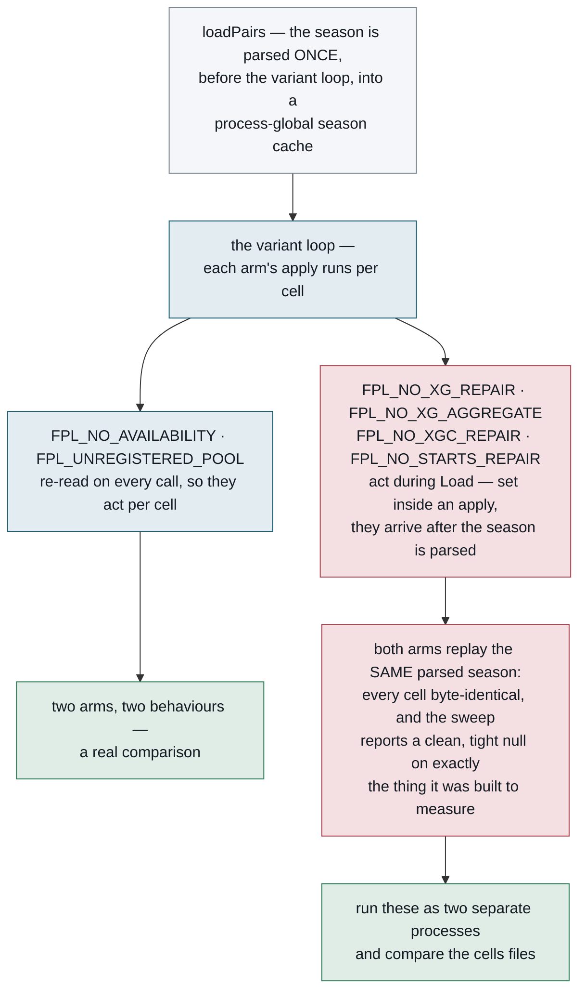
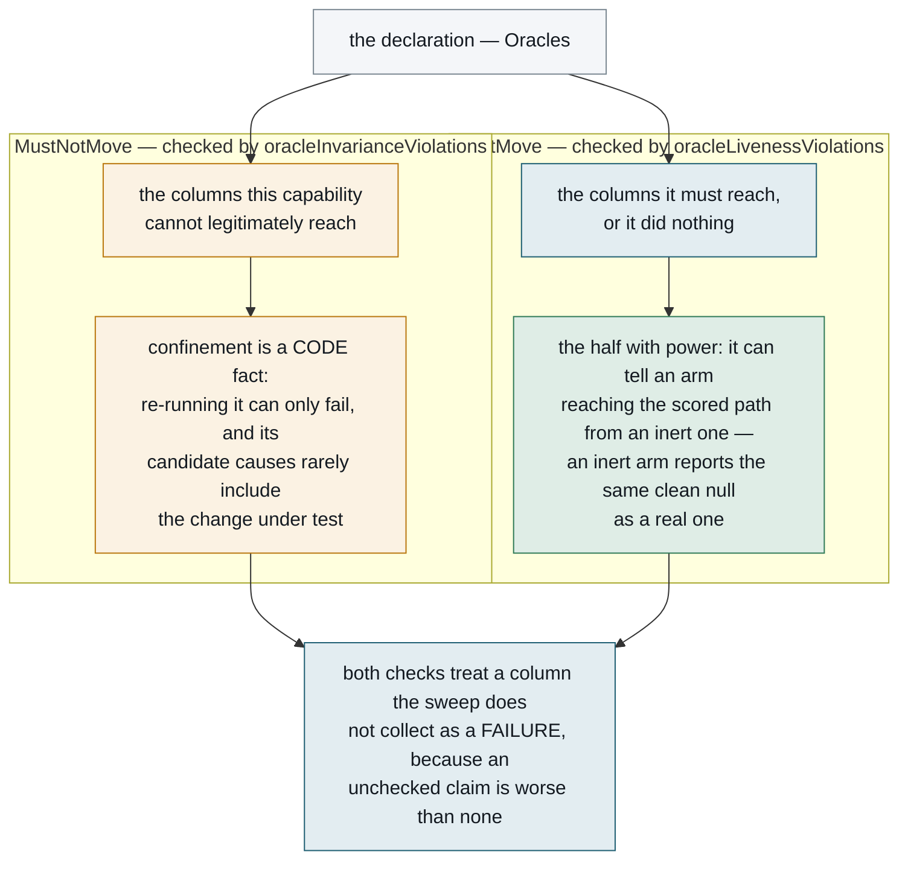
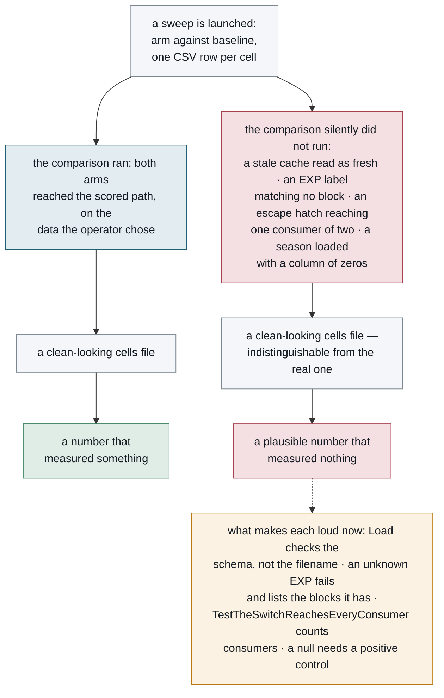

# The replay

`internal/backtest` re-plays finished Premier League seasons through the shipped scoring
model and counts what the policy would have earned. It is how every scoring claim in this
project is validated, and it is the thing that decides whether a change ships.

This is a guide to **using and extending it**. The statistics that turn its output into a
verdict live in [`stats/README.md`](../stats/README.md), which is not required reading to
run one. One idea runs through the whole document, so it is worth stating up front: nearly every
bug this harness has ever shipped presented as **a plausible number that measured nothing** —
a sweep that ran no cells and passed, a null produced by a switch that never arrived, a stale
cache read as fresh data. Most of the machinery described below exists to make that failure
loud, and the closing section collects the design rules it taught.

---

## What it does

For a chosen season, the replay reconstructs the FPL bootstrap **as it stood before a given
gameweek**, builds an ordinary `analysis.Engine` from it, lets the model pick a squad and
re-decide every week, and then scores each week against what the archive says actually
happened.



The loop is the point. The engine is rebuilt from data **through the previous gameweek** at
every step, so the model never sees a result it could not have seen. `PreSeason` does the
same job for the opening squad: this season's rosters and opening prices carrying last
season's statistics, which is exactly the evidence a manager has in August.

**Point-in-time honesty is enforced, not assumed, and it is the one place a new feature can
silently train on the future.** The archive holds every score for the whole season, so
`playedFixtures` strips the scoreline and the `Finished` flag from any fixture after the
cutoff — `TestPointInTimeHidesFutureResults` pins it. The same rule governs the pool: a
January signing appears in `players_raw.csv` with a full season record and in no gameweek row
until January, so building the pre-season pool from the first file alone bought players who
were not in the game, at prices that did not exist, with their prior season visible. If you
add a signal, ask what it reads and when that became knowable.

**It measures the floor, not the system.** Everything the judgement layer does — team news,
press conferences, predicted line-ups — is unreproducible in hindsight, so a replay scores
the deterministic model with nobody watching it. That gap is real and has been sized; the
evidence sits outside this repository, with its verdicts resident in
[AGENTS.md](../AGENTS.md).

## The archive

Seasons come from
[vaastav/Fantasy-Premier-League](https://github.com/vaastav/Fantasy-Premier-League), which
snapshots the FPL API by gameweek back to 2016-17. Four files per season —
`players_raw.csv`, `gws/merged_gw.csv`, `teams.csv`, `fixtures.csv`.

A finished season never changes, so `Load` caches the parsed result to
`<cache_dir>/backtest-v8-<season>.json` and never expires it. The first load of a season
fetches over the network; every later one is local.

**The version in the filename is not the check.** A cache written by an older parser is a
perfectly valid file with no way to know it is missing a field, and relying on the version
alone once cost an afternoon: a v4-to-v5 bump hit v5 files left behind by an earlier
experiment, so a fresh parser read a stale schema and reported no congestion anywhere — a
null result that looked exactly like a real one. So `Load` *checks the schema*: a season
with fixtures but no kickoff times, or gameweek rows with no fixture count, cannot have come
from this parser whatever the filename says. **Add a check there for any field a new
measurement depends on.**

The archive has known defects, and they are documented rather than patched over — a season
with two thirds of its expected goals missing, a `starts` column that is zero for a season
and a half, a gameweek that never happened. The season-by-season inventory is part of the
research record held outside this repository; before trusting a season you have not used
before, check what [AGENTS.md](../AGENTS.md) says it can and cannot run.

## The two metrics

Every run produces two totals from the same opening squad.

| metric | what it scores | use it for |
|---|---|---|
| **`HOLD`** | buy the opening fifteen and **never transfer**, but re-pick the eleven and the captain every week, with autosubs and the vice-captain fallback applied | anything about **scoring** or squad selection |
| **`POLICY`** | the same, plus the weekly transfer decision | only constants that are themselves **about transfers** |

`HOLD` is the default for a scoring constant because it carries **one** squad decision where
`POLICY` carries a season of compounding ones. The replay is deterministic — same inputs,
same outputs — but the optimiser returns a *discrete* fifteen, so a hair's-breadth score
change flips one player, and that squad then scores differently for every remaining week.
Transfers multiply that: each weekly decision is an argmax against a threshold, and one
flipped transfer changes what the next decision is choosing between.

> Determinism is load-bearing rather than incidental, because every byte-identical invariance
> in this project rests on it — and it was **not** true until recently. `seedFor` filled each
> DP seed's bench by iterating a map, so `Optimize` called twice on identical inputs could
> return two different fifteens: the injection rate was 100% and it changed the final answer in
> about 1.4% of landscapes. `TestSeedOrderIsDeterministic` now pins it, and it watches the
> *defect* (seed order) rather than a consequence of it, because the original reproducer
> stopped reproducing mid-investigation and left a census that could not detect anything.

The consequence is that `POLICY` moves several times as far as `HOLD` for the same nudge, and
almost none of the extra movement is the model.

Drawn as two paths from the same opening squad, that asymmetry is the whole argument for
defaulting to `HOLD`: the left path decides a squad once, while the right one feeds each
week's argmax into the next.



**`HOLD` doubles as an invariance check.** A knob that only touches the transfer decision
must leave `HOLD` **byte-identical** across every cell. If it moves, the knob is leaking into
scoring and the experiment is measuring two things at once. That check is cheap — one
disagreeing cell refutes it — where *confirming* an effect costs tens of points a season.
Falsification is the bargain here; take it whenever a change offers one.

Two further scorings ride along for free, because `HoldCaptaincyWeekly` computes all three in
the one weekly pass `HOLD` already pays for: `hold_fixedcap` pins the armband to the day-one
pick, and `hold_nocap` doubles nobody. **Neither may replace `HOLD`** — FPL doubles a captain
every week, so a metric that does not is further from the game rather than closer to it. They
exist to answer whether a quieter instrument is available, and the answer so far is no.

### The other four columns: xPoints, moves and hits

A sweep collects a **comparable series** for eight columns, named by `cellMetricColumns`
(`internal/backtest/oracle.go`): the four points series above, then the expected-points pair
`hold_xpoints` and `policy_xpoints`, then `moves` and `hits`. That list is the set an
invariance declaration may name, not the CSV schema, which is much wider and lives in
[`stats/README.md`](../stats/README.md).

`moves` and `hits` are both counted off the `POLICY` arm: transfers made, and how many of
those moves were paid for with a −4. **`hits` is a count, not points** — the points charged
are `4 × hits` (`HitCost`, `internal/backtest/gate.go`), and reading it as points puts every
gate table out by a factor of four.

**"xPoints" is realised points with four channels swapped for their expected value.** It is
a **residual**, not a re-scoring (`internal/analysis/xpoints.go`): `xPoints = points −
residual`, where the residual covers goals against xG, assists against xA, and the clean
sheet and the concede deduction against expected goals conceded. Every other channel —
appearance, bonus, saves, cards, defensive contribution — keeps its realised value, which is
what lets the instrument span three bonus regimes without knowing about any of them. The
attacking half of the swap is priced through a per-season, per-position `ConversionScale`;
the clean-sheet half is not scaled at all.

The appeal is that it should be a **quieter instrument**. Conversion luck — chances scored
against chances created — is a large part of what a footballer earns in a season, so a
measure built from chances rather than outcomes ought to let a real effect show through with
fewer replays.

What actually happened, on a pre-registered 36-cell pilot with a kill criterion it met: the
instrument cuts standard errors on both metrics, but on `HOLD` it **attenuates the means
along with them**, so `|t|` goes down rather than up and nothing is gained — never quote a
`hold_xpoints` threshold as if power improved. On `POLICY` the means survive the shrinking,
so `policy_xpoints` earns its keep as a second instrument — **beside points, never instead
of them**.

*(**Standard error**: how much a measured average would wobble if you re-ran the experiment.
**`t`**: the effect divided by that wobble — bigger means harder to dismiss as chance. How
big counts as big is **not** the familiar 2 here — it is `t_crit` at the comparison's own
degrees of freedom, 2.571 at best on this grid and often worse; see "What it cannot do".
Shrinking the wobble only helps if the effect survives the shrinking, and on `HOLD` it does
not — the third recorded instance in this project of removing variance removing signal.)*

Two honest limitations stand. First, the instrument **leaks**: the bonus points system pays
goals, assists and clean sheets, so about a quarter of the conversion luck the residual
removes walks back in through the realised bonus column for an attacker
(`stats/xpoints_channel_audit.py`: corr 0.606, slope 0.252, n 12,104). It is under-smoothed
exactly where it is used most — recorded rather than fixed, because modelling expected bonus
is its own closed line. Second, **tuning a constant on xPoints is a closed line** — the
columns are instrumentation only. Further caveats on the conversion scale — it ships on
mechanism, is fitted in sample, and recentres cross-season levels — live in
[AGENTS.md](../AGENTS.md) under "What has been measured".

One mechanical note for anyone reading cells files: `runPolicySweep` populates the xPoints
pair on every cell, but the variance decomposition builds its own row and leaves the pair
*blank rather than zero* — a blank means the column was not computed, not that it was.

## Cells and paired differences

A **cell** is one replayed season entered at one gameweek. The grid of cells is the unit
every sweep is measured on, and two normalisations applied to it are what make cells
comparable at all.



Entering at a later deadline is a **real scenario**, not a synthetic one: FPL lets a manager
join at any deadline with a fresh £100m. Each entry point is a different path through the
same football. Paths are the cheap axis; seasons are the scarce one, and buying a season is
worth more than any number of paths — see "What it cannot do" for the arithmetic.

Doubling the entry points from three to six changed what a sweep could see at all: a transfer
comparison that read as pure noise at twelve cells showed structure at twenty-four. Take that
as a claim about the **method** and not about the constant — the particular shape it revealed
was later re-run on a changed model and did not replicate, which is itself the standing rule
that a sweep is only valid at the setting of every knob it shares a population with.

Two normalisations are load-bearing and both have been got wrong:

- **Per gameweek played, never per season.** Pooling raw totals across entry points weights
  the GW1 regime nearly three times as heavily as the GW26 one.
- **Paired within the cell, never two sums compared.** Twelve cells agreeing at +40 is a real
  effect; +900 against −860 is not, and a totals column cannot tell them apart.

**The shipped grid is six season pairs by six entry gameweeks — `sweepPairNames()` returns
`extendedPairNames()`, 36 cells per setting.** The four season pairs the research record was
originally built on are a strict subset of the six, and the cells they produce inside a
six-season run are byte-identical to an independently run four-season sweep — verified cell
by cell across every outcome column. So earlier figures were not invalidated by the
widening; each remains correct **as a four-season figure**, and says so when quoted.

What the widening buys is **degrees of freedom**, which no number of entry points can move —
3 to 5, dropping the positive control's smallest detectable effect from 12.4 to 8.4 points a
season on `HOLD`. Read that as a shape and not a ratio: across all fifteen four-season
subsets of the six the same threshold ranges 8.2 to 16.0, so any single four-season figure
carries about ±30% of which-seasons-you-got, while all six five-season subsets beat the
median four-season one. The cost is arithmetic: half again the compute, 36 cells where there
were 24. The added seasons carry caveats that travel with them — xG on a borrowed provider
offset, priced at about 1 point a season of threshold and a lower bound, and a reconstructed
`starts` column biased 3:1 toward making fringe players look nailed. The comment on
`extendedPairNames` enumerates the full set; read it before sweeping anything about minutes
or rotation on those seasons.

**Sweep transfer settings on six seasons too.** Widening helped 10 of 11 transfer-side arms,
median threshold ratio 0.62, four of them `min_gain` — a transfer setting.

The grid is declared once in `harness_test.go`, and `TestTheGridIsDeclaredOnce` fails if a
file pastes a literal back in. `FPL_SWEEP_SEASONS` selects between the named grids —
`extended` (the six that ship), `default` (the historical four, which is how a recorded
figure is reproduced on the grid it was measured on) and `scoring` (seven, `HOLD`-only, and
`runPolicySweep` refuses to report `POLICY` on it rather than trusting an operator to
remember). Entry-point densification stays opt-in through `FPL_SWEEP_STARTS`.

## Running one

### The human-readable replay — free, no LLM, no API key

```bash
go build -o armband ./cmd/armband
./armband backtest 2023-24          # judge each transfer over the configured horizon
./armband backtest 2023-24 10       # ...or over 10 gameweeks instead
```

It prints the model's GW1 squad against the random-squad distribution and a perfect-hindsight
ceiling, plays the season out under three transfer policies, reports every week against
holding the opening fifteen, and scores every transfer against what the two players actually
went on to do.

This is the one to reach for when you want to *see* what the model did. It is a single path
through a single season, so it is the noisiest thing here — read it for mechanism, not for a
verdict.

### A sweep — the thing that decides whether a constant moves

Sweeps are Go tests behind `DIAG=1`, because they take minutes and have no business running
in `go test ./...`. Each sweep diagnostic offers named **blocks**, selected with `EXP`.

```bash
# 1. Replay the grid, emitting one CSV row per cell.
EXP=MINHL FPL_CELLS=/tmp/cells.csv \
  scripts/replay -run TestDiagProjection -v -timeout 180m

# 2. Is this arm distinguishable from the baseline?
Rscript stats/sweep_inference.R /tmp/cells.csv

# 3. What size of effect could this design have seen at all?
Rscript stats/variance_components.R /tmp/cells.csv

# 4. Is the ORDER of the settings reproducible? Much cheaper than any single gap.
Rscript stats/shape_inference.R --order=numeric --mediator=moves \
  --invariant=hold /tmp/cells.csv
```

The flag spellings above are `go test`'s, deliberately: `scripts/replay` sets `DIAG=1` itself
and translates `-run`, `-v`, `-timeout` and `-count` into the `-test.*` forms a compiled test
binary answers to.

**Drop the `go test ./internal/backtest` prefix entirely, package path included** — and this
is a silent failure, not an error. Go's flag parsing stops at the first non-flag argument, so
a stray `./internal/backtest` disables every `-test.*` flag after it: the binary then runs
the whole package under `DIAG=1`, selects nothing, prints nothing extra and exits 0. Some
recipes in `stats/README.md` are still written in the `go test` form; when copying one, remove
the prefix rather than swapping the command.

A sweep cell costs about **4.5 seconds**, so an arm on the shipped 36-cell grid is roughly
**two and a half to three minutes**. That rate comes from two banked runs: `BLEND` at 4 arms ×
36 cells in 10m49s and `BLENDLO` at 6 × 36 in 15m07s, which are 4.5 and 4.2 seconds a cell
(`stats/snapshots/2026-08-14-blend/` and `-blendlo/`). Budget from the per-cell rate, not from a
per-arm number — per-arm figures rot every time the grid changes. (It was fifteen minutes an arm
before the optimiser stopped being GC-bound, which is why older comments budget an
afternoon.)

**Run sweeps through `scripts/replay`, and they run in parallel.** The rule used to be one at
a time, because runs were being killed under memory pressure — and the culprit was never the
replay but the `go test` driver it ran under. The wrapper compiles once and runs the binary
as a child, which removes the problem; the measurement and the guard rails are the next
section.

The consequence of a kill is unchanged, which is why the provenance sidecar still matters: a
killed arm is a silently partial result, so `runPolicySweep` declares the arms it *intends*
to run before computing the first cell, and the gap becomes arithmetic instead of invisible.

Where the blocks live:

| diagnostic | blocks |
|---|---|
| `TestDiagProjection` | `MINHL` `MINW` `BONUS` `DCC` `BENCH` `FIXW` `MINK` |
| `TestDiagTransferPolicy` | `A` `B` `C` `D` `E` `F` `G` |
| `TestDiagRejudge` | `H` `I` `J` `K` `CAPTAIN` `LADDER` `CAPSEAM` `LOADTR` `BANK` `PRIOR` `BLEND` `BLENDLO` `BLEND2` `WEEKXI` `BUY` |

**`EXP` must name a block the diagnostic you are running actually has.** Naming another
diagnostic's block used to select nothing, write no cells, and pass in 0.00 s — which reads
downstream as a sweep that had nothing to say rather than one that never ran. It now fails
and lists the blocks it does have; that mistake cost a snapshot once, when a recipe paired
`EXP=A` with `TestDiagProjection`. The table above is a hand-maintained convenience; the list
`blockPicker.check` prints on a miss is generated from the blocks the diagnostic actually
offers, so on any disagreement the table is the one that is wrong.

### A one-off diagnostic

Most of the `TestDiag*` tests are not sweeps at all — there are around a hundred, and the
current count is one `grep` away — they measure the model against outcomes rather than
against another setting, and most run in seconds:

```bash
DIAG=1 go test ./internal/backtest -run TestDiagCalibrationDrift -count=1 -v
```

`-count=1` is not optional. Go caches test results, and a cached run replays its stdout while
writing no new CSV rows — so a diagnostic feeding a snapshot appears to have run and did not.

## Why `scripts/replay` runs a prebuilt binary

Sweeps used to be serialised by hand, after blocks were repeatedly killed by memory pressure
— one six-arm block was killed four times. Sampling every process across a whole sweep block
found the memory, and it was not where anyone was looking:

| process | peak RSS | lives for |
|---|---|---|
| **`go`** — the `go test` driver | **~1 GB** | the entire run |
| `link` | 262 MB | seconds, during the build |
| `compile` | 211 MB | seconds, during the build |
| **`backtest.test`** — the sweep itself | **145 MB** | the entire run |
| `vet` | 28 MB | seconds |

**The toolchain driver is roughly seven times the size of the sweep it is driving, and it
stays resident for the whole run.** Every concurrent `go test` pays it again, so four
parallel sweeps was four gigabytes of toolchain and about half a gigabyte of actual replay.
That is what was being killed, and it is why the failure looked like "replays cannot run in
parallel".

So `scripts/replay` **compiles once under a build lock and runs the binary as a child**,
which is the whole of the fix — the same block costs about a tenth of the memory through the
wrapper, at the same speed. The child is waited for rather than `exec`'d, deliberately: the
wrapper has to outlive the run to read the peak RSS out of the timer file and to print the
signal-9 diagnosis, and an `exec` would replace the wrapper process so neither survives.

**Budget a real grid sweep at roughly 90 to 140 MB resident.** That band comes from the
banked runs themselves; a short static probe with no replay, or a row-dump diagnostic, sits
well below it, and neither is a grid sweep. The wrapper prints each run's peak precisely so
the band can be checked rather than trusted — it holds only until some arm makes it false.

The rest is guard rails:

- a **bounded semaphore** (`FPL_REPLAY_SLOTS`, default 3) so extra runs *queue* instead of
  racing. The slot directory is keyed by a hash of the repository path, so the limit is per
  checkout and not per machine: a second worktree gets its own three and does not queue
  against the first;
- a **per-run memory cap** set well above the measured peak, so it binds only on a run that
  has gone wrong rather than taxing every ordinary one — `FPL_REPLAY_MEM_HIGH` (default 2G,
  the soft cap that throttles and reclaims) and `FPL_REPLAY_MEM_MAX` (default 4G, hard).
  Both exist only inside `systemd-run --user --scope`: without a user systemd manager the
  wrapper prints `replay: no user systemd manager; running without a memory cap` and runs
  under plain `nice`, so on such a host the semaphore and the exit status are the whole of
  the protection;
- **`FPL_REPLAY_NICE`** (default 10), so a three-hour sweep yields to interactive work. It
  applies on both paths, as `systemd-run --nice` or as `nice -n`;
- an **exit status you can trust**. A sweep once reported success while having been
  OOM-killed, because a trailing `echo` masked the exit status — and a killed sweep leaves a
  partial cells file that reads downstream as a complete sweep with fewer arms. The wrapper
  exits with the real status, and on signal 9 prints `KILLED BY SIGNAL 9 — this is an
  out-of-memory kill, not a test failure`. It does not print the string "OOM", so grep a log
  for `SIGNAL`, not `OOM`;
- the **peak RSS of every run**, printed. It comes from GNU `/usr/bin/time`; a host without
  it prints `peak_rss=unknown` rather than losing the run, so a snapshot banked from such a
  host has no memory provenance at all — worth knowing before quoting its absence as a low
  figure.

## The switches

Every one of these defaults to shipped behaviour. **None is set in normal operation**; they
exist because a constant nobody can vary is a constant nobody measures.

The tables below cover the switches a sweep is likely to set, and they are not complete —
`FPL_CONFIG` (which `config.json` a diagnostic loads, so every constant at once),
`FPL_TEAMNEWS_MAX_HOURS` and `FPL_FIXTURE_LOAD` are registered but not covered here. The
authority is `internal/snapshot`'s `envSwitches`: `TestEnvSwitchListIsComplete` holds it
against a scan of the tree's Go source, so a knob added without being registered there fails
a test rather than quietly making two snapshots incomparable. It does not reach the
wrapper's own `FPL_REPLAY_*`, which are shell.

Most are read **once at process start**, so they select an arm for a whole run rather than
toggling between cells. Two are deliberately re-read on **every call** —
`FPL_NO_AVAILABILITY` and `FPL_UNREGISTERED_POOL` — so both arms can be toggled inside one
run and paired properly. A cached copy cannot be, and then the whole measurement is lost.

**The oracles are neither.** They are a field on `SimConfig`. Two of them — availability and
transaction price — are seeded from `FPL_ORACLE_AVAILABILITY` and `FPL_ORACLE_PRICES` where a
cell's config is built and read nowhere deeper; the rest have no environment name at all and
are only reachable as a declared sweep arm, which is the direction this is moving in. A field
is strictly better than either mechanism: both arms toggle in one process, concurrent cells
cannot read each other's setting, there is no environment scan on a path that runs once per
player per gameweek, and the provenance stamp is derived from the same value the simulation
consumed rather than being a second mechanism to keep in sync.

One consequence worth knowing before you export one of these into a shell you then run a
sweep from: an oracle may only enter a sweep as a **declared arm**. The seed reaches the
baseline arm too, and a sweep whose baseline is oracled is refused outright, because every
difference it printed would be hindsight measured against hindsight.

### Selecting the grid and the output

These pick what a run replays and where its numbers land; none of them changes a decision the
model makes.

| switch | effect |
|---|---|
| `DIAG=1` | required — every diagnostic skips without it |
| `EXP=<block>` | run one named block instead of all of them |
| `FPL_CELLS=<path>` | write one CSV row per cell, plus a `.means.csv` mirror and a `.provenance.csv` sidecar |
| `FPL_MODEL_CSV=<path>` | a model diagnostic writes its numbers beside the table it prints |
| `FPL_PREDICTION_CSV=<path>` | the prediction benchmark's per-gameweek cells |
| `FPL_*_ROWS=<path>` | a per-observation dump from one diagnostic, so an R script can fit on the rows rather than on the bucket means the diagnostic prints — `grep newRowDump internal/backtest` is the current list, plus `FPL_XGC_TERCILE_CSV`, which names a **directory** rather than a file |
| `FPL_SWEEP_SEASONS=extended\|default\|scoring` | which season grid a sweep replays — the three named grids described under "Cells and paired differences". Panics on anything else |
| `FPL_SWEEP_STARTS="1,2,3,..."` | replace the six entry gameweeks. Panics on anything it cannot read |
| `FPL_SWEEP=1` | make `armband backtest` print one machine-readable `SWEEP` line |
| `FPL_WEIGHT="bonus=0.5,fixture=0.8"` | override scoring weights for `armband backtest`, applied before anything is built from the config |
| `FPL_SEASON`, `FPL_PRIOR`, `FPL_TRACE` | select the season and players for `TestDiagTrace` |
| `FPL_REPLAY_HTML=<path>` | `armband backtest` also writes a clickable page — a tab per gameweek and the transfer list, which a scrollback cannot be |
| `FPL_REPLAY_GWS=<n>` | how many gameweeks that page shows, default 10. Read only when `FPL_REPLAY_HTML` is set |

Three notes. The two grid switches **panic on a value they cannot read rather than falling
back** — an unrecognised grid or entry list would otherwise produce a complete-looking sweep
on a grid its operator never chose. `FPL_SWEEP_SEASONS` is consumed by `loadPairs` once,
before the variant loop, so it selects a grid for a whole process and can never be a sweep
arm. The `FPL_*_ROWS` switches are output paths, so `TestEnvSwitchListIsComplete` skips them
and no fingerprint records them — which also means setting one cannot move a measured number.

And one key of `FPL_WEIGHT` is inert here: `prior_half_life` reaches the live blend only, so
`armband backtest` comes back byte-identical and says so on stderr
(`TestPriorHalfLifeSaysItCannotReachTheReplay`). The replay reads `SimConfig.PriorHalfLife`,
which needs `SimConfig.OlderPriors`, which this switch cannot set.

### Turning a shipped behaviour off, to re-measure it

Each of these restores a behaviour the project used to have, so that the value of the fix can
be re-measured on demand.

| switch | restores |
|---|---|
| `FPL_NO_VICE_CAPTAIN=1` | a blanking captain forfeits the bonus outright |
| `FPL_NO_LEGAL_AUTOSUBS=1` | substitutions made in bench order without checking formation legality — an outfielder on for a blanking keeper, a fourth defender behind a back three |
| `FPL_WC_IGNORES_BOOST=1` | a wildcard played **the week before** a bench boost builds an ordinary squad rather than optimising all fifteen for the chip it is preparing for. FPL allows one chip a gameweek, so the two can never share a week — the gate is on `gw+1`. It exists to separate the cost of the *wildcard* from the cost of *building for the boost*, which the first sequence measurement conflated |
| `FPL_NO_THRESHOLD_SPLIT=1` | appearance points and the clean sheet scaled by minutes reliability rather than P(60 minutes) |
| `FPL_NO_SHORT_PLAY=1` | no appearance point below sixty minutes |
| `FPL_NO_FIXTURE_LOAD=1` | the model's `Score` stops being multiplied by matches per gameweek, so a double looks like a single **to the scorer**. The replay still pays both fixtures |
| `FPL_NO_LOAD_TRANSFERS=1` | the transfer objective cannot see a double coming |
| `FPL_NO_SAVES_FIXTURE=1` | a keeper's saves carried across unadjusted by the opponent |
| `FPL_NO_BLANK_RUN=1` | no discount at the onset of an absence |
| `FPL_NO_UNIFIED_APPEARANCE=1` | the second start-share estimator of P(appears) |
| `FPL_NO_FUNDED_UPGRADE=1` | the optimiser's N-downgrades-fund-one-upgrade move |
| `FPL_FLAT_BENCH=1` | uniform bench credit instead of per-slot weights |
| `FPL_FIXED_BENCH_SLOTS=1` | the fixed bench tuple instead of weights derived from the eleven |
| `FPL_NO_XG_REPAIR=1` | the archive's own expected goals, unbackfilled |
| `FPL_NO_XG_AGGREGATE=1` | leave the repaired season *totals* alone, isolating that half of the repair |
| `FPL_NO_XGC_REPAIR=1` | no expected goals *conceded* in the four seasons the archive gives none, so defenders and keepers are scored with neither the clean sheet nor the goals-conceded deduction |
| `FPL_NO_AVAILABILITY=1` | the replay cannot see that a player left the league |
| `FPL_NO_STARTS_REPAIR=1` | `starts` reconstructed from minutes rather than taken from the Understat harvest |

> **A switch that changes the parsed season cannot be a sweep arm.** `FPL_NO_XG_REPAIR`,
> `FPL_NO_XG_AGGREGATE`, `FPL_NO_XGC_REPAIR` and `FPL_NO_STARTS_REPAIR` all act during `Load`,
> and `runPolicySweep` calls `loadPairs` **once, before the variant loop**, into a
> process-global season cache. An arm that sets one of them inside its `apply` — the way
> `FPL_NO_AVAILABILITY` and `FPL_UNREGISTERED_POOL` legitimately do, since those act per cell
> — therefore replays the *same* already-parsed season in both arms. Every cell comes out
> byte-identical and the sweep reports a clean, tight null on exactly the thing it was built
> to measure. Run these as **two separate processes** and compare the cells files.

The trap is one of position — where the load sits relative to the variant loop — and it is
easier to see than to say. Everything below the load line runs per cell; everything above it
has already happened by the time any arm's `apply` executes.



Three caveats belong beside this table rather than inside it. `FPL_NO_LEGAL_AUTOSUBS`
restores a named contamination event worth 7-14 points a season, so it reproduces a figure
measured before `legalAutosubs` shipped rather than offering a knob worth sweeping — and
since `HOLD` is *defined* as "with autosubs and the vice-captain fallback applied", a run
with it (or with `FPL_NO_VICE_CAPTAIN`) set is not the same metric as one without.

`FPL_NO_FIXTURE_LOAD` reaches `Score` only through a horizon-1 engine
(`Engine.FixtureLoadInScore`), which the replay builds only for the fielded eleven when a
cell sets `SimConfig.WeeklyXI`, or for a free-hit squad. `HoldCaptaincyWeekly` builds every
weekly engine at the configured horizon, so `HOLD` is byte-identical to this switch at
shipped config, and an arm leaving `WeeklyXI` false is byte-identical on both metrics. Check
the mediator before reading the null.

`FPL_NO_STARTS_REPAIR` is byte-identical to shipped on every populated outcome column at
shipped config — a null there says the harvest is unread on the scoring path, not that it
does not matter. It moves under `FPL_NO_UNIFIED_APPEARANCE`, `FPL_RELIABILITY_SPLIT` and in
the oracles.

### Turning something on that does not ship

These enable a behaviour the project measured and declined, or a hindsight capability used to
bound what a real feature could be worth.

| switch | effect |
|---|---|
| `FPL_MAGNITUDE=1` | continuous fixture difficulty instead of FPL's integer ladder (`FPL_MAGNITUDE_ALPHA` sets its exponent) |
| `FPL_UNIFIED_TRANSFERS=1` | the bounded-revision search in place of the bespoke pair-then-singles policy |
| `FPL_UNREGISTERED_POOL=1` | admit players who were not yet in the game, which is the leak the pool gate closed |
| `FPL_TEAM_FORM=<w>` | scale a club's rates by `(recent/season)^w`. Zero ships, which is the feature off; the prediction work found 0.5 and did not resolve it. Read once at startup, so it selects an arm for a whole process — `SetTeamFormWeight` is how a sweep varies it |
| `FPL_TEAM_FORM_RAW=1` | with the blend on, take each window raw instead of dividing it by the ease of the fixtures it contained. The two arms differ by exactly the fixture component, which is what separates "tracking the club pays" from "the fixture ladder is mis-scaled" |
| `FPL_CHIP_PLAN="wildcard=6,bb=8,tc=9,free_hit=16"` | the chip weeks `armband backtest` plays, or `config` to play your saved plan. **The replay is chipless unless a plan is given**, so every figure recorded before chips were modelled is a chipless season — and a sweep arm sets `SimConfig.Chips` rather than this, which `cmd/armband` reads and `internal/backtest` never does |
| `FPL_ORACLE_AVAILABILITY=1` | seeds `Oracles{Info: OracleAvailability}` — hindsight: anyone who finished with no minutes is unavailable from the start |
| `FPL_ORACLE_PRICES=1` | seeds `Oracles{Info: OracleTransactPrice}` — hindsight: every transfer transacts at the best price within two gameweeks either side |

**Never make an oracle the default.** Every figure in the record was measured without them,
so switching one on would inflate all of them at once and make the record incomparable with
itself.

A diagnostic that wants to *measure* an oracle declares it as an arm rather than setting the
variable — `oracleVariant(Oracles{Info: OracleAvailability}, "perfect team news", nil)` —
which stamps the label, the per-cell CSV and the means file from the same value it installs.
The variables remain because they appear throughout the research record and a figure recorded
against one must stay reproducible.

**The declaration has two halves, and the sweep enforces both.** `Oracles` answers
`MustNotMove()` — the columns this capability cannot legitimately reach — and `MustMove()`,
the columns it must reach or it did nothing. `oracleInvarianceViolations` and
`oracleLivenessViolations` check one each, and both treat "the sweep does not collect that
column" as a failure, because an unchecked claim is worse than none.

**The liveness half is the half with power.** Confinement is usually a *code* fact, so
re-running it can only fail, and its candidate causes rarely include the change under test.
It is the `MustMove` side that can distinguish an arm reaching the scored path from one that
is inert — an inert arm reports the same clean null as a real one, which is this package's
whole failure mode. `TestLivenessDeclarationsAreCoherent` pins the three properties a
`MustMove` set has to have: it may only name a column the sweep collects, it may never name a
column the same oracle pinned, and the price oracle must declare one, because it is the arm
with no other evidence it is doing anything.

The two halves side by side, with where the power sits — the left column can only re-confirm
a code fact, while the right one is the check that can tell a real arm from an inert one:



`MustMove` is empty for most decision axes, so an arm having one is not the default — read
the switch statement in the code rather than counting from memory. `AxisChipWeek`'s
emptiness is the one the test pins as *deliberate*: it pins every column, changes no decision
by construction, and carries its liveness in its `observe` hook, which is why the field
cannot be a blanket "something must move".

### Varying a constant

These sweep a scoring or policy constant across values. The cells say what each varies; how
the parsers fail is collected below the table, because it is how a sweep goes quietly wrong.

| switch | varies |
|---|---|
| `FPL_MINUTES_WEIGHT` | the convexity exponent on minutes reliability |
| `FPL_POS_MINUTES_SCALE="MID=0.75,FWD=0.5"` | how much of the rotation severity each position carries |
| `FPL_RELIABILITY_SPLIT` | share of reliability from minutes rather than start share |
| `FPL_ATK_FIXTURE_SCALE`, `FPL_DEF_FIXTURE_SCALE` | stretch either difficulty ladder around 1.0 — the only way past full strength, since `fixture_weight` is clamped to [0,1]. `0` is valid and flattens the ladder |
| `FPL_CS_XGC_FACTOR` | scale expected goals conceded *only* inside the clean-sheet term — the exponent half |
| `FPL_CS_SCALE` | multiply every clean-sheet probability by a constant — the flat half. The two are one fitted curve and must be swept together, never as two ladders |
| `FPL_BENCH_SLOTS="out1,out2,out3,gk"` | the bench shape, renormalised to sum to four so it does not also sweep the scale |
| `FPL_BLANK_RUN_PENALTY`, `FPL_BLANK_RUN_MAX` | the absence-onset discount and its window |
| `FPL_CAPTAIN_SHRINK` | pull the captain term toward the runner-up |
| `FPL_BUY_DISCOUNT` | charge a buy-side over-rating against an incoming player |
| `FPL_APPEARANCE_FIT="sixty_slope,sixty_midpoint,cond_intercept,cond_slope"` | the four constants of the two appearance curves, all four or none |
| `FPL_MULTI_SURCHARGE` | an escalating charge on doing several things in one week: the second move costs one of these, the third two. Zero ships. Reaches only the `FPL_UNIFIED_TRANSFERS` search, so it is inert on the shipped path |
| `FPL_BUDGET_WEIGHT` | what money freed by a transfer is worth per gameweek remaining. Zero ships, which is money having no value at all. Unlike the surcharge above, this **does** act on the shipped bespoke search — `moneyPts` in `decide`, on both the funded pair and the single move |
| `FPL_BENCH_WEIGHT`, `FPL_START_GW`, `FPL_BAND_STRENGTH` | `armband backtest` only |

**Most of these parsers fall back to the shipped value in silence rather than refusing a
value they cannot read** — and the run fingerprint stamps the string you *set*, not the value
that ran, so a malformed arm produces a complete-looking sweep at the shipped constant under
a provenance claiming otherwise. That is this page's closing failure mode, reachable from
this table. Within `internal/analysis/sweep.go` the strict exceptions are the two fixture
ladders and `FPL_CS_SCALE`, which
share `envScaleStrict`: it panics on anything it cannot parse and on a negative (a negative
would invert the ladder), while `NaN` and `Inf` parse and are deliberately not refused —
the fingerprint then stamps what ran. Other packages have lenient parsers of their own —
`envFloat` in `internal/backtest/unified.go` reads `FPL_MULTI_SURCHARGE` and
`FPL_BUDGET_WEIGHT` — so do not read the three above as a complete inventory. The comment on
`envScaleStrict` carries the current list of which parsers are strict; the code is the
authority, so **check the value landed before believing a null**.

The lenient failures worth knowing by name:

- `envDefaultAbove` defaults on any value `<= 0`, so **the zero arm is unreachable from the
  environment** for every switch that reads it — `FPL_CS_XGC_FACTOR` (no clean-sheet exponent
  at all), `FPL_BLANK_RUN_MAX` (no window), `FPL_CAPTAIN_SHRINK`, `FPL_BLANK_RUN_PENALTY`
  and `FPL_MAGNITUDE_ALPHA`. `FPL_BUY_DISCOUNT` reads it too and is harmless, because it
  ships at 0 and its consumer no-ops on `<= 0`.
- `FPL_POS_MINUTES_SCALE` **drops** an entry it cannot parse while applying its siblings, so
  half a map arrives looking whole.
- `FPL_RELIABILITY_SPLIT` is bounded to [0,1] and silently defaults outside it.
- `FPL_BENCH_SLOTS` is silent on wrong arity.
- `FPL_APPEARANCE_FIT` is all-four-or-none — and "none" means silently ignored, not refused:
  wrong arity or one unparseable field returns the four shipped values with no error. The
  curves have to move together because `playsAtAll` takes the max of the identity and
  `playsSixty`, so a fit that moves one curve can spend its whole effect on that max.

## What it cannot do

This is the part to read before quoting any number it produces.

**Degrees of freedom are a property of the comparison; the grid only sets their ceiling.**
The season-clustered standard error rests on `S − 1`, and no number of entry points moves it:
the six seasons that ship give df 5 and a 5% critical value of **2.571**, where the four they
replaced gave df 3 and **3.18**. `|t| = 2` is about p = 0.10 at df 5 and p = 0.14 at df 3, so
it is not the familiar 2 on either grid. Every `t` written into the record before CR2 shipped
is a naive figure computed as though every cell were independent.

Do not compute with df 5 either. It is the widest the grid allows, not a property to
substitute into a formula: df is resolved **per contrast** and is frequently lower, which is
why one table in the record carries thresholds of 17, 14 and 34-40 side by side. A detection
threshold is `t_crit(df) × SE × 38`, never `2 × SE × 38`. Take the df, the p = 0.05 effect
and the 80%-power MDE from `stats/variance_components.R`, and quote the range between its
clustered and start-fixed estimators rather than picking an end.

**A detection threshold belongs to a comparison, not to the harness.** Across 23 real
comparisons on the four-season grid the significance threshold has a median of **39 points a
season on the season-clustered estimator** — the start-fixed one puts the same 23 at 32 — and
quote the grid with the 39, because it is a four-season figure. On the clustered estimator
the same comparisons range **7.6 to 232**, depending entirely on how consistently the change
lands across cells; the start-fixed estimator reaches 3.9 at the low end, so name the
estimator with any figure — `stats/regenerate_mde.sh` prints both. A mechanism-certain change
— one that does the same thing in every cell — resolves an order of magnitude more finely
than a constant whose effect varies by season. The widening prices mechanically: a threshold
scales as `t_crit(S−1)/√S`, which is 0.66 of the four-season figure, so the median reads as
roughly 26 on today's grid — an ordering, not a point estimate.

Read the threshold off the `scope = "arm"` rows of the sweep's own
`stats/out/<label>/mde.csv`, or of the aggregate `stats/out/mde-all-arms.csv` that
`stats/mde_aggregate.py` collects every per-sweep table into; do not quote a single number as
the instrument's resolution. There is deliberately no bare `stats/out/mde.csv`:
`variance_components.R` writes one directory per sweep because a twelve-cell demo run once
wrote to a bare default and its figures were read as current by the accuracy snapshot for
weeks, the output naming no source. `stats/out/` is gitignored; the cells behind it are
committed, so `stats/regenerate_mde.sh` rebuilds every table from scratch in seconds.

**Almost every constant here is worth 11 to 34 points a season**, which sits below that
median. So **"unresolved" is the expected reading for a real effect**, not evidence against
one. It is not "refuted".

Three responses are legitimate when a comparison will not resolve, and relabelling is not one
of them:

- **decide on mechanism** — "the objective should say what the game actually pays" needs no
  significance at all, and is why the vice-captain fallback and the sixty-minute threshold
  split both ship;
- **decide on shape** — a plateau with a cliff, or monotonicity across several settings, pools
  information across arms instead of testing each alone. `shape_inference.R` does this
  properly, and requires the predicted order to be committed to *before* the data is read;
- **buy seasons wherever a season can be bought, and densify paths only where it cannot.**
  Entry points buy about 20% off the standard error at twelve of them and cannot move the df
  at all, where two more seasons take df from 3 to 5 and `t_crit` from 3.18 to 2.571 — the
  Understat backfill is what made two more playable. Paths remain a real axis and a
  **nested** one: `SimConfig` carries `StartGW` and no `EndGW`, so every window runs to GW38
  and an entry at GW2 shares 37 of its 38 gameweeks with an entry at GW1. At spacing 5 that
  correlation is evidently tolerable; at spacing 1 a grid of near-duplicates would shrink the
  reported SE without adding information. `FPL_SWEEP_STARTS` is the knob.

**Absolute totals from a sweep are not comparable with anything else.** `runPolicySweep` pins
the modern five-transfer bank for every cell, which is historically wrong for 2022-23 and
2023-24 — deliberately, so that cells governed by different transfer rules stay comparable.
Only the paired differences carry across. Use `seasonConfig` rather than `sweepConfig` when
the output is a description of a season rather than a contrast between settings.

**A better predictor can make a worse policy.** Recency-weighted rates improve out-of-sample
error and cost points, because a transfer policy is an argmax living in the tail of the
estimate distribution. The prediction benchmark ranks candidates; the replay prices them.
Neither substitutes for the other — see "Two instruments, two questions" in
[`stats/README.md`](../stats/README.md).

## The failure mode to design against

Nearly every bug this harness has shipped presented the same way: **a plausible number that
measured nothing**. A cache-version bump defeated by a stale file. An `EXP` label matching no
block, so the sweep ran nothing and passed. An escape hatch that reached one consumer of two.
A diagnostic selecting rows by iterating a map, so identical runs disagreed. A season loaded
with a column of zeros, read as evidence.

The shape they all share is the point, and it is worth one picture: the path where a real
comparison ran and the path where nothing did both end in the same clean-looking cells file,
and nothing about the file tells you which path produced it.



None of those failed loudly, and none was caught by a test that merely exercised the code. So
the conventions in this package are aimed squarely at that class:

- **A null needs a positive control.** An arm that should move something must be shown to move
  it. `hold` at exactly 0.000 across all 36 cells is a *result* when the change is transfer-only,
  and a *bug* when it is not.
- **An escape hatch must reach every consumer.** `TestTheSwitchReachesEveryConsumer` counts
  them, the way `TestEveryScoringEngineGetsRecency` counts scoring engines.
- **An infeasible cell emits a flagged row, never nothing.** A dropped cell reads downstream as
  a comparison on fewer cells rather than a variant that failed.
- **Accumulating over a map is safe; selecting from one is not.** Use `sortedPlayerIDs` in any
  diagnostic that picks one of several equivalent rows.
- **One implementation per quantity.** Inference lives in R, not Go; the mean is the single
  deliberate duplicate and R asserts its own recomputation against Go's `.means.csv` by
  `stop()`. A duplicate that is *checked* is a pipeline test; one that is merely watched is the
  bug.

## What each season can and cannot run

**A byte-identical season under an intervention is not a tie — it is a season where the
intervention could not run.**

| season | cannot run | note |
|---|---|---|
| 2018-19 and earlier | xG, xA, xGC natively | `tackled` and the full bonus-points component set are present 2016-19, which is what let the pre-2024-25 bonus schedule be decoded |
| 2019-20 | **`POLICY`** — FPL granted unlimited free transfers before the GW30+ deadline and froze prices for three months. Also xG and `starts`, both backfilled | scoring is fine, so it stays valid for `HOLD`. Rounds are numbered 1-29 then 39-47 |
| 2020-21, 2021-22 | xG natively; `starts` is recorded, from the Understat harvest | nothing on the **replay's** scoring path reads `Starts` (byte-identical at shipped config — a **simple-effect null**, untested under `FPL_NO_UNIFIED_APPEARANCE` or `FPL_RELIABILITY_SPLIT`). It *is* live on the agent path (`tournamentAbsence`) and in `OracleLineups` |
| 2022-23 | xG and `starts` for GW1-15 — FPL added fields mid-season | GW7 has no rows and GW8 is partial. Real football, not a hole |
| every season but 2025-26 | defensive contribution ("defcon") | 6 live cells in 36, so widening the grid makes defcon *harder* to measure |
| all archived seasons | the full five-change 2026/27 bonus figure — no season carries both the modern saves baseline and a `tackled` column | the individual channels **are** measurable; the joint CBI-plus-tackled arm is measurable on 2016-19 and unrun. The four shipped seasons span three bonus regimes, so `Bonus90`'s (the blended per-90 bonus rate a player is scored on) *level* is not comparable across them, though paired comparisons are |

The earliest season that is recognisably the same game is **2013-14** — the introduction of the
Bonus Points System. → **archive-and-data**

## Where to go next

[`stats/README.md`](../stats/README.md) holds the inference side: the CSV schema, the R
scripts that read it, and the snapshot recipe. The evidence behind the findings this page
alludes to is not held in this repository; the verdict of each is named — title and pointer —
in [AGENTS.md](../AGENTS.md), under "What has been measured".
