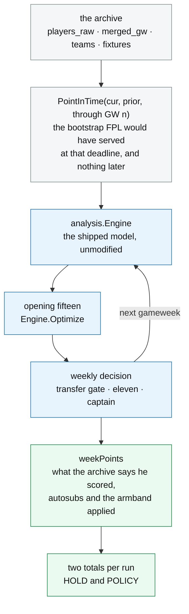
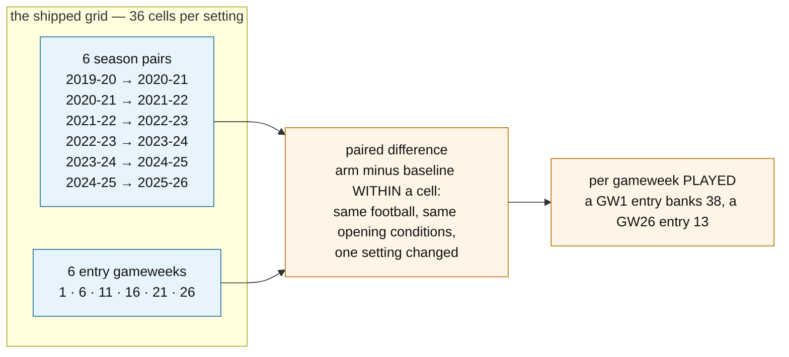

# The replay

`internal/backtest` re-plays finished Premier League seasons through the shipped scoring
model and counts what the policy would have earned. It is how every scoring claim in this
project is validated, and it is the thing that decides whether a change ships.

This is a guide to **using and extending it**. The evidence it has produced lives in
the harness-and-inference note; the statistics that turn
its output into a verdict live in [`stats/README.md`](../stats/README.md). Neither is
required reading to run one.

---

## What it does

For a chosen season, the replay reconstructs the FPL bootstrap **as it stood before a given
gameweek**, builds an ordinary `analysis.Engine` from it, lets the model pick a squad and
re-decide every week, and then scores each week against what the archive says actually
happened.



The loop is the point. The engine is rebuilt from data **through the previous gameweek** at
every step, so the model never sees a result it could not have seen. `PreSeason` does the
same job for the opening squad: this season's rosters and opening prices carrying last
season's statistics, which is exactly the evidence a manager has in August.

**Point-in-time honesty is enforced, not assumed, and it is the one place a new feature can
silently train on the future.** The archive holds every score for the whole season, so
`playedFixtures` strips the scoreline and the `Finished` flag from any fixture after the
cutoff — `TestPointInTimeHidesFutureResults` pins it. The same rule governs the pool: a
January signing appears in `players_raw.csv` with a full season record and in no gameweek row
until January, so building the pre-season pool from the first file alone bought players who
were not in the game, at prices that did not exist, with their prior season visible. If you
add a signal, ask what it reads and when that became knowable.

**It measures the floor, not the system.** Everything the judgement layer does — team news,
press conferences, predicted line-ups — is unreproducible in hindsight, so a replay scores
the deterministic model with nobody watching it. That gap is real and has been sized: see
the oracle-design document.

## The archive

Seasons come from
[vaastav/Fantasy-Premier-League](https://github.com/vaastav/Fantasy-Premier-League), which
snapshots the FPL API by gameweek back to 2016-17. Four files per season —
`players_raw.csv`, `gws/merged_gw.csv`, `teams.csv`, `fixtures.csv`.

A finished season never changes, so `Load` caches the parsed result to
`<cache_dir>/backtest-v8-<season>.json` and never expires it. The first load of a season
fetches over the network; every later one is local.

**The version in the filename is not the check.** A cache written by an older parser is a
perfectly valid file with no way to know it is missing a field, and relying on the version
alone once cost an afternoon: a v4-to-v5 bump hit v5 files left behind by an earlier
experiment, so a fresh parser read a stale schema and reported no congestion anywhere — a
null result that looked exactly like a real one. So `Load` *checks the schema*: a season
with fixtures but no kickoff times, or gameweek rows with no fixture count, cannot have come
from this parser whatever the filename says. **Add a check there for any field a new
measurement depends on.**

The archive has known defects, and they are documented rather than patched over — a season
with two thirds of its expected goals missing, a `starts` column that is zero for a season
and a half, a gameweek that never happened. The archive-and-data note
is the inventory. Read it before trusting a season you have not used before.

## The two metrics

Every run produces two totals from the same opening squad.

| metric | what it scores | use it for |
|---|---|---|
| **`HOLD`** | buy the opening fifteen and **never transfer**, but re-pick the eleven and the captain every week, with autosubs and the vice-captain fallback applied | anything about **scoring** or squad selection |
| **`POLICY`** | the same, plus the weekly transfer decision | only constants that are themselves **about transfers** |

`HOLD` is the default for a scoring constant because it carries **one** squad decision where
`POLICY` carries a season of compounding ones. The replay is deterministic — same inputs,
same outputs — but the optimiser returns a *discrete* fifteen, so a hair's-breadth score
change flips one player, and that squad then scores differently for every remaining week.
Transfers multiply that: each weekly decision is an argmax against a threshold, and one
flipped transfer changes what the next decision is choosing between.

> Determinism is load-bearing rather than incidental, because every byte-identical invariance
> in this project rests on it — and it was **not** true until recently. `seedFor` filled each
> DP seed's bench by iterating a map, so `Optimize` called twice on identical inputs could
> return two different fifteens: the injection rate was 100% and it changed the final answer in
> about 1.4% of landscapes. `TestSeedOrderIsDeterministic` now pins it, and it watches the
> *defect* (seed order) rather than a consequence of it, because the original reproducer
> stopped reproducing mid-investigation and left a census that could not detect anything.
> Any note still saying the optimiser is non-deterministic predates that fix.

The consequence is that `POLICY` moves several times as far as `HOLD` for the same nudge, and
almost none of the extra movement is the model.

**`HOLD` doubles as an invariance check.** A knob that only touches the transfer decision
must leave `HOLD` **byte-identical** across every cell. If it moves, the knob is leaking into
scoring and the experiment is measuring two things at once. That check is cheap — one
disagreeing cell refutes it — where *confirming* an effect costs tens of points a season.
Falsification is the bargain here; take it whenever a change offers one.

Two further scorings ride along for free, because `HoldCaptaincyWeekly` computes all three in
the one weekly pass `HOLD` already pays for: `hold_fixedcap` pins the armband to the day-one
pick, and `hold_nocap` doubles nobody. **Neither may replace `HOLD`** — FPL doubles a captain
every week, so a metric that does not is further from the game rather than closer to it. They
exist to answer whether a quieter instrument is available, and the answer so far is no.

### The other two columns: `hold_xpoints` and `policy_xpoints`

⚠️ **`cellMetricColumns` names eight, and the four above are half of them.** The list
(`internal/backtest/oracle.go`) is the set a sweep collects a **comparable series** for — and
therefore the set `MustNotMove` may name — **not** the CSV schema, which is much wider and lives in
`stats/README.md`. In order: the four points series, then the **expected-points pair**, then `moves`
and `hits`. This page previously introduced neither the pair nor the last two.

`moves` and `hits` are **both counted off the `POLICY` arm**: transfers made, and how many of those
moves were paid for with a −4. ⚠️ **`hits` is a count, not points** — the points charged are
`4 × hits` (`HitCost`, `internal/backtest/gate.go`). Read it as points and every gate table is
wrong by four.

**"xPoints" is realised points with four channels swapped for their expected value.** It is a
**residual**, not a re-scoring (`internal/analysis/xpoints.go`): `xPoints = points − residual`,
where the residual covers goals against xG, assists against xA, and the clean sheet and the concede
deduction against expected goals conceded. ⚠️ **Every other channel keeps its realised value** —
appearance, bonus, saves, cards, defensive contribution — which is what lets the instrument span
three bonus regimes without knowing about any of them. The attacking half of the swap is priced
through a per-season, per-position `ConversionScale`; **the clean-sheet half is not scaled at all.**

The appeal is that it should be a **quieter instrument**: conversion luck is a large part of what a
footballer scores in a season, so a measure built from chances rather than outcomes should let a
real effect show through with fewer replays.

⚠️ **In practice it works on one metric and backfires on the other.** The evidence is one pilot
sweep — 36 cells, the `MinutesHalfLife` ladder plus a control — pre-registered with a kill
criterion, which it met.

| column | what happened | what you may do with it |
|---|---|---|
| `hold_xpoints` | cuts standard errors **and attenuates the means with them**, so `\|t\|` falls on **all six between-arm contrasts** of the pilot, on both estimators | ⚠️ **Never quote a `hold_xpoints` threshold as if power improved.** It did not — and note the *arm levels* split two down, two up, so a single arm whose `\|t\|` rises is not a counter-example. Name which population you mean |
| `policy_xpoints` | comparable SE cuts **with the means preserved** | a second `POLICY`-side instrument — **beside points, never instead of them** |

⚠️ **The percentages that used to sit in that table are PRE-SCALE and superseded; the verdict is
not.** They were measured before the per-position conversion scale shipped on 2026-08-15, have not
been re-run, and cannot be by any sweep since — `internal/analysis/xpoints.go` lists them among the
figures the scale superseded, and `TestDiagGateOracleOnXPoints` (`internal/backtest/gatexpoints_diag_test.go`) prints *"take them from a re-run, not from
here"* for the same reason. ⚠️ **`AGENTS.md` still carries them unmarked; the code and the review
record are the ones that carry the marker.** The **direction** is what survives, because it rests on
*removing variance removes signal*, which a rescaling does not reach. ⚠️ **A count once written here
as "five of six contrasts" does not reproduce** — the committed
`stats/snapshots/2026-08-15-xppilot/inference.txt` shows six of six on both estimators, and the
count's population is stated nowhere. **Read the direction, not the count.**

*(**Standard error**: how much a measured average would wobble if you re-ran the experiment.
**`t`**: the effect divided by that wobble — bigger means harder to dismiss as chance. ⚠️ **How big
counts as big is NOT 2 here** — it is `t_crit` at the comparison's own degrees of freedom, 2.571 at
best on this grid and often worse; see "What it cannot do". Shrinking the wobble only helps if the
effect survives the shrinking, and on `HOLD` it does not — the third recorded instance in this
project of **removing variance removing signal**.)*

⚠️ **It is also leaky.** The bonus points system pays goals, assists and clean sheets, so about **a
quarter of the conversion luck the residual removes walks back in** through the realised bonus
column for an attacker (`stats/xpoints_channel_audit.py`: corr 0.606, slope 0.252, n 12,104). The
instrument is under-smoothed, worst where it is used most — recorded rather than fixed, because
expected bonus is its own closed line.

⚠️ **Tuning a constant on xPoints is a CLOSED line — the columns stay purely as instrumentation.**
See `AGENTS.md` under "What has been measured". Three further caveats live there: the conversion
scale ships **on mechanism** rather than on a points win; it is fitted **in sample**, so the
position-mean attacking residual is zero by construction for defenders, midfielders and forwards but
not goalkeepers, and the instrument sees **within-position** deviation only; and cross-season levels
are recentred and carry a data state, so a **paired difference stays one metric but is not
numerically unchanged**.

⚠️ **Two qualifications on "every sweep", both of a kind this file has been bitten by.**
`runPolicySweep` populates the xPoints pair on every cell, but the **variance decomposition** builds
its own row and leaves the pair *blank rather than zero*; and cells files banked before 2026-08-15
do not carry the columns at all — including `2026-08-14-blend/` and `-blendlo/`, which this page
cites two sections below.

## Cells and paired differences

A **cell** is one replayed season entered at one gameweek.



Entering at a later deadline is a **real scenario**, not a synthetic one: FPL lets a manager
join at any deadline with a fresh £100m. Each entry point is a different path through the
same football, and paths are the cheap axis — seasons are the scarce one. ⚠️ Scarce turned out
not to mean fixed: two more became playable and were worth more than any number of paths. See
"What it cannot do".

Doubling the entry points from three to six changed what a sweep could see at all: a transfer
comparison that read as pure noise at twelve cells showed structure at twenty-four. Take that
as a claim about the **method** and not about the constant — the particular shape it revealed
was later re-run on a changed model and did not replicate, which is itself the standing rule
that a sweep is only valid at the setting of every knob it shares a population with.

Two normalisations are load-bearing and both have been got wrong:

- **Per gameweek played, never per season.** Pooling raw totals across entry points weights
  the GW1 regime nearly three times as heavily as the GW26 one.
- **Paired within the cell, never two sums compared.** Twelve cells agreeing at +40 is a real
  effect; +900 against −860 is not, and a totals column cannot tell them apart.

⚠️ **"Do not change the grid" stood here for a long time, and it did not survive.** The rule
rested on the argument that every figure in the record is measured at four season pairs, so
widening the default would make new work incomparable with the whole record at a stroke. The
argument is **wrong on a checkable point**, and the check was run: the shipped four are a strict
subset of the extended six, and the cells they produce *inside* a six-season run are
byte-identical to an independently run four-season sweep — 48 of 48 overlapping cells agreeing on
every outcome column, 192 across all arms. No published figure was invalidated. Each remains
correct **as a four-season figure**, so the record wanted annotating rather than re-deriving. The
objection is recorded rather than deleted because it is the one the next reader will re-derive
unprompted — the working is under "Why the 'incomparable with itself' objection did not survive"
on `sweepPairNames`.

**So `sweepPairNames()` now returns `extendedPairNames()`: six pairs, 36 cells per setting.** What
the widening buys is degrees of freedom, which no number of entry points can move — 3 to 5,
dropping the positive control's smallest detectable effect from 12.4 to 8.4 points a season on
`HOLD`. Read that as a *shape* and not a ratio: across all fifteen four-season subsets of the six
the same threshold ranges 8.2 to 16.0, so any single four-season figure carries about ±30% of
which-seasons-you-got, while all six five-season subsets beat the median four-season one. The cost
is arithmetic: half again the compute, 36 cells where there were 24. The added seasons carry
caveats that travel with them — xG on a *borrowed* provider offset, priced at about 1 point a
season of threshold and a lower bound, and a reconstructed `starts` column biased 3:1 toward
making fringe players look nailed. `extendedPairNames`' own comment enumerates all four before
you sweep anything about minutes or rotation on them.

The grid is still declared once in `harness_test.go`, and `TestTheGridIsDeclaredOnce` fails if a
file pastes a literal back in. `FPL_SWEEP_SEASONS` selects between the named grids —
`extended` (the six that ship), `default` (the historical four, which is how a recorded figure is
reproduced on the grid it was measured on) and `scoring` (seven, `HOLD`-only, and
`runPolicySweep` refuses to report `POLICY` on it rather than trusting an operator to remember).
Entry-point densification stays opt-in through `FPL_SWEEP_STARTS`.

⚠️ **One exception was recorded and has itself been overtaken.** `sweepPairNames`' own comment
says transfer settings want `FPL_SWEEP_SEASONS=default`, because one positive control's `POLICY`
threshold *rose* on six seasons when 2021-22 nearly doubled its between-season spread. Ten later
arms refute it — widening helps 10 of 11, median ratio 0.62, and four of them are `min_gain`, a
transfer setting. **Sweep transfers on six too.**

## Running one

### The human-readable replay — free, no LLM, no API key

```bash
go build -o armband ./cmd/armband
./armband backtest 2023-24          # judge each transfer over the configured horizon
./armband backtest 2023-24 10       # ...or over 10 gameweeks instead
```

It prints the model's GW1 squad against the random-squad distribution and a perfect-hindsight
ceiling, plays the season out under three transfer policies, reports every week against
holding the opening fifteen, and scores every transfer against what the two players actually
went on to do.

This is the one to reach for when you want to *see* what the model did. It is a single path
through a single season, so it is the noisiest thing here — read it for mechanism, not for a
verdict.

### A sweep — the thing that decides whether a constant moves

Sweeps are Go tests behind `DIAG=1`, because they take minutes and have no business running
in `go test ./...`. Each sweep diagnostic offers named **blocks**, selected with `EXP`.

```bash
# 1. Replay the grid, emitting one CSV row per cell.
EXP=MINHL FPL_CELLS=/tmp/cells.csv \
  scripts/replay -run TestDiagProjection -v -timeout 180m

# 2. Is this arm distinguishable from the baseline?
Rscript stats/sweep_inference.R /tmp/cells.csv

# 3. What size of effect could this design have seen at all?
Rscript stats/variance_components.R /tmp/cells.csv

# 4. Is the ORDER of the settings reproducible? Much cheaper than any single gap.
Rscript stats/shape_inference.R --order=numeric --mediator=moves \
  --invariant=hold /tmp/cells.csv
```

The flag spellings above are `go test`'s, deliberately: `scripts/replay` sets `DIAG=1` itself and
translates `-run`, `-v`, `-timeout` and `-count` into the `-test.*` forms a compiled test binary
answers to.

⚠️ **But drop the `go test ./internal/backtest` prefix entirely, package path included** — and
this is a silent failure, not an error. Go's flag parsing stops at the first non-flag argument, so
a stray `./internal/backtest` disables every `-test.*` flag after it: the binary then runs the
**whole package** under `DIAG=1`, selects nothing, prints nothing extra and **exits 0**. Verified
directly. Several recipes in `stats/README.md` are still written in the `go test` form, so they
need the prefix removed rather than the command swapped.

A sweep cell is about **4.5 seconds**, so an arm on the shipped 36-cell grid is **two and a half
to three minutes** — measured 2026-08-14: `BLEND` ran 4 arms × 36 cells in 10m49s and `BLENDLO`
6 × 36 in 15m07s, which is 4.5 and 4.2 seconds a cell (`stats/snapshots/2026-08-14-blend/` and
`-blendlo/`). ⚠️ **Those two timings are transcribed PROSE in each directory's `FINDINGS.md`, not
committed `elapsed=` lines** — `grep -rn 'elapsed=' ` over both returns nothing, so do not go
looking for a wrapper log there. Committed `elapsed=` lines do exist in other snapshot
directories, which is exactly what makes this citation look checkable when it is not. **Budget from the per-cell
rate, not from a per-arm number**: the figure recorded here was 85 seconds, measured on `MINHL`
over 24 cells, and it rotted the day the grid widened. It was fifteen minutes an arm before the
optimiser stopped being GC-bound, which is why older comments and recipes budget an afternoon.

**Run them through `scripts/replay`, and they run in parallel.** The rule used to be "one at a
time", because replays were dropped under load — one six-arm block was killed four times, at 1,
3, 3 and 4 arms of 6. That was the `go test` **driver**, not the replay: it peaks at 1031 MB and
stays resident for the whole run, against 145 MB for the sweep binary it is driving, so four
parallel sweeps was four gigabytes of toolchain and half a gigabyte of replay. The wrapper
compiles once and runs the binary as a child — one block measured both ways on 2026-08-11 came out at
1031 MB through `go test` and 97 MB through it — and adds a slot semaphore so extra runs queue
rather than race. What a run of yours will actually cost is under "the memory forensics" below,
along with what the caps do and do not bind on.

The consequence of a kill is unchanged, which is why the provenance sidecar still matters: a
killed arm is a silently partial result, so `runPolicySweep` declares the arms it *intends* to
run before computing the first cell, and the gap becomes arithmetic instead of invisible.

Where the blocks live:

| diagnostic | blocks |
|---|---|
| `TestDiagProjection` | `MINHL` `MINW` `BONUS` `DCC` `BENCH` `FIXW` `MINK` |
| `TestDiagTransferPolicy` | `A` `B` `C` `D` `E` `F` `G` |
| `TestDiagRejudge` | `H` `I` `J` `K` `CAPTAIN` `LADDER` `CAPSEAM` `LOADTR` `BANK` `PRIOR` `BLEND` `BLENDLO` `BLEND2` `WEEKXI` `BUY` |

**`EXP` must name a block the diagnostic you are running actually has.** Naming another
diagnostic's block used to select nothing, write no cells, and **pass in 0.00 s** — which
reads downstream as a sweep that had nothing to say rather than one that never ran. It now
fails and lists the blocks it does have. That cost a snapshot once, when a recipe paired
`EXP=A` with `TestDiagProjection`.

⚠️ **The table above is hand-maintained and has drifted before** — `BLENDLO` and `BLEND2` were
added to `TestDiagRejudge` and not to it. That instance is closed and the table agrees with the
code as of 2026-08-16 — checked by enumerating every `want("…")` call in `transferpolicy_test.go` — the local alias for `blockPicker.want` —
against its enclosing function — which is a fact with a short shelf life rather than a property.
The list
`blockPicker.check` prints on a miss is **generated from the blocks the diagnostic actually
offers, so it is the authority**; this table is a convenience, and a disagreement between the two
is the table being wrong.

### A one-off diagnostic

Most of the `TestDiag*` tests are not sweeps at all — there are around a hundred, and the
current count is one `grep` away — they measure the model against outcomes rather than
against another setting, and most run in seconds:

```bash
DIAG=1 go test ./internal/backtest -run TestDiagCalibrationDrift -count=1 -v
```

`-count=1` is not optional. Go caches test results, and a cached run replays its stdout while
writing no new CSV rows — so a diagnostic feeding a snapshot appears to have run and did not.

## The switches

Every one of these defaults to shipped behaviour. **None is set in normal operation**; they
exist because a constant nobody can vary is a constant nobody measures. The tables below cover the
switches a sweep is likely to set, and they are ⚠️ **not complete**: `FPL_CONFIG` (which
`config.json` a diagnostic loads, so every constant at once), `FPL_TEAMNEWS_MAX_HOURS` and
`FPL_FIXTURE_LOAD` are registered and documented nowhere. **The authority is
`internal/snapshot`'s `envSwitches`** — `TestEnvSwitchListIsComplete` holds it against a scan of
the tree's Go source, so a knob added without being registered there fails a test rather than
quietly making two snapshots incomparable. It does not reach the wrapper's own `FPL_REPLAY_*`,
which are shell.

Most are read **once at process start**, so they select an arm for a whole run rather than
toggling between cells. Two are deliberately re-read on **every call** —
`FPL_NO_AVAILABILITY` and `FPL_UNREGISTERED_POOL` — so both arms can be toggled inside one
run and paired properly. A cached copy cannot be, and then the whole measurement is lost.

**The oracles are neither.** They are a field on `SimConfig`. Two of them — availability and
transaction price — are seeded from `FPL_ORACLE_AVAILABILITY` and `FPL_ORACLE_PRICES` where a
cell's config is built and read nowhere deeper; the rest have no environment name at all and
are only reachable as a declared sweep arm, which is the direction this is moving in — see the oracle-design document. A field is strictly better than
either mechanism: both arms toggle in one process, concurrent cells cannot read each other's
setting, there is no environment scan on a path that runs once per player per gameweek, and
the provenance stamp is derived from the same value the simulation consumed rather than being
a second mechanism to keep in sync.

One consequence worth knowing before you export one of these into a shell you then run a
sweep from: an oracle may only enter a sweep as a **declared arm**. The seed reaches the
baseline arm too, and a sweep whose baseline is oracled is refused outright, because every
difference it printed would be hindsight measured against hindsight.

### Selecting the grid and the output

| switch | effect |
|---|---|
| `DIAG=1` | required — every diagnostic skips without it |
| `EXP=<block>` | run one named block instead of all of them |
| `FPL_CELLS=<path>` | write one CSV row per cell, plus a `.means.csv` mirror and a `.provenance.csv` sidecar |
| `FPL_MODEL_CSV=<path>` | a model diagnostic writes its numbers beside the table it prints |
| `FPL_PREDICTION_CSV=<path>` | the prediction benchmark's per-gameweek cells |
| `FPL_*_ROWS=<path>` | a per-observation dump from one diagnostic, so an R script can fit on the rows rather than on the bucket means the diagnostic prints — `FPL_CS_ROWS`, `FPL_CSREG_ROWS`, `FPL_CSREG_DEF_ROWS`, `FPL_BLANKRUN_ROWS`, all through `newRowDump`, plus `FPL_XGC_TERCILE_CSV`, which names a **directory** rather than a file. `grep newRowDump internal/backtest` is the current list. They are output paths, so `TestEnvSwitchListIsComplete` skips them and no fingerprint records them — which also means setting one cannot move a measured number |
| `FPL_SWEEP_SEASONS=extended\|default\|scoring` | which season grid a sweep replays: `extended` is the shipped six pairs and the default, `default` the historical four (how a recorded figure is reproduced on the grid it was measured on), `scoring` the seven-season `HOLD`-only grid, which `runPolicySweep` refuses to report `POLICY` on. Panics on anything else, because an unrecognised grid would otherwise fall through to the default and every figure would carry a season count its operator never chose. ⚠️ Read in `sweepPairNames` and consumed by `loadPairs` **once, before the variant loop** — so it selects a grid for a whole process and can never be a sweep arm |
| `FPL_SWEEP_STARTS="1,2,3,..."` | replace the six entry gameweeks. Panics on anything it cannot read, rather than falling back — a silently ignored grid produces a complete-looking sweep at the shipped six |
| `FPL_SWEEP=1` | make `armband backtest` print one machine-readable `SWEEP` line |
| `FPL_WEIGHT="bonus=0.5,fixture=0.8"` | override scoring weights for `armband backtest`, applied before anything is built from the config. ⚠️ **One key is inert here: `prior_half_life`.** It reaches the live blend only; this command comes back byte-identical and says so on stderr (`TestPriorHalfLifeSaysItCannotReachTheReplay`). The replay reads `SimConfig.PriorHalfLife`, which needs `SimConfig.OlderPriors`, which this cannot set |
| `FPL_SEASON`, `FPL_PRIOR`, `FPL_TRACE` | select the season and players for `TestDiagTrace` |
| `FPL_REPLAY_HTML=<path>` | `armband backtest` also writes a clickable page — a tab per gameweek and the transfer list, which a scrollback cannot be |
| `FPL_REPLAY_GWS=<n>` | how many gameweeks that page shows, default 10. Read only when `FPL_REPLAY_HTML` is set |

### Turning a shipped behaviour off, to re-measure it

| switch | restores |
|---|---|
| `FPL_NO_VICE_CAPTAIN=1` | a blanking captain forfeits the bonus outright |
| `FPL_NO_LEGAL_AUTOSUBS=1` | substitutions made in bench order without checking formation legality — an outfielder on for a blanking keeper, a fourth defender behind a back three. ⚠️ **This one restores a named contamination event**, worth 7-14 points a season, so it reproduces a figure measured before `legalAutosubs` shipped rather than offering a knob worth sweeping. ⚠️ `HOLD` is defined above as *"with autosubs and the vice-captain fallback applied"*, so a run with this set is **not the same metric** as one without — the same is true of `FPL_NO_VICE_CAPTAIN` above it |
| `FPL_WC_IGNORES_BOOST=1` | a wildcard played **the week before** a bench boost builds an ordinary squad rather than optimising all fifteen for the chip it is preparing for. ⚠️ **FPL allows one chip a gameweek, so the two can never share a week** — the gate is on `gw+1`. It exists to separate the cost of the *wildcard* from the cost of *building for the boost*, which the first sequence measurement conflated |
| `FPL_NO_THRESHOLD_SPLIT=1` | appearance points and the clean sheet scaled by minutes reliability rather than P(60 minutes) |
| `FPL_NO_SHORT_PLAY=1` | no appearance point below sixty minutes |
| `FPL_NO_FIXTURE_LOAD=1` | the model's `Score` stops being multiplied by matches per gameweek, so a double looks like a single **to the scorer**. The replay still pays both fixtures. ⚠️ **It reaches `Score` only through a horizon-1 engine** (`Engine.FixtureLoadInScore`), and the replay builds one only for the fielded eleven when a cell sets `SimConfig.WeeklyXI`, or for a free-hit squad. `HoldCaptaincyWeekly` builds every weekly engine at the configured horizon, so **`HOLD` is byte-identical to this switch at shipped config**, and an arm leaving `WeeklyXI` false is byte-identical on both metrics. Check the mediator before reading the null |
| `FPL_NO_LOAD_TRANSFERS=1` | the transfer objective cannot see a double coming |
| `FPL_NO_SAVES_FIXTURE=1` | a keeper's saves carried across unadjusted by the opponent |
| `FPL_NO_BLANK_RUN=1` | no discount at the onset of an absence |
| `FPL_NO_UNIFIED_APPEARANCE=1` | the second start-share estimator of P(appears) |
| `FPL_NO_FUNDED_UPGRADE=1` | the optimiser's N-downgrades-fund-one-upgrade move |
| `FPL_FLAT_BENCH=1` | uniform bench credit instead of per-slot weights |
| `FPL_FIXED_BENCH_SLOTS=1` | the fixed bench tuple instead of weights derived from the eleven |
| `FPL_NO_XG_REPAIR=1` | the archive's own expected goals, unbackfilled |
| `FPL_NO_XG_AGGREGATE=1` | leave the repaired season *totals* alone, isolating that half of the repair |
| `FPL_NO_XGC_REPAIR=1` | no expected goals *conceded* in the four seasons the archive gives none, so defenders and keepers are scored with neither the clean sheet nor the goals-conceded deduction. ⚠️ **Two separate process runs, never two arms of one sweep** — see below |
| `FPL_NO_AVAILABILITY=1` | the replay cannot see that a player left the league |
| `FPL_NO_STARTS_REPAIR=1` | `starts` reconstructed from minutes rather than taken from the Understat harvest. ⚠️ Same class as the three above — it acts in `Load`. At shipped config both arms are **byte-identical on every populated outcome column**, so a null here says the harvest is unread on the scoring path, not that it does not matter; it moves under `FPL_NO_UNIFIED_APPEARANCE`, `FPL_RELIABILITY_SPLIT` and in the oracles |

> ⚠️ **A switch that changes the PARSED SEASON cannot be a sweep arm.** `FPL_NO_XG_REPAIR`,
> `FPL_NO_XG_AGGREGATE`, `FPL_NO_XGC_REPAIR` and `FPL_NO_STARTS_REPAIR` all act during `Load`
> (`applyStartsRepair` is called from `repaired`, on that path), and `runPolicySweep`
> calls `loadPairs` **once, before the variant loop**, into a process-global season cache. So
> an arm that sets one of them inside its `apply` — the way `FPL_NO_AVAILABILITY` and
> `FPL_UNREGISTERED_POOL` legitimately do, since those act per cell — replays the *same*
> already-parsed season in both arms. Every cell comes out byte-identical and the sweep
> reports a clean, tight null on exactly the thing it was built to measure. Run these as **two
> separate processes** and compare the cells files.

### Turning something on that does not ship

| switch | effect |
|---|---|
| `FPL_MAGNITUDE=1` | continuous fixture difficulty instead of FPL's integer ladder (`FPL_MAGNITUDE_ALPHA` sets its exponent) |
| `FPL_UNIFIED_TRANSFERS=1` | the bounded-revision search in place of the bespoke pair-then-singles policy |
| `FPL_UNREGISTERED_POOL=1` | admit players who were not yet in the game, which is the leak the pool gate closed |
| `FPL_TEAM_FORM=<w>` | scale a club's rates by `(recent/season)^w`. Zero ships, which is the feature off; the prediction work found 0.5 and did not resolve it. Read **once at startup**, so it selects an arm for a whole process — `SetTeamFormWeight` is how a sweep varies it |
| `FPL_TEAM_FORM_RAW=1` | with the blend on, take each window raw instead of dividing it by the ease of the fixtures it contained. The two arms differ by exactly the fixture component, which is what separates "tracking the club pays" from "the fixture ladder is mis-scaled" |
| `FPL_CHIP_PLAN="wildcard=6,bb=8,tc=9,free_hit=16"` | the chip weeks `armband backtest` plays, or `config` to play your saved plan. **The replay is chipless unless a plan is given**, so every figure recorded before chips were modelled is a chipless season — and a sweep arm sets `SimConfig.Chips` rather than this, which `cmd/armband` reads and `internal/backtest` never does |
| `FPL_ORACLE_AVAILABILITY=1` | seeds `Oracles{Info: OracleAvailability}` — hindsight: anyone who finished with no minutes is unavailable from the start |
| `FPL_ORACLE_PRICES=1` | seeds `Oracles{Info: OracleTransactPrice}` — hindsight: every transfer transacts at the best price within two gameweeks either side |

> ⚠️ **Never make an oracle the default.** Every figure in the record was measured without
> them, so switching one on would inflate all of them at once and make the record
> incomparable with itself.

A diagnostic that wants to *measure* an oracle declares it as an arm rather than setting the
variable — `oracleVariant(Oracles{Info: OracleAvailability}, "perfect team news", nil)` — which
stamps the label, the per-cell CSV and the means file from the same value it installs. The
variables remain because they appear throughout the research record and a figure recorded against
one must stay reproducible.

**The declaration has two halves, and the sweep enforces both.** `Oracles` answers
`MustNotMove()` — the columns this capability cannot legitimately reach — and `MustMove()`, the
columns it must reach or it did nothing. `oracleInvarianceViolations` and
`oracleLivenessViolations` check one each, and both treat "the sweep does not collect that
column" as a failure, because an unchecked claim is worse than none.

⚠️ **The liveness half is the half with power.** Confinement is usually a *code* fact, so
re-running it can only fail, and its candidate causes rarely include the change under test. It is
the `MustMove` side that can distinguish an arm reaching the scored path from one that is inert —
an inert arm reports the same clean null as a real one, which is this package's whole failure
mode. `TestLivenessDeclarationsAreCoherent` pins the three properties a `MustMove` set has to
have: it may only name a column the sweep collects, it may never name a column the same oracle
pinned, and the price oracle must declare one, because it is the arm with no other evidence it is
doing anything.

⚠️ **`MustMove` is empty for most decision axes**, so an arm having one is not the default. The
information oracles that legitimately move every metric declare `moves`, while omniscience and the
team-news percentage declare nothing; on the decision side only the anti-residual and accept-all
gate arms do, and chip week, the armband and the other gate axes declare nothing. **Do not read a
count off that** — `mustMoveForAxis`'s own comment records a stale one — read the switch.
`AxisChipWeek`'s emptiness is the one the test pins as *deliberate*: it pins every column, changes
no decision by construction, and carries its liveness in its `observe` hook, which is why the
field cannot be a blanket "something must move".

### Varying a constant

| switch | varies |
|---|---|
| `FPL_MINUTES_WEIGHT` | the convexity exponent on minutes reliability |
| `FPL_POS_MINUTES_SCALE="MID=0.75,FWD=0.5"` | how much of the rotation severity each position carries. ⚠️ An entry it cannot parse is **dropped, not refused** — the siblings still apply, so half a map arrives looking whole |
| `FPL_RELIABILITY_SPLIT` | share of reliability from minutes rather than start share |
| `FPL_ATK_FIXTURE_SCALE`, `FPL_DEF_FIXTURE_SCALE` | stretch either difficulty ladder around 1.0. The only way past full strength, since `fixture_weight` is clamped to [0,1]. Panics on anything it cannot parse **and on a negative** — a negative would invert the ladder, so it is refused rather than honoured. ⚠️ `NaN` and `Inf` parse and are *not* refused, deliberately: the fingerprint then stamps what ran. Both names are stamped into the run fingerprint, so a silently ignored scale would produce a complete-looking sweep at the shipped 1.0 under a provenance claiming otherwise. `0` is valid and flattens the ladder |
| `FPL_CS_XGC_FACTOR` | scale expected goals conceded *only* inside the clean-sheet term — the exponent half. ⚠️ **`0` is silently ignored and scores as shipped**, since the parser defaults on anything `<= 0` — so the flatten-the-exponent arm cannot be reached from the environment at all |
| `FPL_CS_SCALE` | multiply every clean-sheet probability by a constant — the flat half. The two are one fitted curve and must be swept together, never as two ladders. Reads the same strict parser as the two ladders above, and panics identically |
| `FPL_BENCH_SLOTS="out1,out2,out3,gk"` | the bench shape, renormalised to sum to four so it does not also sweep the scale |
| `FPL_BLANK_RUN_PENALTY`, `FPL_BLANK_RUN_MAX` | the absence-onset discount and its window |
| `FPL_CAPTAIN_SHRINK` | pull the captain term toward the runner-up |
| `FPL_BUY_DISCOUNT` | charge a buy-side over-rating against an incoming player |
| `FPL_APPEARANCE_FIT="sixty_slope,sixty_midpoint,cond_intercept,cond_slope"` | the four constants of the two appearance curves. **All four or none** — a partial override is not half-applied, because `playsAtAll` takes the max of the identity and `playsSixty`, so a fit that moves one curve can spend its whole effect on that max. ⚠️ **"Not half-applied" means SILENTLY IGNORED, not refused**: wrong arity or one unparseable field returns the four shipped values with no error, so a typo here scores as shipped under a fingerprint recording your string. See the parser note below the table |
| `FPL_MULTI_SURCHARGE` | an escalating charge on doing several things in one week: the second move costs one of these, the third two. Zero ships. ⚠️ Reaches only the `FPL_UNIFIED_TRANSFERS` search, so it is inert on the shipped path |
| `FPL_BUDGET_WEIGHT` | what money freed by a transfer is worth per gameweek remaining. Zero ships, which is money having no value at all. ⚠️ Unlike the surcharge above this **does** act on the shipped bespoke search — `moneyPts` in `decide`, on both the funded pair and the single move |
| `FPL_BENCH_WEIGHT`, `FPL_START_GW`, `FPL_BAND_STRENGTH` | `armband backtest` only |

⚠️ **Only three of these refuse a value they will not take; the rest fall back to shipped and say
nothing.** `FPL_CS_SCALE` and the two fixture ladders read `envScaleStrict`. Every other row here
reads a lenient parser — and the fingerprint stamps the string you *set*, not the value that ran,
so a malformed arm produces a complete-looking sweep at the shipped constant under a provenance
claiming otherwise. **That is this page's own closing failure mode — a plausible number that
measured nothing — reachable from the table above.**

**One PARSER is worse than a typo, and naming the switch understates it: `envDefaultAbove`
defaults on any value `<= 0`, so the zero arm is unreachable from the environment for every switch
that reads it** — `FPL_CS_XGC_FACTOR` (no clean-sheet exponent at all) and `FPL_BLANK_RUN_MAX`
(no window) alike, plus `FPL_CAPTAIN_SHRINK`, `FPL_BLANK_RUN_PENALTY` and `FPL_MAGNITUDE_ALPHA`.
`FPL_BUY_DISCOUNT` reads it too and is harmless, because it ships at 0 and its consumer no-ops on
`<= 0`. The rest are typo defects: `FPL_POS_MINUTES_SCALE` drops an entry it cannot parse while
applying its siblings, `FPL_RELIABILITY_SPLIT` is bounded to [0,1] and silently defaults outside
it, `FPL_BENCH_SLOTS` is silent on wrong arity, and `FPL_APPEARANCE_FIT` is all-four-or-none,
silently.

⚠️ **"Three" counts the parsers in `internal/analysis/sweep.go` only.** At least one more lenient
parser lives outside it — `envFloat` in `internal/backtest/unified.go`, behind
`FPL_MULTI_SURCHARGE` and `FPL_BUDGET_WEIGHT` — so do not read this as a complete inventory of the lenient parsers. **Check the value landed before believing a null**; the comment on `envScaleStrict` carries
the current list, and it is the authority rather than this paragraph.

## What it cannot do

This is the part to read before quoting any number it produces.

**Degrees of freedom are a property of the comparison; the grid only sets their ceiling — and the
ceiling moved.** The season-clustered standard error rests on `S − 1`, and no number of entry points
moves it: the **six** seasons that now ship give **df 5 and a 5% critical value of 2.571**, where
the four they replaced gave df 3 and **3.18**. `|t| = 2` is about p = 0.10 at df 5 and p = 0.14 at
df 3, so it is not the familiar 2 on either grid. Every `t` written into the record before CR2
shipped is a naive figure computed as though every cell were independent.

⚠️ **Do not compute with `df 5` either.** It is the widest the grid allows, not a property to
substitute into a formula: df is resolved **per contrast** and is frequently lower, which is why
one table in the record carries thresholds of 17, 14 and 34-40 side by side. A detection threshold
is `t_crit(df) × SE × 38`, never `2 × SE × 38`. Take the df, the p = 0.05 effect and the 80%-power
MDE from `stats/variance_components.R`, and quote the range between its clustered and start-fixed
estimators rather than picking an end.

The same arithmetic prices the widening: a threshold scales as `t_crit(S−1)/√S`, which is 0.66 of
the four-season figure, so the canonical median below — measured over four-season comparisons —
reads as roughly 26 on today's grid. That is an **ordering**, not a point estimate.

**A detection threshold belongs to a comparison, not to the harness.** Across 23 real
comparisons **on four seasons × six entry gameweeks** the significance threshold has a median of
**39 points a season on the season-clustered estimator** — the start-fixed one puts the same 23
at 32 — and ranges from **3.9 to 232**, depending entirely on how consistently the change lands
across cells. ⚠️ **Quote the grid with the 39 or do not quote it**: it is a four-season figure, and
the paragraph above prices what today's six do to it.
⚠️ **That span is pooled across the two estimators.** On the season-clustered one the same 23
comparisons run **7.6 to 232**; the 3.9 end is the start-fixed estimator's. Quote the range with
its estimator or quote the clustered end alone — `stats/regenerate_mde.sh` prints both. A
mechanism-certain change — one that does the same thing in every cell — resolves an order of
magnitude more finely than a constant whose effect varies by season. Read the threshold off the
`scope = "arm"` rows of the sweep's own `stats/out/<label>/mde.csv`, or of the aggregate
`stats/out/mde-all-arms.csv` that `stats/mde_aggregate.py` collects every per-sweep table into;
do not quote a single number as the instrument's resolution.

⚠️ **There is no bare `stats/out/mde.csv`, and citing one is a real hazard rather than a typo.**
`variance_components.R` writes one directory per sweep precisely because a twelve-cell demo run
once wrote to the bare default and its figures were read as current by the accuracy snapshot for
weeks, the output naming no source. `stats/out/` is gitignored; the cells behind it are committed,
so `stats/regenerate_mde.sh` rebuilds every table from scratch in seconds.

**Almost every constant here is worth 11 to 34 points a season**, which sits below that
median. So **"unresolved" is the expected reading for a real effect**, not evidence against
one. It is not "refuted".

Three responses are legitimate when a comparison will not resolve, and relabelling is not one
of them:

- **decide on mechanism** — "the objective should say what the game actually pays" needs no
  significance at all, and is why the vice-captain fallback and the sixty-minute threshold
  split both ship;
- **decide on shape** — a plateau with a cliff, or monotonicity across several settings, pools
  information across arms instead of testing each alone. `shape_inference.R` does this
  properly, and requires the predicted order to be committed to *before* the data is read;
- ⚠️ **"buy paths, not seasons" was the third response, and the six-season work falsified it.**
  It was true while seasons could not be bought at all. Priced, entry points buy about **20% off
  the standard error at twelve of them and cannot move the df at all**, where two more seasons
  take df from 3 to 5 and `t_crit` from 3.18 to 2.571. So **buy seasons wherever a season can be
  bought** — the Understat backfill is what made two more playable — and densify paths only where
  it cannot, through `FPL_SWEEP_STARTS`. Paths remain a real axis and a **nested** one:
  `SimConfig` carries `StartGW` and no `EndGW`, so every window runs to GW38 and an entry at GW2
  shares 37 of its 38 gameweeks with an entry at GW1. At spacing 5 that correlation is evidently
  tolerable; at spacing 1 a grid of near-duplicates would shrink the reported SE without adding
  information.

**Absolute totals from a sweep are not comparable with anything else.** `runPolicySweep` pins
the modern five-transfer bank for every cell, which is historically wrong for 2022-23 and
2023-24 — deliberately, so that cells governed by different transfer rules stay comparable.
Only the paired differences carry across. Use `seasonConfig` rather than `sweepConfig` when
the output is a description of a season rather than a contrast between settings.

**A better predictor can make a worse policy.** Recency-weighted rates improve out-of-sample
error and cost points, because a transfer policy is an argmax living in the tail of the
estimate distribution. The prediction benchmark ranks candidates; the replay prices them.
Neither substitutes for the other — see "Two instruments, two questions" in
[`stats/README.md`](../stats/README.md).

## The failure mode to design against

Nearly every bug this harness has shipped presented the same way: **a plausible number that
measured nothing**. A cache-version bump defeated by a stale file. An `EXP` label matching no
block, so the sweep ran nothing and passed. An escape hatch that reached one consumer of two.
A diagnostic selecting rows by iterating a map, so identical runs disagreed. A season loaded
with a column of zeros, read as evidence.

None of those failed loudly, and none was caught by a test that merely exercised the code. So
the conventions in this package are aimed squarely at that class:

- **A null needs a positive control.** An arm that should move something must be shown to move
  it. `hold` at exactly 0.000 across all 36 cells is a *result* when the change is transfer-only,
  and a *bug* when it is not.
- **An escape hatch must reach every consumer.** `TestTheSwitchReachesEveryConsumer` counts
  them, the way `TestEveryScoringEngineGetsRecency` counts scoring engines.
- **An infeasible cell emits a flagged row, never nothing.** A dropped cell reads downstream as
  a comparison on fewer cells rather than a variant that failed.
- **Accumulating over a map is safe; selecting from one is not.** Use `sortedPlayerIDs` in any
  diagnostic that picks one of several equivalent rows.
- **One implementation per quantity.** Inference lives in R, not Go; the mean is the single
  deliberate duplicate and R asserts its own recomputation against Go's `.means.csv` by
  `stop()`. A duplicate that is *checked* is a pipeline test; one that is merely watched is the
  bug.

## Where to go next

| | |
|---|---|
| [`stats/README.md`](../stats/README.md) | the inference: the CSV schema, the R scripts that read it, and the snapshot recipe |
| the harness-and-inference note | what the replay has actually resolved, and the noise decomposition behind these thresholds |
| the archive-and-data note | the archive's defects, season by season |
| the constants-and-sweeps note | every constant sweep and its verdict |
| the oracle-design document | bounding a capability before building it |

The last four rows are named rather than linked because those documents are not held in this
repository; the verdict of each finding they carry is resident in AGENTS.md, under "What has been
measured".

## Why `scripts/replay` runs a prebuilt binary: the memory forensics

Moved from AGENTS.md 2026-08-12, verbatim. AGENTS.md keeps the invocation and the guard rails;
this is the measurement that retired the "sweeps must be run one at a time" rule.

**The rule that sweeps must be run one at a time is retracted, and the thing that made them
expensive was never the replay.** The rule was recorded after blocks were killed by memory
pressure on the test infrastructure — one block four times, at 1, 3, 3 and 4 arms of 6 — and
sweeps have been serialised by hand ever since.

Sampling every process once a second across a whole sweep block gives the answer, and it is not
where anyone was looking:

| process | peak RSS | lives for |
|---|---|---|
| **`go`** — the `go test` driver | **1031 MB** | the entire run |
| `link` | 262 MB | seconds, during the build |
| `compile` | 211 MB | seconds, during the build |
| **`backtest.test`** — the sweep itself | **145 MB** | the entire run |
| `vet` | 28 MB | seconds |

**The toolchain driver is seven times the size of the sweep it is driving, and it stays resident
for the whole three hours.** Every concurrent `go test` pays it again, so four parallel sweeps
is four gigabytes of `go` and about half a gigabyte of actual replay. That is what was being
killed, and it is why the failure looked like "replays cannot run in parallel".

So `scripts/replay` **compiles once under a build lock and runs the binary as a child**, which is
the whole of the fix. The same block, measured both ways: **1031 MB through `go test`, 97 MB
through the wrapper** — about a tenth, and the run was no slower.

⚠️ **A child it waits for, deliberately, and not an `exec`.** The wrapper has to outlive the run to
read the peak RSS out of the timer file and to print the signal-9 diagnosis; an `exec` replaces the
wrapper process and neither survives. **Do not read a count of guard rails off this** — read the
script. In particular the slot semaphore is *not* one of them: it is an `flock` on an inherited file
descriptor, which an exec'd process would hold for the run and release at exit anyway.

*(The script does contain the word `exec`, which is confusing until you look: every one is
`exec {fd}>file`, with no command word, which redirects the shell's own file descriptors and
replaces nothing. What it never does is `exec` a **command**.)*

⚠️ **That 97 MB is one block, measured once**, on **2026-08-11**, against the same block through
`go test`. It is a before/after pair rather than a budget, and it is not even the same statistic as
the number the wrapper prints. ⚠️ **The instrument behind 97 is not recorded anywhere** — the
commit that introduced it names only the block, and this page has previously asserted its
provenance in both directions without new evidence. What IS provable is that the table's 145 MB is
the 1 Hz sampler's peak for the binary **under `go test`**, so 97 and 145 are not two readings of
one quantity and neither is a budget. Budget from what has actually been banked since, which is GNU
`time`'s maximum resident set for a whole run: a **replayed grid sweep** sits between
**89 and 142 MB** —
89 and 91 in `stats/snapshots/2026-08-11-0104d9d/`, 94 in `2026-08-14-blend-datastate/`, 111 in
`-blend/`, 119 in `-blendlo/`, 93 to 124 across `-minfloor/`, 117 in
`2026-08-16-anti-residual-gate/`, and the widest banked at 142 in
`2026-08-13-4d61058/cells/runC-6s-aggoff.log`. A short static probe with no replay goes as low as
37, and a row-dump diagnostic 69 to 87 (`2026-08-16-blank-run-position/`), neither of which is a
grid sweep. Against 89-142 the soft cap sits **14 to 23 times** above and the hard cap **29 to 46**, which
is what "set above the measured peak" is worth in practice.

⚠️ **Read a banked figure from the wrapper's own line, and mind that three of these are not.**
`-blend`, `-blendlo` and `-blend-datastate` record theirs as prose in `FINDINGS.md` rather than as
a `peak_rss=` line, so a grep for the wrapper's output format finds a different set of runs than
the write-ups do. And `2026-08-16-anti-residual-gate/` **disagrees with itself** — one run, 117 in
`console.txt` and 130 in `FINDINGS.md`. Unadjudicated, and nothing downstream depends on it.

The rest is guard rails:

- a **bounded semaphore** (`FPL_REPLAY_SLOTS`, default 3) so extra runs *queue* instead of racing.
  ⚠️ The slot directory is keyed by a hash of the **repository path**, so the limit is per
  checkout and not per machine: a second worktree gets its own three and does not queue against
  the first;
- a **per-run memory cap** set *above* the measured peak, so it binds only on a run that has gone
  wrong rather than taxing every ordinary one — `FPL_REPLAY_MEM_HIGH` (default 2G, the soft cap
  that throttles and reclaims) and `FPL_REPLAY_MEM_MAX` (default 4G, hard). ⚠️ **Both exist only
  inside `systemd-run --user --scope`.** Without a user systemd manager the wrapper prints
  `replay: no user systemd manager; running without a memory cap` and runs under plain `nice`, so
  on such a host the semaphore and the exit status are the whole of the protection — read that
  line rather than assuming a cap;
- **`FPL_REPLAY_NICE`** (default 10), so a three-hour sweep yields to interactive work. It applies
  on both paths, as `systemd-run --nice` or as `nice -n`;
- an **exit status you can trust**. A sweep once "reported success while having been OOM-killed,
  because a trailing `echo` masked the exit status", and a killed sweep leaves a partial cells
  file that reads downstream as a complete sweep with fewer arms. The wrapper exits with the
  real status, and on signal 9 prints `KILLED BY SIGNAL 9 — this is an out-of-memory kill, not a
  test failure`. ⚠️ **It does not print the string "OOM"** — grep your log for `SIGNAL`, not for
  `OOM`, or you will conclude a killed run was clean;
- the **peak RSS of every run**, printed. This is not decoration: the 89-142 MB band above holds
  only until some arm makes it false, and the table above exists *because* an earlier version of
  this section confidently recorded 70 MB — the steady state of the sweep binary alone, measured
  on a pre-built binary. Against the runs actually banked since (89-142 MB) that is low by a fifth to a half, and against a whole run under the old `go test` path it was low by more than an order of magnitude. **The multiplier depends on which regime you mean, so quote the band and not a ratio.** ⚠️ **It comes
  from GNU `/usr/bin/time`, and a host without it prints `peak_rss=unknown`** rather than losing
  the run. A snapshot banked from such a host has no memory provenance at all, which is worth
  knowing before quoting its absence as a low figure.

