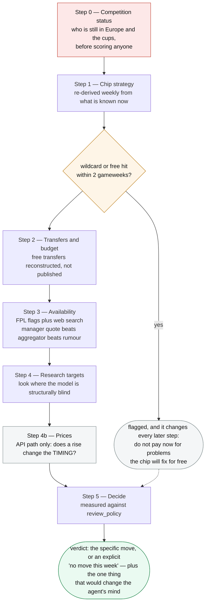

# Weekly workflow and chip strategy

## Two ways to run the review

The protocol below is the same either way; only who does the reasoning changes.

**`armband brief`** writes the whole deterministic picture as one self-contained Markdown
document and costs nothing: your criteria and review policy, the six steps, competition
status, chip plan, squad and transfers, every flagged player, standing overrides, research
targets, the optimal squad, the fixture table, and a "what this model cannot see" section.
Hand it to a Claude Code session and work the steps there.

**`armband review`** runs the same protocol through the API, where the agent calls tools
iteratively and can chase something it notices mid-analysis rather than reasoning from one
snapshot. This is the path intended to eventually run unattended just before a deadline.

The brief's one real limitation is that it is a snapshot: it cannot decide halfway through
that a particular player needs a closer look. It also omits the API path's **Step 4b**, the
price check — that step calls the optimiser twice, once against tomorrow's prices, which a
static document cannot do.

---

## The weekly review

Both paths run the same numbered deliberation, **Step 0 through Step 5**, with the API path
adding a price check as Step 4b. The order matters — each step constrains the next, and
jumping straight to "which transfer" is how managers burn transfers on problems a planned
wildcard would have fixed for free.

Step 0 is red because it is the one that invalidates everything after it: score players
against stale competition status and the earlier work has to be thrown away rather than
adjusted.

**An imminent chip does not skip the later steps**, and an earlier version of this diagram
said it did. The prompt asks the agent to *say so immediately* because it changes how every
later step is weighed — a transfer to paper over a problem the wildcard will fix is not worth
making. Availability still gets checked; a player who is out is still out.

### Step 0 — Competition status

**Before scoring anyone.** Which clubs are still in Europe and the domestic cups, over what
dates, and how long ago that was verified.

Participation is not in the FPL API, so the configuration is only as good as the last check —
and it goes stale every time a club is eliminated. The agent verifies against current results
by web search and corrects anything wrong with `update_competition_status`, which re-scores
every player immediately and persists the change to `config.json`.

This is first because it changes the numbers everything else rests on. A club knocked out of
Europe should stop carrying a rotation penalty; one that wins a play-off should start
carrying it. Scoring players against stale competition status produces confidently wrong
recommendations — and if you score first and discover the error afterwards, the earlier work
has to be thrown away.

### Step 1 — Chip strategy, re-derived weekly

**Chip timing is delegated to the agent.** The gameweeks in `config.json` are a starting
hypothesis, not a commitment: each week the agent asks what the best gameweek for every
unused chip is *given what is known now*, and says whether that differs from the plan on
file. Fixture runs, injuries, price changes and how the squad actually developed all move
the answer.

Two things force a rethink: a chip whose window is closing unused, and a wildcard now sitting
so far away that the squad cannot survive until it.

If a wildcard or free hit is within two gameweeks, the agent says so immediately, because it
re-weighs everything downstream — problems the chip will fix for free should not be paid for
now.

Moving a chip is cheap; drifting without a plan is not. The step always ends with a specific
gameweek for every unused chip, even a provisional one, plus the single thing that would
move it.

### Step 2 — Transfers and budget

Free transfers and money in the bank. The transfer count is **reconstructed** from history
rather than published, so it is close but not authoritative; the agent flags when a decision
turns on it.

### Step 3 — Availability, including news the model cannot see

FPL's official status flags, **plus a web search**. FPL's `news` field is terse and lags press
conferences by days, so the agent searches for injury updates, expected return dates and
rotation talk on any flagged player and any player under consideration.

Source weighting is explicit: a manager's direct quote outranks an aggregator, which outranks
a rumour account. The agent states which it relied on and labels a rumour as a rumour.

The step has a second half that is easy to skip and is the one that keeps the system honest.
New findings are written back with `set_player_status`, so the *next* run starts from them.
And **every standing override is re-checked against this week's news**, not just the ones
about to lapse — a hand-maintained list that outlives its situation and keeps applying
silently is a failure mode this project has hit more than once.

### Step 4 — Research targets, where the model is structurally blind

The model cannot see a role change, a set-piece hierarchy that moved over the summer, or a
player whose statistics came from a different club. `research_targets` names those players,
and the instruction is to search them **even though you were not considering them** — that is
the entire point of the step, and it is the one an agent optimising for a tidy answer will
quietly drop.

### Step 4b — Prices, API path only

The optimiser is run twice, the second time against tomorrow's expected prices. A price
change is a **timing** input, not a decision input: it can say to make a move today rather
than Friday, and it should not decide which move. `armband brief` has no equivalent, because
a static document cannot re-run the optimiser.

### Step 5 — Decide, including deciding nothing

Measured against `review_policy`. **Doing nothing and banking the transfer is a first-class
outcome and usually the right one.**

A move is recommended only on an affirmative case: an injury or suspension costing real
points, a player who has lost his starting place, a fixture swing worth acting on, or an
upgrade clearing the threshold. Never churn to look busy after a bad week.

The output ends with a clear verdict — the specific move, or an explicit "no move this week"
— plus the one thing that would change the agent's mind before the deadline.

---

## Chip strategy

Chips expire and only one may be played per gameweek, so four first-half chips need four
distinct gameweeks inside a fixed window. Deciding week by week reliably ends with chips
burned in the last fortnight or lost outright.

### Windows

FPL issues two sets per season, and `ChipWindows()` **reads them from the bootstrap payload**
rather than assuming them — `start_event` and `stop_event` per chip. The table below is what the
payload currently says, transcribed here for orientation; the code is the authority and nothing
pins this table, so treat a disagreement as the table being stale.

| Chip | First half | Second half |
|---|---|---|
| Bench Boost | **GW1**-19 | GW20-38 |
| Triple Captain | **GW1**-19 | GW20-38 |
| Wildcard | GW2-19 | GW20-38 |
| Free Hit | GW2-19 | GW20-38 |

Bench Boost and Triple Captain are playable in GW1; wildcard and free hit are not.

`armband chips` does **not** print both columns. It keeps only the half covering the upcoming
gameweek, so from GW20 onward every row reads `GW20-38` — which is the useful view when planning
and a surprise if you are expecting the table above.

### How the plan changes squad construction

This is the part most managers miss, and it is wired into the optimiser:

- **A wildcard at GW N** makes the current squad disposable, so the horizon shortens to the span **from the upcoming gameweek to N-1**. There is no value optimising for fixtures the squad will never serve. ⚠️ **A free hit does not do this, and this document said it did until 2026-08-13**: the chip fields a separate temporary fifteen for one gameweek and hands the permanent squad straight back, so the squad still has to be good afterwards. What it removes is one gameweek from scoring, which `ApplyFreeHitToScoring` already does.

The bench-boost effect is large and easy to see for yourself: set a plan, run `armband chips`
to confirm the raised bench weight, and run `armband squad` with and without it. Expect a bench
of genuine starters instead of two near-ghosts, paid for by a weaker eleven in the weeks before
the boost.

### Timing principles

**Wildcard.** Late enough that roles have resolved, early enough to fix a bad start. The
biggest weakness of any pre-season squad is unproven roles — new signings, new managers,
players whose stats came from another club — and four or five gameweeks of real data settles
almost all of it.

Prefer the gameweek **after** a long international break over the one before it. Wildcarding
before a break commits the squad, then leaves it idle for three weeks while players get
injured on international duty, with only a single free transfer to react.

**Bench Boost.** Must follow the wildcard, so the squad can be built for it, and should avoid
post-international-break gameweeks where rotation is least predictable.

**Triple Captain.** A nailed premium with a soft home fixture. Without double gameweeks
there is no obvious spike, so this is a judgement call best made close to the week itself.

**Free Hit.** The awkward one. Its natural use is a blank gameweek — and blanks come from
FA Cup postponements in January, which fall in the *second* half. **The first-half Free Hit
may have no natural target at all.** Treat it as a chip to spend opportunistically on the
week your squad's fixtures are worst, and set a placeholder gameweek so it does not expire
unnoticed.

### Validation

`armband chips` checks the plan against the windows the API publishes, and reports five
distinct problems: a gameweek outside a chip's range, a chip planned for the wrong half of the
season, two chips in one gameweek, a gameweek that has already passed, and a chip left to
expire unplanned. A clean plan says so explicitly.

It then reports the effect on squad building — the shortened horizon and the raised bench weight
— so you can see what the plan is doing before running the optimiser.

**Blanks and doubles are printed separately and are not part of plan validation.** They are
computed from the fixture list whether or not a plan exists, which is the right shape: a blank
is a fact about the calendar, not a mistake in your plan.

---

## A note on blanks and doubles

In a freshly published fixture list, **every club plays exactly once in every gameweek**.
Blanks and doubles emerge later, once cup progress forces postponements.

This means a Free Hit held for a blank is a bet that one materialises before the chip
expires — and in the first half of a season, that bet is usually a bad one.

## Correct the numbers, do not override the decision

Moved from the resident index (then `CLAUDE.md`) on 2026-08-12, verbatim. This is operator guidance: what to do when the
analysis layer knows something the model cannot see. AGENTS.md keeps the one-line rule.

**Correct the numbers, do not override the decision.** The analysis layer knows facts the model
cannot see; it does not know better than the optimiser what a player is worth. `minutes` mode
supplies the fact — what he actually plays — and lets everything downstream recompute. `lock`
and `start` assert a conclusion instead, and are unfalsifiable: the optimiser cannot decline.

Isak is the case. He scored 0.49 pts/gw because a leg break held him to 694 minutes, so he was
locked in — and the optimiser satisfied that by parking £9.0m on the bench at 0.53. Correcting
his minutes to 85 puts him at **3.57**, and the optimiser then declines him at £9.0m in favour
of Thiago at 4.66 for £8.0m. That refusal *is the answer*, and a lock destroys it.

Setting minutes to 0 also subsumes most exclusions: the score collapses and the player is never
picked, without the layer having to be certain.

**Check the claim before you exclude on it.** The first live run excluded Gabriel because
Arsenal's 0.72 xGC "was earned with Saliba alongside him". The archive says otherwise — in
2025-26 Arsenal conceded **0.67** a game without Saliba against 0.71 with him, over nine games,
with near-identical xGC. The reasoning was plausible, the press coverage of the injury was real,
and the inference was never checked against thirty seconds of data. The 4th-best player in the
game was excluded on it.
